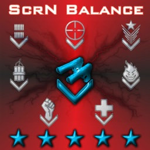

> [go back to README](../README.md 'go back to Table of Content')

<!-- steam link shortcuts -->
[NikC-]: http://steamcommunity.com/profiles/76561198044316328
[PooSH]: http://steamcommunity.com/profiles/76561197992537591
[nmmblez]: http://steamcommunity.com/profiles/76561198075092161
[Scuddles]: https://steamcommunity.com/profiles/76561197985454628
[Vrana]: https://steamcommunity.com/profiles/76561198021913290
[Joe]: http://steamcommunity.com/profiles/76561198005354377
[Duckbuster]: http://steamcommunity.com/profiles/76561197986770985
[Lost_Champ]: http://steamcommunity.com/profiles/76561198080088953
[P-Jay]: http://steamcommunity.com/profiles/76561198052307800
[ImmortalNub]: https://steamcommunity.com/id/ImmortalNub
[ivanmagadan]: https://steamcommunity.com/id/ivanmagadan
[Broski]: https://steamcommunity.com/id/broski270
[That1Guy]: https://steamcommunity.com/id/defenciveguy121
[FishFlop_The_CatSlap]: https://steamcommunity.com/id/FishFlop_The_CatSlap/
<!-- add other peaople too!!! -->

# Version History

> In this document all references to config file **ScrnBalance.ini** should be
  treated as **ScrnBalanceSrv.ini**, if you're using server version of
  ScrnBalance (ScrnBalanceSrv.ScrnBalance).

-------------------------------------------------------------------------------

## VERSION 9

-------------------------------------------------------------------------------
## v9.72
- The default map voting handler switched to `KFMapVoteV3SE.KFVotingHandler`
- Deprecated `VotingHandlerOverride`
- *ScrnBalanceSrv.ini*: added `[ScrnBalanceSrv.ScrnInit]` section to override the map voting handler.
- *KFMapVote.ini*: switched to `[KFMapVoteV3SE.KFVotingHandler]`
- New game mode - **53. Follow or Escape**, where the players need to either Follow The Guardian or Escape The Hunter.
- *ScrnGames.ini*: Added random wave dependency, where a random wave is followed a specific wave (e.g., `Wave2A => Wave3A | Wave2B => Wave3B`).
- **52. Escape The Hunter v1.03** - added the Hunter to the boss wave. Players need to kill Pat while escaping the Hunter.
- **XCM**: a player can get the "Suicide Bomber" achievement by killing 10 zeds with the "ass pipe" explosion
- Player paths avoid `ZombiePathNode` (path to the trader or base)
- Chat spam prevention switched to "5 messages per 10 seconds" instead of "1 message per 2 seconds"

## v9.71.17
- **FTG**: `StinkyClot` extends `ZombieClotMix`. The latter is an unused legacy zed that can be referenced on maps to block Stinky Clot path (e.g., `ZombiePathNode.DisallowedZombies`)

## v9.71.16
- ZombieVolumes within 90uu of Z distance from the player is considered on the same floor (no FloorPenalty applied)

### ScrN Zed Pack
- Fixed an issue where decapitated zed chunks may never disapper client-side

## v9.71.15
- Fixed headshot detection of wide melee swings.
- Melee weapons now properly play flesh hit sounds on dedicated servers (thanks [Broski])
- Fixed custom gun skins for spawn weapons (thanks[Duckbuster] and [That1Guy])
- Last 16 zeds in a wave spawn closer to players with forced **FastTrack**
- **FTG**: Tweaked the ammo production rate to approximately one box per player per minute.
- Stinky Clot doesn't produce additional ammo boxes if a lot of ammo is produced shortly. It prevents an overwhelming amount of ammo on maps with many ammo boxes.
- Stinky Clot may produce additional ammo boxes even in the Solo game if he hasn't spawned them for a while.
- Fixed `ZVolLinks` in *ScrnMapInfo.ini*
- *ScrnMapInfo.ini*: added `AchName` to override map achievement for a custom map/version
- *ScrnMapInfo.ini*: added map definition for the upcomming **KF-BioticsLab-SE**
- **TSC**: allowed L4D character selection. L4D1 survivors can be picked on the red team, L4D2 - blue.
- **Berserker** range weapon movement penalty reduced to -10% (from -15%).
- **Speed Boost**: Player base movement speed reduced to 250 (down from 260). Now, players have +25% speed over the regular game, like zeds.
- `DebugClear` console command - clear debug lines from the screen (e.g., clear zed spawn cylinders when bDebug=true)

### ScrN Zed Pack
- Fixed **Brute**'s pushing force to properly include the target's mass. Heavy zeds are harder to push.

## v9.71.12
- **TSC**: fixed a bug where doors respawned at the beginning of a wave instead of trader time.
- Adjusted **TSC** message position to avoid overlaps with player death messages.

#### Heavy Machinegunner
- **M41A** 3rd person model replaced by the M4-M203 placehold due to crashes

## v9.71.11
- **Pipebomb** alt-fire displays the placed pipebomb count (thanks [FishFlop_The_CatSlap])
- *ScrnBalanceSrv.ini*: added map aliases for *KF-SunnyLandSanitarium-SE*
- *ScrnMapInfo.ini*: added `BoringStage`, `bOnlyInvisibleZVol`, `ZVolLinks`, and `bDebug`
- `DebugZedSpawn` console command now marks spawn locations (withs only in solo or listen server mode)
- HUD: Perk Bonus Level is not drawn if it is equal to 6 and the XP level >= 6.
- HUD: XP Progress Bar is drawn only in the Scoreboard mode.
- SUPPORT, ALERT, and DIRECTION messages use team messages (TeamSay)
- **M203** grenade cost raised to $15 (up from $10)

#### Heavy Machinegunner
- **M41A** restored the original 3rd person mode (experimental). Fixed bugs.
- **M41A** now has laser sights
- **M41A** primary damage reduced to 75 (down from 82)
- **M41A** grenade type chaged to M203 (from M32)
- **M41A** grenade capacity raised to 12 (up from 8)
- **Stinger Minigun** weight raised to 14kg (up from 13) to prevent carrying it along with PKM.
- **Stinger Minigun** fire rate reduced to 1800 RPM (down from 2000)
- **Stinger Minigun** cost raised to $7500 (up from $5000)
- **PKM** weight raised to 12kg (up from 11)
- **M249** weight raised to 12kg (up from 11)


## v9.71.10
#### FastTrack
- Zeds go to a random place on the map after spawn. Only then do they move to the player. It may add variety to the zed attack paths. However, it increases the time between spawning and engaging (slower spawns) on big maps. Zed may also get stuck on small maps with narrow corridors.
- **FastTrack** eliminates the initial random roam and redirects Zeds straight to the players after spawning.
- FastTrack can be configured per-map - see `bFastTrack` in *ScrnMapInfo.ini*
- By default, FastTrack is enabled for Aperture, Farm, Hell Ride, Hospital Horrors, Mountain Pass, and Transit.
- Players can force FastTrack via `MVOTE BORING` (see `BoringFastTrack` in *ScrnBalanceSrv.ini*)
- Setting `BoringFastTrack=0` forces FastTrack on all maps
- `bRandomSpawnLoc=true` in *ScrnWaves.ini* disables FastTrack.
- FastTrack is disabled in **FTG** or during a Boss wave.
- FastTrack can be forced per-wave by setting `bForceFastTrack=true` in *ScrnWaves.ini*
#### FTG
- *ScrnWaves.ini*: added `FtgRule`
- Fixed Stinky CLot movement speed in a boss wave.
- The base gets marked when the player is outside it.

#### ScrN Zed Pack
- Fixed **Tesla Husk** ability to *unweld* doors
- Fixed HardPat's head hitbox while firing minigun or multiple rockets.
- ScrnZedPack.ini: `bCommandoRevealsStalkers=true` by default (you can still change it)
- ScrnZedPack.ini: added `bLegacyHusk` and `bLegacyFleshpound`
- Legacy Fleshpound starts raging immediately after taking enough damage, while the new one tries to attack the player first if the latter is in melee range.
- **Grittier Fleshpound** always has the new behaviour, regardless of the `bLegacyFleshpound` setting.
- The New FP behaviour was hardcoded since v9.69.39. Now, it is configurable.
- The New **Husk** has the same fireballs as the Grittier Husk, but the former fires only one at a time (thanks *Mortimer*).
- New Husk fireballs have collision and can hit players or zeds. Legacy fireballs rely on the splash damage only.
- **Grittier Scrake** unstuns from 150+ explosive damage. Don't nade Scrakes!
- **Grittier Scrake** no longer has the slomo rage exploit.
- **Jason** code cleanup.
-
## v9.71.07
- Duplicate votes result into `MVOTE YES`. For instance, when two players did `MVOTE END TRADE`, it results into a single vote with two YES votes instead of failing the second vote (thanks [FishFlop_The_CatSlap])
- Fixed an issue where "v22 - No" sometimes didn't trigger `MVOTE NO` (thanks [FishFlop_The_CatSlap])

## v9.71.06
- Yet another **QuickMelee** fix

## v9.71.05
- Fixed and issue where **DDT** did not increase the "Donated Cash" stat

## v9.71.04
- Adjusted game modes for map achievement requirements:
  - Suicidal: FTG, ESC (Escape The Hunter), Social Isolation, or any custom game (GameLength >= 60)
  - HoE: XCM, Nightmare, Doom3
- Players cannot fill the next Zed Time Bucket while the Zed Time is active.
- Fixed `ZedTimeTrigger` in *ScrnBalanceSrv.ini*
- Added `ZedTimeChanceMult` to *ScrnBalanceSrv.ini*, too. Previously, it was available only in *ScrnGames.ini*
- Added `ZT_Custom` for modders to override Zed Time behavior.

## v9.71.03
- **Predictable Zed Time** - see `ZedTimeTrigger` in *ScrnBalanceSrv.ini*
- Per-game Zed Time settings: `ZedTimeTrigger`, `ZedTimeChanceMult`, `ZedTimeDuration` in *ScrnGames.ini*
- Default Zed Time duration incereased to 4s (up from 3s) to allow weapon switch within ZT
- The original ZT duration can be restored by setting `ZedTimeDuration` in *ScrnBalanceSrv.ini* or *ScrnGames.ini*
- New perk function `ScrnVeterancyTypes.GetZedTimeChance()` - can be ovverrided by custom ScrN perks to modify ZT chance on a zed kill.
- **Combat Medic**: reduced Zed Time extensions to 5 (down from 6) to compensate for ZT duration increase
- Fixed **M4-203** burst fire during Zed Time
- Changed dual pistol fire order when switched from the single pistol
- Restored S/A fire mode of **Tommy Gun** SP & RS (community request)
- **Manual Reload** disabled by default (community request). ScrN veterans already have it enabled, while newcomers may struggle to find R on the keyboard. I cannot believe I'm doing this :facepalm:
- Fixed the double reload bug where a tactical reload could trigger immediately after the full reload when Manual Reload disabled.
- Added `bShowCowboyMode` to *ScrnUser.ini* (enabled by default)
- **DDT**: Dosh receiver gets a notification message (thanks [That1Guy])
- **DDT**: Fixed `ScrnTraderPlayerList.KFGRI` null reference warning (thanks [That1Guy])
- New map alias: `KF-Steamland_Fogged` => `KF-Steamland` (*ScrnBalanceSrv.ini*)
- **Escape The Hunter v1.02** - "Finish them off" waves changed to "Kill half zeds"
- **Circus Husk** disabled by default due to similarity to Tesla Husk. It still can be restored in *ScrnZeds.ini*

## v9.71.01
- **Support Specialist** gained extra damage bonus against Gorefasts.
- **Pump** and **Combat Shotguns** now have higher body damage while retaining the original headshot damage
- **KSG** restored the original fire rate
- Fixed an issue where **Boomstick** sometimes didn't reload due to netcode.
- Fixed an issue when dead zeds continued blocking players for a fraction of a second.
- Team Wallet gets emptied at the beginning of earn/grab dosh waves to prevent cheating (thanks [nmmblez])
- Fixed an issue in **XCM Duel** where Human Damage was enabled in Wave 1.

#### ScrN Weapon Pack
- **SPAS** now have higher body damage while retaining the original headshot damage

## v9.71
#### DO$H
- New feature: **Digital Dosh Transfer (DDT)**. Allows transfering dosh to other players from the Trader Menu.
- DDT allows sharing dosh with the team by sending dosh to the Team Wallet, where everybody can use it.
- New Trader button: "Request Dosh" - allows doing "v13 - I Need Money" without exiting the Trader.
- A dosh request puts the player on top of the DDT player list and marks it so the teammates can identify those in need.
- If a player abuses dosh requests, blame them (`MVOTE BLAME`). Blame vote clears the dosh request mark.
- Blamed players cannot use voice communication commands (vXX) for one minute after the blame.
- Blame message (poop) display time reduced to one minute - to match the communication ban.
- New Trader button: "F7 Armor" - quickly repairs the current armor or buys a new one.
- New Trader button: "F9 Share Dosh" - share all dosh with the team.
- The "F10 Exit" button received a new hotkey. Esc works, too.
- Players can quickly refill everyhing, share spare dosh, then exit the trader by pressing buttons: **F7, F8, F8, F9, F10**.
- There is no typo in the line above. The first F8 fills weapon ammo without resupplying nades or pipebombs. The second click restocks nades and pipebombs.
- "Sell Offperk" / "Sell ALL" button hotkeys changed to `Ctrl+Backspace` / `Ctrl+Shift+Backspace`
- Improved netcode in the Trader Menu
- The default dropped dosh amount is set to $100 (up from $50). Players can still drop $50 by executing `TossCash 50`
- Dropped dosh objects combine on touching each other.
- Dosh object size scales by the dosh amount.

#### Side Arm Selection
- The selection of single-handed weapons made twice as fast (single pistols, knife, machete, syringe, welder)
- Switching to a side arm is faster than switching between primary weapons.
- Fast switching between single and dual pistols via alt-fire
- **Dual Flare Revolvers**: alt-fire switches between single and dual guns

#### Gunslinger
- **Laser .44 Magnums** upgraded to Armor-Piercing rounds.
- Laser and non-laser pistols of the same kind can be carried together.
- Laser .44 Magnums have a separate ammo pool from regular ones due to ammo difference (.44 AP vs. .44)
- **Laser MK23** share the ammo pool with regulal MK23(-s), doubling the ammo capacity.
- 30% Fire rate bonus on **Flare Revolvers**
- Flare impact kills grant Gunslinger XP (not iDoT kills)
- Discount and reload bonus on **Medic Pistol**
- Extra +10% damage bonus on **LAR** to kill HoE Clots with one body shots. Previously, it left a Clot with 3hp.
- **LAR** in Gunslinger's hands can flinch-lock Scrakes like HC.
- Fixed incorrect sell price of dual pistols
- **Handcannon** starting and max ammo adjusted to match full magazines (7, 14)
- **MK23** lowered ammo cost to 14 per magazine (down from 16)

#### ScrnBalanceSrv.ini
- New: `bStoryZedPack` - replaces vanilla Zeds with their ScrnZedPack counterparts
- `AutoLoadMutators=ScrnBalanceSrv.ScrnSpeedMut` enabled by default
- Trader time and starting dosh can be adjusted in *ScrnGames.ini* and *ScrnWaves.ini*
- The config options below are deprecated and hardcoded to the given values:
```ini
bSpawn0=true
bMedicRewardFromTeam=true
bLeaveCashOnDisconnect=true
bNoStartCashToss=false
StartCashNormal=0
StartCashHard=0
StartCashSui=0
StartCashHoE=0
MinRespawnCashNormal=0
MinRespawnCashHard=0
MinRespawnCashSui=0
MinRespawnCashHoE=0
TraderTimeNormal=60
TraderTimeHard=60
TraderTimeSui=60
TraderTimeHoE=60
```

#### ScrnGames.ini
- Deprecated: `bStartingCashReset`, `StartingCashBonus`, `bStartingCashRelative`
- New: `StartDosh`, `StartDoshPerWave`, `StartDoshMin`, `StartDoshMax`

#### Other Changes
- **Syringe**: both healing modes made faster. Pro players are using macros to skip healing animations anyway, while newbies were unnecessarily struggling for too long.
- Classic HUD shows health in green when the player is healing up to the max health (current health + healing bar = max health)
- **MP5M**: Removed tactical reload as being unrealistic.
- **MP5M**: Regular reload made faster to compensate for tactical reload removal.
- Blocked weapons (*ScrnGames.ini*) do not spawn on the map anymore (thanks [nmmblez])
- **ScrN Objective Mode** now uses **ScrN Zed Pack** (see `bStoryZedPack` in *ScrnBalanceSrv.ini*)
- If a player has >100 armor, the cyan bar is drawn on the blue background. It fixes the issue where players with slightly above 100 armor looked like they did not have armor at all.
- `bLowAmmoColorSwitch` added to *ScrnUser.ini* - low ammo counter blinks between red to yellow like the low HP counter.
- Fixed an issue where dead player bodies could stay forever on the map
- Spectators may join after the game has ended to participate in the next map voting.

#### Known Issues
- Trader Menu shows the full price of dual pistols despite the single exists in the inventory. Only half of the cost is actually charged, though.
- Trader Menu ignores single pistol weight when upgrading to dual pistols, requiring the player to have free weight for single+dual (10kg in the case of Handcannons). As a workaround, temporarily drop other weapons while upgrading to dual pistols.

#### Code Changes
- Refactored the healing code. Medic reward calculation moved to `ScrnHumanPawn.TakeHealing()`. Make sure to check your custom medic guns for ScrN compatibility.
- `ScrnHumanPawn.AssessThreatTo()` logic moved to `ScrnPawnFunc`, allowing easy overides.
- Added `ScrnVotingHandlerMut.bVotedPlayerAutoVote`
- Moved global functions from `ScrnBalanceSrv.ScrnFunctions` to `ScrnShared.ScrnF`

#### ScrN Zed Pack
- Pat dead body stays longer on the map
- SC/FP/JS/FFP/BR dead bodies stay longer at high-quality physics settings.

#### ScrN Weapon Pack
- Faster selection of **Medic Pistol** and **Colt**
- **Colt** received Horzine modification to .50 AE rounds. Extra damage to Fleshpouds.
- **Colt** price incereased to 1750 (up from 1250)

#### Horzine Technicial
- **Cryo Harpoon Bomber**: tactical reload gives +1 ammo (3 in the magazine + 1 in the barrel)


## v9.70.18
- *ScrnBalanceSrv.ini*: added `bLateJoinersSpectate` to force late joiners to spectators by default - with exception of reconnecting players.
- Spectators may spawn immediately after joining the game during Trader Time.
- *ScrnWaves.ini*: `WaveHeader`, `WaveTitle`, and `WaveMessage` support color tags.
- **SpeedMut**: proportionally increased burning DoT
- **Husk Gun**: 20% faster charging

## v9.70.15
- Last zeds in a wave get auto-marked.
- Added "End Wave" button to ScrN Features. The button cycles between "Boring / End Wave / End Trade" depending on the current game state.
- *ScrnBalanceSrv.ini*: deprecated `MaxVoteKillHP` - replaced by `MaxVoteKillBounty`.
- Reverted the shotgun change from 9.70.12. Now shotguns can do damage twice without scoring a headshot. For example, "LAW+HSg" team combo works again now.
- **Boomstick** (HSg) weight lower to 8 (down from 10) and max ammo to 36, perked 46 (down from 54), enhancing loadout variety.
- **Boomstick** pellet base damage raise to 60 (up from 50), headshot multiplier lowered to x1.25 (down from x1.50). Headshot damage remains the same.
- Fixed a bug where a **nail** could push a zed through a wall (floor, ceiling), e.g., on KF-Swamp. Zeds may still get stuck in walls on maps with complex geometry, but at least they get stuck on the right side of the wall.
- Carry weight bonus (>15) doesn't slow down players anymore (Support Spec., HMG). Unlike vanilla, these perks do not receive a low-weight speed bonus either.
- *ScrnGames.ini*: added `SuicideTimePerPlayerDeath`
- **XCM v1.04**: a player death adds +30s to the suicide timer. That allows the remaining players to finish the wave when the timer is tight already.

#### Zed Pack
- Fixed an issue where **Hard Pat** could shoot rockets without arming
- **Grittier Siren** cannot be scream-canceled anymore
- Lowered **Jason** bounty to $125 (down from $300)

#### Horzine Technician
- New weapon: **Cryo Harpoon Bomber** - a remake of Seal Squeal (thanks [ivanmagadan] for the idea)


## v9.70.12
### Shop Menu Overhaul
#### Weapon Search Textbox
- Added Weapon Search Textbox, allowing to quickly search for weapons to buy.
- Weapon Search Textbox is focused by default when entering the Shop Menu. Press `F3` anywhere in the Shop Menu to focus it again.
- Weapon Search is tokenized by words. For example, entering "med pis" finds "Medic Pistol".
- Pressing `Enter` from Weapon Search Textbox buys the selected weapon. You can also press Up/Down arrow keys to quickly navigate through search results.
#### Perk Selection Submenu
- Removed Quick Perk Selection
- Perk/Store buttons replaced with a single "Change Perk" button.
- Perk list now displays 9 items at once, avoiding scrolling for Gunslinger or Combat Medic seletion.
- Quick Perk selection by pressing number keys (`1`..`9`).
- Perk confirmation on `Enter`.
- Return to Shop on `Esc`. Previously, pressing Escape exited the Shop Menu.
- `F9` - hotkey to open/close Perk Submenu
- For example, switching to Commando can be as easy as pressing 3 keys: `F9`, `4`, `Enter`.
#### Shop Menu
- **9mm Pistol** moved under Equipment
- New "Sell Off-Perk" / "Sell ALL" weapons button. The first click sells all off-perk weapons. The second one sells all weapons but the starting equipment. 1kg items (Machete, Pipe Bombs) are excluded from the off-perk category, so they are not sold on the first click.
- `Ctrl+F9` sells off-perk weapons.
- `Ctrl+Shift+F9` sells all weapons (simulates the button double-click)
- There can be up to 12 weapon category icons now.
- Fixed a rare issue where trader inventory did not update after selling a weapon.
- Shop Menu displays Medic Gun healing info

### Lobby Marks
- Now, players can mark locations on the map during Lobby time, for insstance, to suggest the camping spot.
- Press "View Map" button in the Lobby to browse the map.
- Go to location you want to map and press the `Mark` or "Lets hole up here!" key to leave the mapk. Keep in mind that the Speech Menu does not work for spectators, so v35 will NOT work. You have to bind a dedicated key for `Mark` or `speech ALERT 4`.
- You can add a custom label to the mark by typing in the console `mark <my label name>`. For example, `mark Weld this door!`.
- Lobby marks can be colored via color tags, e.g., `mark ^3this is yellow mark`

### Weapon/Money Balance
- Players don't drop spawn inventory on death. They drop only the weapons they have bought + the current weapon.
- Selling Dual Pistols sells them BOTH. The only exception is 9mm pistol.
- `Dual-9mm Pistols` now weight 2kg and cost $200 (mainly, to bypass new Shop Menu checks).
- Restored **Combat Shotgun** flashlight. Laser sights automatically turns off when the flashlight is active.
- Fixed a shotgun exploit where it was possible to do damage twice to the same zed without scoring a headshot.
- Fixed yet another bug in **Healing Projectile** hit detection.
- **M7A3M**: damage rased to 80 (up from 70)
- Reworked **M7A3M** healing projectile: now it consumes 100% of the charge but heals 20hp instantly + 50hp over time (offperk), 35+87hp if healed by a lv6 Field Medic or 26+65 - Combat Medic.
- Fixed an issue where **Buzzsaw** Blade couldn't hit the same target again after bouncing off a wall.

### Game Modes
- **TSC**: players get thrown out of enemy shop immediately when pressing the USE key
- **FTG**: Base light color turned green by default (can be replaced via `GuardianHue`), and lowered its radius and brightness.
- **XCM v1.03**: disabled random player start, added wave (challenge) names
- *ScrnBalanceSrv.ini*: added `GuardianLight` and `GuardianHue` for TSC/FTG global overrides
- *ScrnMapVote.ini*: `GuardianHueBlue` and `GuardianHueBlue` replaced by `GuardianHue`, which is available in FTG only.
- *ScrnMapVote.ini*: enhanced KF-EvilSantasLair
- *ScrnMapVote.ini*: lowered zed spawn rate on KF-HospitalHorrors to partially compensate for improved spawns.
- *KFMapVote.ini* cleanup - removed many game mod variation from the official rotation, leaving only the core/recommended game modes. The rest of game modes are still available and can be restored by uncommenting the respective `GameConfig` lines.

### Other Changes
- Added difficulty voting GUI setting
- Fixed a state sync issue between `ScrnGameType` and `ScrnBalance` during the first second of Trader Time begin/end
- *ScrnBalanceSrv.ini*: added `bLouderZeds`
- Fixed a warning in `ScrnHumanPawn.SetWeaponAttachment()`

### ScrN Zed Pack
- **Hard Pat**: lowered charging minigun speed multiplier (x2.3 => x1.75)
- **Hard Pat** always charges player with minigun after the final healing (previously, it was 40% chance)
- **Hard Pat**: when firing multiple rockers, reduced the splash radius of subsequent rockets by 20%

### ScrN Weapon Pack
- Fixed **HK417** bringup/putdown animations
- Slightly boosted **CZ805M** healing recharge rate
- Increased max ammo for **SVD** (90 => 100), **SVDS** (60 => 70), **Hunting Rifle** (50 => 70)
- Increased **SVDS** fire rate (0.75s => 0.5s)


## v9.70.01
- New **Gunslinger** perk icon
- Enhanced some perk icons
- FTG/TSC: Fixed glowing of some player models

## v9.70
#### Feature Summary (from 9.69.39)
- New feature - **MARK** (a.k.a. **SPOT** or **PING**).
- A brand new game mode - **52. Escape the Hunter** (by [nmmblez])
- Remastered Doom Demon Invasion into a new game mode - **20. New Doom**
- Improved headshot detection (once more)
- Enhanced Zed Spawning system.

#### Mark (Ping / Spot)
- New feature - **Mark** (a.k.a. *spot* or *ping*) - an ability to mark big zeds or items (ammo, weapons, armor) on the map. Teammates can see the marks (even through walls). Marks disappear in 5..10 seconds.
- By default, the marking feature is used via the Speech Menu Command v31 ("Lookout!") - marks the zed or item the player is looking at.
- The recommended way is binding the `MARK` command to a separate key (`set input T MARK` or via *ScrN Key Bindings* GUI).
- Some Speech Menu items mark the player: v11 ("Medic"), v12 ("Help"), v33 ("Wait for me!"), v36 ("Follow me")
- v13 ("I need some money") - also marks the player, but only during the Trader Time.
- v35 ("Lets hole up here!") - marks the player location and may stay up to the end of the Trader Time (30s max)
- Marking can be prohibited on the server by setting `MarkDistanceMeters=0` in *ScrnBalanceSrv.ini*
- Players can locally disable marks by setting `bShowMarks=false` in *ScrnUser.ini* (a GUI option will come later)
- *ScrnBalanceSrv.ini*: new option `MarkDistanceMeters` - maximum distance to item/zed to set/reveal a mark.
- *ScrnBalanceSrv.ini*: new option `MarkZedBounty` - filters out markable zeds by their Bounty (`ScoringValue`). By default, Husks, Scrakes and Fleshpounds are markable (and also Brutes, Jasons, Female FP, and upper roster of DooM demons). Patriarch cannot be marked to avoid exploits.
   Note that if a marked player or enemy is too far away, their marked location is not updated on move. This is designed behavior.

#### Escape The Hunter
- A new game mode by [nmmblez] included into the official rotation. The game loop is opposite from FTG: players must run away from the **Chaser** (Invulnerable Hunter's cousin) instead of following the guardian until the timer runs out.
- The game mode provides a unique KF experience but cannot be enjoyed by the mentally disabled.

#### New Doom
- Totally reworked Doom 3 Demon Invasion mode to use modern ScrN features. A long game, 16+1 waves: 4 regular waves + 2 mid-game boss fights + 6 random waves + 6 trader paths + final boss battle. Each of the 8 Doom bosses now has its unique wave. A mid-game boss wave ends when the boss is defeated. Other enemies don't matter. Moreover, only killing the boss grants dosh.
- Significantly improved Doom AI, especially projectile aiming. On Suicidal/HoE, ranged Doom Demons better predict a player movement and may shoot the ground beneath the player for splash damage.
- Enhanced almost all Doom Demons. Read *README.md* in ScrnDoom3KF for more details.

#### Money Balance
- Players now lose constant amount of dosh on death (instead if % of total money).
- By default, a player death subtracts from $100 both from player and team wallet ($200 in total).
- In **TSC** and Tourney, a death "costs" -$250 for the player and the team.
- If killed by an enemy player in TSC, the killer and their team gains +$250, shifting the overall team dosh balance by $1000 in total.

#### Weapon Balance
- **M7A3** magazine capacity raised to 20 (up from 15)
- **Combat Medic** melee speed bonus raised to +100% (up from +75%) to match Berserker's DPS.
- Removed a flashlight from **Combat Shotgun** as it looked silly together with laser sights. AltFire now toggles LS.
- Added laser sight switching sound for all guns with LS.
- Fixed an issue when `ToggleFlashlight` could switch to Combat Shotgun which does not have a flashlight anymore. Now, `ToggleFlashlight` also can switch to custom weapons that have a flashlight.

#### ScrN Games/Waves/Zeds
- "23. Late Pure Doom" and "41. FTG Survival Competition" removed from the official rotation due to `GameConfig` 4095-char limit.
- Now end-game bosses can be spawned separately (e.g., `SpecialSquads=BOSS1 | BOSS2`)
- *ScrnWaves.ini*: Added `bNoBounty` and `CashBonus`.
- If the wave got picked randomly, its Header/Title/Message is not revealed until the trader time ends
- Faster zed spawning at the beginning of a wave.
- If there are not enough zeds on the map, new ones are always spawned close to players, ignoring other settings, such as `bRandomSpawnLoc`. "Enough" currently means `4 * AlivePlayerCount`, capped at 16 (24 in TSC).
- `MVOTE BORING` spawns zeds closer to players even if `bRandomSpawnLoc=true`
- *ScrnGames.ini*: New config options: `MinBonusLevel`, `MaxBonusLevel`, `bUniqueWaves`
- *ScrnGames.ini*: `LaterWavePct` and  `LaterWaveSpawnCooldown` deprecated. Set `SpawnRateMod` in each wave instead.
- *ScrnWaves.ini*: New config option - `ZedsBeforeSpecialSquad`
- *ScrnWaves.ini*: adjusted `SpawnRateMod` to compensate for `LaterWaveSpawnCooldown` removal.
- *ScrnWaves.ini*: `SpecialSquadCooldown` now is set in seconds instead of multiplier. The end result is the same for maps with default `WaveSpawnPeriod=2.0`. However, WaveSpawnPeriod no longer affects the cooldown.
- *ScrnWaves.ini*: New wave end rule - `RULE_KillSpecial` () - kill the special squad (e.g., a mid-game boss) to end the wave. `RULE_KillBoss` automatically switches to `RULE_KillSpecial` if used anywhere but the final wave.
- *ScrnMapInfo.ini*: Added `ZedSpawnMinDistWeight` to limit zed spawn range on very big maps (e.g., *KF-Boardwalk*)
- **72. Mystery Game** - updated to v2.02. Added new wave "Big Fat Kenny" to demonstrate `RULE_KillSpecial`.

#### TSC / FTG
- `bScrnWaves=True` hardcoded in **TSC** and **FTG** (previously it was hardcoded in TSC only)
- Players glow when are a subject of friendly fire (human damage), e.g., outside the base during a wave.
- Players can adjust the glow color in *ScrnUser.ini* (client-side)
- **FTG**: disabled player auto-blame for setting a base in a glitch spot (community request)

#### Other Changes
- *ScrnBalanceSrv.ini*: New config option `bKickBan` in
- **12. Noob Trinity** game mode now runs at uncapped bonus levels.
- *ScrnBalanceSrv.ini*: new option `ZedToZedDamageMult` (default=5.0) to boost the damage Zeds deal to each other.
- Added Kill/Death/Dosh totals on the scoreboard.
- Added a proper HUD widget for the movement speed.
- Replaced the ugly weight numbers with the normal ones. By default, only the current weight is displayed. When Scoreboard is opened, the value changes to the max weight. Same with the speed.
- NearDeathOverlay is used what the player (or spectated pawn) has <25HP, not <25%.
- Some minor HUD improvements
- `KFRandomAmmoSpawn` items are automatically deleted from the map as those are leftovers from KFMod and do not work well in KF1.
- Fixed a log spam when an ammo box gets destroyed mid-game. This happens only on badly designed maps.
- Fixed "Sole Survivor" stat (thanks [Broski])
- Fixed color tag parsing is some console messages
- Fixed color tag parsing in Marco's Multi-Kill Messages (e.g, "^1Fresh ^2Meat +2 Scrake kills")

#### Code changes
- Moved many generic helper functions from ScrnBalanceSrv to ScrnShared.
- Localized generic messages in ScrN Voting Handler (may cause compatibility issues)
- `mvote HELP` is still parsed server-side and not localized yet.

#### ScrN Zed Pack
- Improved headshot detection while a Zed is moving and attacking at the same time.
- **Husk** and **Tesla Husk** bounty raised to 35 (up from 17 and 25, respectively) to match `MarkZedBounty`. The Original bounty was ridiculously low.
- Added `bCommandoRevealsStalkers` config option for Commando to reveal Stalkers for all teammates (like in KF2)
- `bCommandoRevealsStalkers` does not affect Ghosts
- Refactored Stalker and Ghost code
- Fixed a warning: "PlayAnim: Sequence 'Jump' not found for mesh 'Patriarch_Freak'"
- Fixed a network replication bug where sometimes a decapitated **Bloat** kept his head client-side.

#### Heavy Machinegunner
- **XMV850** laser sight is turned on by default.
- Fixed `ChainGun.SelectedHudImageRef` (thanks [P-Jay])

#### Horzine Technician
- Maximum damage that Siren's Sonic Shatter can do per each shattered zed is capped at 80 on Normal, 140 - HoE.
- Frozen zeds now receive minor Damage over Time (DoT).
- Increased **ZED Gun MKI** damage to 100 (up from 85)
- Increased **ZED Gun MKII** damage to 80 (up from 50)
- **Cryo Thrower** weight lowered to 7 (down from 8)

### v9.69.39
- Added dedicated commands for sprinting: `StartSprint` and `StopSprint`.
- The new key binding for the sprint is `StartSprint | Button bSprint | onrelease StopSprint`. Rebind the sprint key in GUI.
- The new sprint command works for spectators too, significantly boosting camera movement speed.
- Spectators can use `SetSpectateSpeed <X>` to change the camera speed. The default value is 600.
- **Speed Mut**: restored the original melee movement speed bonus to 20% (up from 15%) to avoid inconsistencies where Medic with Syringe or Gunslinger with dual pistols moved faster than with a knife.
#### ScrN Zed Pack
- Restored the original **Circus Husk** (Dancing Robot) - community request
- Improved headshot detection for jumping/falling zeds on dedicated servers
- Fixed an exploit when Fleshpound did not rage when dealing a massive damage during attack animation.
- Now, FP rages immediately after finishing the attack animation (on Suicidal and HoE)

### v9.69.38
- Yet another bugfix in `QuickMelee`
- Laser sights are switched ON by default for MK23/.44
#### ScrN Zed Pack
- Fixed a network replication bug where sometimes decapitated zeds kept their heads client-side

### v9.69.37
- Added `PerPlayerExclude` to *ScrnWaves.ini*. Allows wave counter increase for big teams only.
- **FTG**: Stinky Clot teleports next to the Guardian if it couldn't been reached in ~2 minutes.

### v9.69.36
- Adjusted **Knife** select animation rate
#### FTG
- Stinky Clot spawns an extra extra ammo box per 3 players in the team (1 box for 1-2p, 2: 3-5p, 3: 6-8p, etc.).
- Extra ammo is spawned only if players manage to quickly pickup the previous box.
- Stinky Clot's movement speed reduction triggers instantly on all players leaving the base.
  Previously, Stinky could keep the previous speed for the next 5-10s.
- Fixed an issue where sometimes FTG required at least 2 players to start the match
#### Code Changes
- `TheGuardian` renamed to `FtgBaseGuardian` along with its Blue and Red subclasses.

### v9.69.35
- Added **Sprint** key binding, which results in `GetWeapon ScrnKnife | onrelease SwitchToLastWeapon`. In other words, the sprint key selects the knife while holding it and switches back to the last weapon on release. KF1 players have been doing that manually for over a decade with no problems, but those who moved from KF2 keep complaining.
- Switching from/to the knife made faster for fluent "sprinting".
- Added "Sprint" and "Cook Grenade" key bindings to Settings / Controls / ScrN Features
- Removed "Enable Grenade Cooking" checkbox from ScrN Features since it is replaced by the separate key binding. Now, player can bind two nade keys: 1) cook 2) throw (for fast throwing). It was possible before the patch too, but was less convinient.
- `bReplaceNades` deprecated
- Fixed nade cooking for **Combat Medic**
- Fixed an issue where custom key bindings appeared twice on the GUI page
- ScrN Key Bindings appear on GUI even if ScrN Balance is not installed locally.
- Added localization for Map Achievements
- **ScrnWelder** - no changes from the vanilla welder. It was the last one KFMod "weapon" that hasn't been ported to ScrN. Not it is.
- New game mode: **12. Headshots Prefered** - a medium game with perk restriction to Sharpshooter, Commando, and Gunslinger only. Weapon restriction to only those that are capable of scoring headshots. Hand nades prohibited too.
- New game mode: **12. Noob Trinity** - perk restriction to Firebug, Demolition, and Heavy Machinegunner. 100% fun, 0% skill.
- Turbo Game removed from the official rotation (deprecated by SpeedMut). Still available in the package.
- "73. Half-Long Game" and "81. Fight the Patriarchs" removed from the official rotation due to `GameConfig` 4095-char limit.
- Newcomers receive a welcome message when first time joining an ScrN server

### v9.69.33
- **Pre-Aiming** - allows holding the Aim button while reloading or switching weapons to begin aiming ASAP. Originally, premature button press did nothing and required the player to release and press the button again.
- Fixed an issue where it was possible to set players on fire despite their immunity to fire damage (Firebugs, teammates, etc. )
- Fixed Trader Speed Boost at the start of the Trader Time (thanks *Mortimer*)
- Trader Speed Boost is applied only when Trader doors are open
- Possible fix for the "LAW not firing" bug (thanks [ivanmagadan])
- Achievement names and descriptions made localized in the following packages:
  ScrnBalanceSrv, ScrnWeaponPack, ScrnHTec, ScrnD3Ach

### v9.69.30
- New game mode **"10. KF Classic 1016"** - restricts perk and weapon loadout to KF v1016 (2010) - the last balanced vanilla version of the game. (check *KFMapVote.ini*)
- ScrN **Demolitions Expert** spawns with **M4-203** by default. This weapon was not available in v1016, so the following workaround should be added to *ScrnBalanceSrv.ini* (the default config is already patched) to make Demo spawn with M79 in 1016:
```ini
SpawnInventory=6:ScrnBalanceSrv.ScrnM4203Pickup:0-255:60+15:150
SpawnInventory=6-1:ScrnBalanceSrv.ScrnM79Pickup:0-255:12+1:150
```
- New game mode **"11. ScrN Classic 1034"** - restricts perk and weapon loadout to KF v1034 + ScrN Balance v1 (2012) - just before the "M99 era" (no DLC weapons). **Gunslinger** is already available.
- Per-game weapon and perk restriction. Check `AllowWeaponPackages`, `AllowWeaponLists`, `AllowPerks`, and their "Block-" counterparts in *ScrnGames.ini* .
- New config file *ScrnWeaponLists.ini* used for per-game weapon restriction.
- New config option `bMedicNades` in *ScrnBalanceSrv.ini* to restore healing hand grenades for **Field Medic**. The option is disabled by default, and ScrN recommends to keep it that way. Use **M79M/M203M** medic grenade launchers instead. Added by the community request. **Tourney Mode** forces `bMedicNades=false`.
- Fixed the dual pistol fire order issue on high ping servers, where sometimes only one of the pistols was firing all rounds (thanks [ImmortalNub])

### v9.69.29
- `mutate zed <alias> spawn` command now spawns the last used zed index instead of the first one.
  For example:
```
mutate zed CL spawn         // spawns regular clot
mutate zed CL 3 spawn       // spawns xmas clot
mutate zed CL spawn         // spawns xmas clot
```
- This feature can be used on **KFT-ScrnTestGrounds-SE** to pre-select the zed variant to spawn on shooting plates.

### v9.69.28
- Fixed weapon fire **spread** calculation during Zed Time in **Story Game** too
- Fixed movement speed calculation after picking/dropping a story item
- **FTG**: Scaled Stinky Clot's movement speed limits according to the original ground speed. Previously, min and max speed were hardcoded constant values. Now, those scale across difficulty and affected by **Speed Boost** mutator.

### v9.69.27
- Fixed weapon fire **spread** calculation during Zed Time.
- Fixed an issue that sometimes caused micro-stuttering due to player speed desync.
- Unfortunately, the micro-stuttering fix prevents **Combat Medic** to gain speed boost in Zed Time.
- **Combat Medic** deals double damage during Zed Time (as compensation for the speed boost removal)

### v9.69.26
- Fixed path to Stinky Clot in **FTG** (the green trail).
- Changed ammo amount received from an ammo box for players with full guns (100% ammo):
  - if the player has only one weapon that requires ammo (9mm and nades excluding), the gun receives double the amount.
  - if the player has no guns that require ammo (except 9mm), he/she receives two nades instead of one.
  - if the player has full ammo and nades, he/she receives extra 60 9mm rounds.
- Buzzsaw Bow ammo pickup amount lowered to 1 (down from 2) to compensate for the above changes since Buzzsaw Bow usually is the only non-melee weapon in a Berserker's loadout (so Berserker will get two blades anyway).
- Added duplicate check to `GunSkin` command (thanks [ivanmagadan])
- New helper functions: `class'ScrnFunctions'.static.AddGunSkin()` and `RemoveGunSkin()`

### v9.69.25
#### New Mutator - Speed Boost
- Boosts movement speed of players and zeds, leading to a faster gameplay pace.
- Speed Boost mutator is optional and disabled by default.
- To enable speed boost for all game types, add `AutoLoadMutators=ScrnBalanceSrv.ScrnSpeedMut` to *ScrnBalanceSrv.ini*.
- To enable speed boost for particular games only, add `Mutators=ScrnBalanceSrv.ScrnSpeedMut` to either *ScrnGames.ini* or *KFMapVote.ini*.
- Zed movement speed increased by 25%.
- Player base speed speed increased by 30%: 200 => 260 uups. Note that other aspects of the game, like fire or reload rate, are unchanged, so players need more boost to stay on par with zeds.
- Melee speed bonus lowered to 15% (down from 20%) - switching to knife grants aprox. +40 uups like in the base game.
- Heavy melee weapons, while equipped, slow down players by 4 uups/kg (up from 2).
- Low health does not slow the player down.
- Increased weight's effect on movement. Each 1kg reduces speed by 3 uups. For instance, a Commando carrying only a SCAR moves by 30 uups faster than a fully stacked (15/15) player.
- Reduced falling damage.
- Added **Bunny-hopping**. While bunny-hopping does not grant a significant speed bonus, it may entertain players during boring trader runs.
- Other speed boosts, such as Machete-sprint or TraderSpeedBoost, are disabled when using the Speed Boost mutator.

#### Balance
- Berserker is immune to falling damage


### v9.69.23
- If a player placed more **pipebombs** than their perk allows to carry, the *oldest* pipebombs get blown up at the beginning of the next wave. Previously, the newest pipebombs got destroyed.
- Optimized game loading sequence

### v9.69.22
- **FTG**: fixed a bug where spectators did not switch team after joining the game.
- Fixed Hardcore mode replication if changed via `mvote diff HoE+` (thanks *Mortimer*)

### v9.69.21
- Added `ServerPackages` to *ScrnGames.ini*. Allows loading extra packages for specific games.
- Added `bStartingCashReset` to *ScrnGames.ini*.
- Added **XCM DUEL** game mode to *ScrnGames.ini* (GameLength=47). Previously, XCM DUEL was using the regular XCM mode (GameLength=7)
- Fixed an issue where a player could cook grenade during pause.

#### TSC
- New TSC **20/80** rule - each team needs to kill at least 20% zeds in every wave. Failing to do so leads to the loss at the end of the wave.
- The 20/80 rule applies only when both teams survived the wave.
- Added wave kills on TSC HUD and Scoreboard
- Defined specific **TSC Tourney** waves in *ScrnWaves.ini*.
- From now on, TSC Tourney (GameLength=42) is played in 6 regular + 1 overtime + 1 sudden death waves.
- Players start with no cash ($1) in TSC Tourney. However, zed count increased in Wave1 to compensate that.
- TSC Tourney waves are:
  1. TSC1: Wave1 + CR and ST, x4 spawn rate, more ammo and weapons on the map
  2. TSC2: Wave3 with x3 spawn rate
  3. TSC3: Wave6 with x2 spawn rate (x2)
  4. TSC4: Wave7 with faster spawn rate
  5. TSC5: Wave9 with faster spawn rate
  6. TSC6: Wave10 with faster spawn rate
  7. TSCOT: the Overtime wave - a harder version of Wave10
  8. TSCSD: the Sudden Death Wave - a harder version of Wave10 + double spawn rate
- Regular TSC and FTG-SC are still played in standard medium game + TSCOT + TSCSD.
- Fixed a bug where sometimes a TSC game could go endlessly if both teams keep surviving the waves.
- Fixed an exploit where the base could set on the enemy base by stunning the enemy Base Guardian
- Fixed an issue where the message wrongly said "Human Damage ON" during wave 1
- Base Guardian stun damage lowered to 500 (down from 700)
- Base Guarding stun protection at the start of each wave increased to 30s (up from 10s). Players now get a message when stun protection wears off.
- Base Guardian does not heal during 2s after the last damage taken. Previously, Guardian started healing immediately, making next to impossible to stun it with low-damage low-firerate weapons (e.g., 9mm pistol).
- Base Guardian heal rate is 50 hp/s
- Base Guardian does not protect from Human Damage while Waking Up from Stunned. Technically, both Waking Up and Stunned states are the same now; Waking Up just informs the players that the base will become active soon. Stun time is 30s, followed by 10s Waking Up phase. In other words, when the Base Guardian gets stunned, players are not protected from Human Damage for 40s.
- Base direction pointers now indicate if the guardians are stunned.
- Console command: `TeamStats` to display & log team stats (kills, death, etc.) during the match.

#### Clans
- Added clan support to TSC. Clans are defined in *ScrnClans.ini*. See *ScrnClans.sample* for details.
- `mvote CLAN GAME <CLAN_A> <CLAN_B>` starts the clan game between `<CLAN_A>` and `<CLAN_B>`.
- type `mvote CLAN HELP` for details
- Server admins can create clans in-game via `mvote CLAN CREATE` command, then use `mvote CLAN CAPTAIN` and/or `mvote CLAN ADD` to set clan captain and/or add players to the clan.
- Clan captains can add/remove players to/from the clan via `mvote CLAN ADD/REMOVE` commands.
- Clan captains cannot add/remove other captains. That can be done only by a server admin.
- A player can leave the clan via `mvote CLAN LEAVE`. The command works only during the clan game.
- A player can be a member of multiple clans.
- Added clan support to TSC HUD, Scoreboard and Lobby menu. During a clan game, clan logos and names are used instead of the standard British/Steampunk teams.


### v9.69.17
- **FTG On The Clock** v2.50 - now, timer waves last 5 minutes regardless of player count.
- If Stinky Clot prematurely dies (e.g., due to getting stuck or finishing the entire route), the base is automatically set instead of simply dropping the Guardian. Previously, the base was autosetting only during the boss wave.
- Fixed the issue where Guardian Hue was reset to 0 (red color) if not set in ScrnMapInfo.ini
- New config option `bZedFights` in *ScrnBalanceSrv.ini* to prevent zeds from fighting each other.

#### ScrN Zed Pack
- Fixed an expoit where some zeds could not attack a player standing on elevated surface next to them (thanks [Joe])
- https://youtu.be/tTItl1_4834

### v9.69.16
- Enhanced *ScrnMapInfo.ini* with `ZVolDisableTimeMax`, `bVanillaVisibilityCheck`, `ZVolClose` options.
- Added `GuardianHueRed` and `GuardianHueBlue` config options to *ScrnMapInfo.ini* (thanks [nmmblez])
- Added map info for CountyJail
- Fixed map list for **ScrnTestGame**
- Fixed a rare bug where players sometimes could join the Red team in **FTG**
- In TSC/FTG, the base direction arrow starts pulsing when the player is outside the base.
- Renamed some ammo to match real counterparts
- new console command `PERK <perkname>` allows changing perk from console. Values for `<perkname>` are the same as for
  `MVOTE LOCKPERK <perkname>`, e.g. `perk commando`, `perk cmd`, or `perk 4`

#### User-Defined Games/Waves/Zeds
- Controlled by `bUserGames` in *ScrnBalanceSrv.ini*. By default, `bUserGames=false` meaning the legacy behavior - load everything from *ScrnGames.ini* regardless of GameLength.
- If `bUserGames=true`, user-defined games (GameLength from **100** to **199**) use `ScrnUserGameLength` objects from *ScrnUserGames.ini* instead of ScrnGames.ini (see *ScrnUserGames.sample*)
- If `ScrnUserGameLength.bUserWaves=true`, waves are loaded from *ScrnUserWaves.ini* (see *ScrnUserWaves.sample*)
- If `ScrnUserGameLength.bUserZeds=true`, zeds are loaded from *ScrnUserZeds.ini* (see *ScrnUserZeds.sample*)
- Allows users to define custom games/waves/zeds without worrying about them being overwritten by future ScrN releases.
- It is not recommended to modify the default ScrnGames/Waves/Zeds.ini anymore. Make your customizations in ScrnUser*.ini instead.

#### Zed Events
- Changed random zed event behavior in ScrN Games (`bScrnWaves=true`). When `EventNum=254` (random), it picks a random
  EventNum from all loaded `ScrnZedInfo` objects in the current game.
  User-created zed events (e.g., `EvenNum=100` in *ScrnZeds.ini*) now participate in random selection too.
- Added `?ZedEvent=` option to command line / *KFMapVote.ini* to allow choosing a zed event via map voting menu.
- Added `ForceZedEvent` and `FallbackZedEvent` config options to *ScrnGames.ini*

##### Zed Event Priority (from highest to lowest)
1. `ScrnGameLength.bAllowZedEvents`. If false, zed events are disabled; end of story. Otherwise:
2. `ScrnGameLength.ForceZedEvent` if set (>0)
3. `?ZedEvent=` if set (>0)
4. `ScrnBalance.EventNum` if set (>0) and `ScrnBalance.bForceEvent=true`
5. `ScrnMapInfo.ZedEventNum` if set (>0) and `ScrnBalance.bForceEvent=true`
6. `ScrnGameLength.FallbackZedEvent`

#### ScrN Weapon Pack
- **AK12** single fire more replaced with two-shot burst. Headshot multiplier reset back to x1.1 (down from 1.2)


### v9.69.15
- **WARNING!** `ServerPerks.ini` renamed to `ScrnServerPerks.ini`
- Added game type `GT` - a duplicate of `ScrnGameType`. Using GT saves 10 characters per `GameConfig` entry in *KFMapVote.ini* (300 per 30 configs), allowing more entries withing the 4095 character cap.
- New game type `ScrnTestGame` - exclusively for test maps
- Added MapAliases from KF-ScrnTestGrounds to KFT-ScrnTestGrounds and SE versions.
- KF-ScrnTestGrounds-SE should be renamed to **KFT-ScrnTestGrounds-SE**. Any other test maps should have "KFT-" prefix.
- Added `DefaultGameLength` config option to `ScrnGameType`. It allows setting the default game length if there is no `GameLength=` option in the cmd line.
  - ScrnTestGame has `DefaultGameLength=8`
  - TSC and FSC have `DefaultGameLength=40`
  - FTG has `DefaultGameLength=51`


### v9.69.12
- Fixed network sync issue to display the actual health level in the "Medic! (x%)" voice message (v11)
- Fixed health bar display of the spectated player


### v9.69.11 - POST-MORTEM UPDATE

#### Balance
- **Combat Medic** received 30% healing and 50% syringe recharge bonus. Still far worse healing than Field Medic but at least now it is better than off-perk.
- **Katana** restored the vanilla attack speed. Previously, ScrN Katana's Primary Attack was slightly slower.
- **Commando** lost 25% ammo bonus. Base ammo pools readjusted to compensate for the bonus loss.
- **M4-203** marked as a cross-perk weapon (Demo/Commando)
- **M4** received Armor-Piercing rounds.
- All assault rifles with Armor-Piercing rounds received "AP" prefix in their names: "M4 AP", "FN FAL AP", "HK417 AP".
- **FN FAL** price raised to $4000 (up from $2750)
- Significantly raised Armor-Piercing ammo price: $30/mag for M4, $35/mag for FN FAL and HK417.
- Removed **Combat Shotgun** weird "feature" that sometimes dealt 10x damage when shot through Siren Scream.
- Reduced **Flare iDoT** damage progression. Previously, each subsequent flare dealt -25% damage. Now: -33%.

#### Games
- **FTG OTC** v2.41
- Fixed a bug where the remaining zed count got doubled at the wave begin if `bOpenTrader=false`
- Added map info for Transit, HillBillyHorror, SteamLand, Forgotten, Filthscross, and HellRide (by [nmmblez])

#### Code Changes
- Moved utility functions from `ScrnBalance` to `ScrnFunctions` class (by [NikC-])
- Removed hardcoded package names everywhere in the code (by [NikC-])

#### Other Changes
- Voice Messages are not sent to the enemy team in TSC
- Support/Medic! voice message (v11) displays health % of the sender.
- Hidden achievements do not show unless unlocked (e.g., "TSC Tourney Member"). Now hidden achievements do not prevent 100% achievement earn.
- Fixed HUD-related log warnings in Objective Mode.
- Temporarily removed auto-blame for buying OP weapons before the Boss Wave. The feature wasn't intuitive as the players didn't know they shouldn't buy those weapons beforehand.
- Added health bar to spectated player (thanks [ImmortalNub])

#### ScrN Weapon Pack
- Adjusted assault rifle ammo count to compensate for Commando's ammo bonus removal. Keep in mind that "A" custom weapon bonus still adds bonus ammo, so that's should be removed:
```
PerkedWeapons=3:ScrnWeaponPack.CZ805M:$WP
PerkedWeapons=3:ScrnWeaponPack.AKC74AssaultRifle:$WP
PerkedWeapons=3:ScrnWeaponPack.AK12AssaultRifle:$WP
PerkedWeapons=3:ScrnWeaponPack.VALDTAssaultRifle:$WP
PerkedWeapons=3:ScrnWeaponPack.HK417AR:$WP
```
- **AK-74** renamed to **AKS-74** to comply with the weapon model.
- **AKS-74** made a Tier-1 weapon: lowered damage to 38 (down from 42), price to $600 (down from $1150), weight 4 (down from 5).

#### ScrN Zed Pack
- **Husk** cannot shoot while falling, dying, or evading other Husk's fireball (by [NikC-])
- **Siren** stops screaming immediately after dying (by [NikC-])
- **Crawler** cannot attack more than once per second. That fixes instant-kill issues where Crawlers were hitting
  again and again by jumping off each other's back.
- **HardPat** gets 33% damage resistance from Flare iDoT
- **HardPat** gets 25% damage resistance from melee body hits (no resistance to head hits)
- Fixed **FleshPound** dealing insane amount of damage when enraged while performing a hit (thanks [Joe])
- **TeslaHusk** now uses energy on repairing FP/FFP/TH head too. Previously, TH used energy to repair body health only,
  while the head was repaired for "free". On HoE, a fully charged TH can repair up to 3500hp, or 1750 body + 1750 head
  if the head is severely damaged. In previous versions, TH could repair 3500hp body + 3500hp head.
- **TeslaHusk** energy restore rate lowered by 25%. Previously, it took 10s to restore full energy up from 0. Now, it
  takes 12.5s.
- Fixed an issue where sometimes **TeslaHusk** could repair multiple targets in a raw, bypassing the cooldown timer.


### v9.69.09 - FINAL

* **Version number of all ScrN packages bumped to v9.69.09** to be the same for the final release.
* Removed "50. Follow The Guardian" from the official game rotation (*KFMapVote.ini*). We recommend playing "51. Follow The Guardian: On The Clock" instead for better FTG experience.
* Updated `MapAliases` in *ScrnBalanceSrv.ini*
* Fixed the warning "ShopVolume Accessed None MyTrader"
* If all players die on a test map, the game triggers `RestartPlayers` event, allowing the test map to respawn dead
  players. If the test map does not respawn players, the game is lost.
* Fixed an issue that prevented spawning more than 5 zeds at once on a test map.

#### ScrN Weapon Pack

* Lowered AK-12 headshot damage multiplier to x1.2 (down from x1.3)

#### Scrn Zed Pack

* Fixed an issue where **Tesla Husk** EMP explosion did too little or no damage to players
* Fixed Tesla's healing ability
* Sui/HoE: Fixed Tesla's ability to use zeds in-between to build an electrical chain to players

### v9.69.08

* Fixed a bug where an FTG game was considered won if players got killed by the boss.
* The game is considered LOST if all players die together with the boss (e.g., blew Pat on their own pipebombs)
* Doom mid-game boss name is hidden in the HL broadcast message to prevent early reveal (thanks [Duckbuster])
* Slightly adjusted per-game Hardcore Levels in *ScrnGames.ini*
  <https://docs.google.com/spreadsheets/d/1Jd5S5XrgrVjq8V8NvHiTG1y6JgE83yzzBYKBeZjRHsg/edit?usp=sharing>

#### ScrN Weapon Pack

* Fixed an issue where HopMines were blocked by Blocking Volumes.

### v9.69.07

* Fixed a critical bug that prevented zed spawns in any door-related volumes (thanks [Joe])
  For instance, this bug completely blocked spawns on KF-TheGreatPyramid-Arena.
* Added map definitions for Clandestine and TheGreatPyramid-Arena.
* Hardcore Level in `HardcoreGames` now gets multiplied by per-difficulty `HLMult_X`.
  Previously, players could get "cheap" HL=6 by playing FTG on Normal.
* Replaced hardcored HL for Social Isolation with x1.5 multiplier.
  Now, enabling custom zeds in Social Isolation raises HL.
* `HLMult_Hard=0.60` (down from 0.75)
* `HLMult_Normal=0.40` (down from 0.75)
* Grittier Siren's HL lowered to 0.5 (down from 1.0)
* HL table: <https://docs.google.com/spreadsheets/d/1Jd5S5XrgrVjq8V8NvHiTG1y6JgE83yzzBYKBeZjRHsg/edit?usp=sharing>

#### ScrN SP

* Fixed "PlayInfo" warnings (thanks [nmmblez])

#### ScrN Weapon Pack

* Raised HopMine damage to 500 (up from 450) for more reliable Scrake stunning.
* Fixed an issue where HopMines didn't explode on hitting zeds

#### ScrN Zed Pack

* **HardPat** gets 50% damage resistance during the healing process on HoE
* HardPat cannot be knocked down while shooting the first rocket on Suicidal/HoE
* Fixed "NoiseMaker" warning

### v9.69.06

* Fixed an issue where locked perks could stay locked after map restart
* Restored default zed count in Doom3 Wave 10.
* Fixed an issue where a regular Grittier Patriarch was spawned instead of Grittier HardPat in some game modes
  (thanks [Duckbuster] and [Joe])

#### FTG

* Fixed a critical bug that caused team wipe on Patriarch kill
* Enhanced Stinky Clot's teleportation ability to get out of bad paths
* Fixed an issue where a player could be blamed multiple time for placing the base at a glitch spot
* **FTG On The Clock** v2.31 - fixed trader arrow in "trader path" waves

#### ScrN Zed Pack

* **HardPat** can fire chaingun on escaping when low on health
* Players cannot interrupt HardPat's healing process by dealing damage on Suicidal/HoE

### v9.69.04

* Reduced Demolition's explosive resistance to 70% (down from 80%)
* Hardcore Mode: Reduced Demolition's explosive resistance to 35% (down from 50%)
* Increased Husk Gun ammo to 250/400 base/lv6 (up from 200/320)
* Fixed a bug where perk ammo bonus got applied twice on weapons that use the same ammo for both primary and secondary
  fire (Husk Gun, Boomstick). Thanks to [Lost_Champ]
* Fixed an issue where wave count displayed 0 in XCM DUEL (e.g., "Wave 3/0").
* "Sell Weapon" button in the Shop changes to "Donate to Charity" if the sell price is $0.
* Minor map improvements in *ScrnMapInfo.ini*

### v9.69.03

* Refactored *ScrnBalanceSrv.ini* by commenting out the default values. That allows users to override a default value
  by uncommenting and changing the value. Keeping a value commented means "follow the default value" - if the default
  value changes in next version, it gets automatically applied on the user side without updating the config.
* Added `MaxPauseTime` and `MaxPauseTimePerWave` to *ScrnBalanceSrv.ini*
* `bForceManualReload` deprecated
* `VoteSquad` / `MVOTE SPAWN` deprecated due to bugs and exploits
* **Short & Dramatic** game moved to GameLength=62 (from 82) to better indicate that it uses Social Isolation.
* **FTG On The Clock** v2.30 - replaced the introduction wave with modified version of XCM1.
* Fixed an issue where sometimes a healing cloud did not get replicated to other players.

### v9.69.02

* **XCM** v1.00 - final (more or less) release
* Winning a **Nightmare** game (GameLength=9) grants all four map achievements
* Added `HLMult` to *ScrnGames.ini*
* Fixed an issue where `MVOTE DIFF` before the game start didn't recalculate HL.
* Another attempt to fix "All Your Cookies Belong To Me" and "Eye for an Eye" achievements
* Fixed "Balls of Steel" achievement
* "KillWhore" achievement requires at least 50 kills.
* Zed aliases from *ScrnZeds.ini* can be used to blame monsters. For example:
  `MVOTE BLAME "SH" for teleporting behind me`

#### ScrN Weapon Pack

* Increased **RPG7** undetonated rocket damage to 500 (up from 400)
* Lowered **HRL** damage to 600 (down from 625)
* Changed HK417 achievement requirement to kill 7 Fleshpounds (thanks [Joe])

### v9.69.01

* Slightly lowered Zed count in Doom3 Wave 10
* When playing **Social Isolation** solo, the player always gets sick. Playing SocIso solo is not recommended.
* Reduced achievement player count requirement from 5-6 down to 3-4 where Zed health does not matter (thanks [Joe])
* "Unassisted" can be earned only on HoE (Kill 6p HoE FP)
* "Kenny" requires a game with at least 5 waves.
* Fixed an issue where Speedrun achievements could be earned in shorter games.
* Fixed "All Your Cookies Belong To Me" and "Eye for an Eye" achievements (thanks [Joe])
* `b10Stars` is taken into account when granting perk-color achievements (Gold, Green, Blue, etc.)
* Unlocking Blue perk achievement grants the Green one too. The same applies to Purple and Orange.
  That solves an issue where players may jump from Gold directly to Blue by winning a game with huge end-game bonuses.

#### ScrN Weapon Pack

* Lowered **HRL** arming distance to 8m (down from 10m) due to reduced explosion radius
* Fixed a bug in "AK Fanboy(-girl)" achievement

#### ScrN Zed Pack

* Fixed a bug that prevented **FP** raging from damage < 300 (behaved like FFP)
* Pat/HardPat's **Radial Attack**:
  * Removed ridiculous double damage to players with >50 armor
  * Made radial damage more consistent and scaled across difficulties.
    Originally, Pat did 54-108 damage to unarmored players, 108 - 216 to armored.
    Now, Pat does 52-87 damage on Hard, Suicidal: 63-105, Hoe: 73-122
  * Radial Attack can be performed only on Hard+ difficulty
  * Damage delivery matches the animation: first, Pat attacks players on the left, then on the right.
    Players straightly in front and at the back are attacked twice.
* Sui/HoE **HardPat**, when low on health, can perform Radial Attack against a single player (thanks [Vrana])
* Increased HardPat impale strike range from 0.9 to ~1.9m [[NikC-]]

### v9.68

* Introduced ScrN Shared Library - **ScrnShared.u** that is used by all mutators.
* All ScrN mutators have the same version numbering and extended from `ScrnShared.ScrnMutator`.
  No More HMG v5, HTec v4, ZedPack v2 - all are v9.68.xx from now on.
* Make sure to update ALL Scrn*.u packages!
* Added `ScrnAchMutator` - base class for achievement-tracking mutators.
* `MUTATE VERSION` displays all ScrN mutator versions, even inactive ones (e.g., achievement trackers)
* Make sure to add those new mutators to *ScrnBalanceSrv.ini*:

```cpp
AutoLoadMutators=ScrnZedPack.ZedPackMut
AutoLoadMutators=ScrnHMG.HmgMut
```

* Added `LockTeamMinWaveTourney=1.0` in *ScrnBalanceSrv.ini* to allow locking team earlier in Tourney Mode
  (e.g., prevent some random noobs from ruining your XCM run)
* Fixed an issue where `MVOTE LOCKPERK` did not display perk name
* Fixed zed precaching on client-side. Should remove stuttering on the first appearance of a custom zed or Doom monster.
* Perk and achievement progress is not saved on a test map. Players can still gain progress (for testing) but it is not
  saved to there perk database. Works like vanilla greylisted servers.
* Achievement earning restored on a test map (for testing) - but gained achievements are not saved.
* Added `bTest` to *ScrnGames.ini*. Forces `bTestMap=true` on any map for the given game mode.
* **XCM** v0.31
* Set `FtgSpawnDelayOnPickup=10` by default.
* Zeds nailed to a wall bleed out in ~20s. That prevents an issue on some custom maps where nailed zed could stuck
  outside the map.
* Added map definition for Suburbia.

#### ScrN Voting Handler

* Partial player name search in `MVOTE <cmd> <playername>`
* Fixed an issue where vote percent did not recalculate on player leaving

### v9.67.19

#### FTG

* Zed spawns made faster
* Added `FtgSpawnRateMod` and `FtgSpawnDelayOnPickup` config options to *ScrnGames.ini* for fine-tuning.
* FTG-OTC v2.20: adjusted spawn rates and added more zeds to "Kill Remaining" waves to give more
  time for Stinky Clot to get to the trader.

#### TSC

* Deprecated `LateJoinerCashBonus` - replaced by `StartingCashBonus` and `bStartingCashRelative` in *ScrnGames.ini*
* Deprecated `OvertimeTeamMoneyPenalty` - harder waves are used in overtime instead of cutting dosh.
* Added `TSCOT` and `TSCSD` waves in *ScrnWaves.ini* for Overtime and Sudden Death respectively.
* Lowered Overtime wave count to 1 by default (down from 2). Now there are 7 normal waves + 1 OT + 1 SD.

#### ScrnGames/Waves.ini

* Added `Doom3DisableSuperMonstersFromWave` to disable Doom3 mid-game bosses on last waves before the boss.
* Doom3 mid-game boss disabled on Doom3 Wave 10 because the final wave wave is generally harder when boss is not spawned
* `MaxZombiesOnce` can be used to control end-game boss waves. If not set, the default value for RULE_KillBoss is 16.

### v9.67.18

* Fixed an issue when players started a game as dead if joined from spectators
* Added `PlayerInfoOffset` config variable to `ScrnHUD` (*ScrnUser.ini*) allowing to tweak vertical offset of player
  health bars. For example, bars can be lowered down to the ground to prevent obscuring vision.
  The config variable can be controlled via ScrN Features GUI or `BarOffset` console command.
* Fixed multiple issues in Hardcore Level calculation
* Raised XCM HL to 30 if played on HoE + Hardcore Mode
* Fixed an issue where TSC displayed "GET BACK TO THE BASE OR DIE!" even when the base loss did not result in a wipe.
* FTG displays a regular "GET BACK TO THE BASE!" message at the beginning, then switches to
  "GET BACK TO THE BASE OR DIE!" for the last 12s before the wipe. Message is displayed every 4 seconds, allowing
  players to predict the remaining time to get back to the base:
  * regular message: time left > 15s;
  * 3 die messages at 12, 8, and 4s left respectively;
  * team wipe in 4s after the 3rd die message.

### v9.67.17

* Removed HoE difficulty requirement for HoE map achievements. It still requires HL15+, therefore, players need
  add more custom zeds on Suicidal to boost HL.
* Suicidal map achievements can be earned on any custom game, included user-defined (GameLength=60+)
* Tweaked HL increase for Doom3 monsters to ensure HL15+ on HoE even if no mid-game bosses spawned.
* Enabled Tesla Husks and Shivers in FTG by default to give a HoE map achievement for winning a Suicidal game.
* Disabled Hard+ map achievements in TSC

##### Map Achievement Summary

* Normal ach is granted for winning any game (including TSC)
* Hard ach requires HL5+ and at least one custom/super/doom zed (excluding Boss)
* Suicidal ach requires HL10+ and one of the following:
  * Turbo Floor
  * Nightmare game (GameLength=9)
  * Social Isolation
  * Any custom game with GameLength >= 60
* HoE ach requires HL15+ and one of the following:
  * FTG
  * Doom3 demons
  * XCM (GameLength=7)

### v9.67.16

* Fixed a bug that preventing earning map achievements and end game bonuses
* HoE map achievement requires HoE difficulty (cannot get it on FTG/Doom3 Suicidal)
* Winning XCM grants HoE map achievement

### v9.67.15

* **XCM** moved into beta phase (v0.30)

* Random map voting allows also game and difficult selection. For example:
  `MVOTE MAP RANDOM DooM3 HoE`
* Added `RandomMapStatBonus` to *ScrnBalanceSrv.ini* - allows boosting `EndGameStatBonus` when voted for a random map.
  Should encourage playing on different maps instead of BioticsLab 24/7.
* Added alias `*` for `RANDOM`. `MVM *` is the shortest way to vote for a random map.
* Typing `^` at the end of the map name selects the first match even if multiple matches detected. For example,
  `MVOTE MAP LONDON^` votes for KF-WestLondon even if KF-WestLondonNight and KF-WestLondonWinter exist on the server.
* Fixed a bug where single pistols headshot kills did not give Sharpshooter XP progress

#### ScrnMapInfo.ini

Added map definitions for the following maps:

* AbusementPark
* Aperture
* Biohazard
* HospitalHorrors (fix)
* Wyre

#### Code Changes

* Moved `BarStyleItems` and `HudStyleItems` from `ScrnTab_UserSettings` to `ScrnHUD` and renamed to `BarStyles` and
  `HudStyles` respectively. That allows custom HUD to be selected by the player via GIU with zero changes to GUI and
  without forcing selection to the custom HUD.
* `PlayerInfoVersion` command deprecated. Use `ToggleBarStyle` instead.
* `bCoolHud` and `bCoolHudLeftAlign` are not configurable anymore. Replaced with `HudStyle`.

### v9.67.14

* `MVM` - console command as a shortcut for `MVOTE MAP`
* Fixed missing smiley tags in ServerPerks
* Fixed multiple issues in  **XCM DUEL**
* Adjusted zed spawns in **FTG**
* Adjusted zed spawn rate in **FTG-OTC**.
* ScrnWaves.ini: Fixed an issue where waves with `bRandomSquads=false` doubled zed spawn rate
* Adjusted **XCM** waves to compensate the above bug fix

### v9.67.11

* New game mode: **XCM DUEL** - two players in TSC-like game try to survive as long as possible in XCM waves.
  The one who dies first, loses.
* `MVOTE DIFFICULTY` does not require map restart the match has not begun yet.
* Mid-game difficulty changes are allowed on a test map.
* TSC: During Overtime or Sudden Wave, if one team gets wiped, then other wins immediately. No need to survive until
  the end of the wave anymore. XCM DUEL has only Sudden Death waves.

### v9.67.10

* Entering the full map name in `MVOTE MAP` have selection priority over a partial match.
  For example, previously it was impossible to vote for KF-Foundry, if you the server also had KF-FoundryLightsOut
  because it selected two maps. Now, `MVOTE MAP KF-FOUNDRY` selects KF-Foundry.
* Code execution optimization. Replaced `ReplaceText()` calls with `Repl()` since the former is an UnrealScript
  function (slow) while the latter is a native one. I have no idea why Tripwire wrote `ReplaceText()` in
  UnrealScript instead of C++.

### v9.67.09

* Added `bTestMap` and `GuardianLight` to *ScrnMapInfo.ini*
* TSC/FTG: lowered default brightness of Base Guardian (but can be altered in *ScrnMapInfo.ini*)
* Achievement progress disabled on test maps, but perk changes are always allowed.
* Fixed a bug in `MVOTE ZED FP SPAWN`

#### ScrN Zed Pack

* Added *ScrnZedPack.ini* to change headshot detection on dedicated servers.
* `bHeadshotSrvAnim=false` fixes headshot detection. Set it to false for vanilla behavior (where you cannot decapitate
  a Bloat while your noobie teammates is body-spamming him)
* Reduced **Siren** Vortex Pull strength on Hard and below.
* Made **Crawlers** lighter. Now it is easier to push them. You can even stomp Crawlers to kill them.

### v9.67.08

#### ScrnMapInfo.ini

* Completely reworked the *ScrnMapInfo.ini*. Now it has per-map objects (somewhat similar to Games/Waves/Zeds).
* Zed spawning can be fine-tuned for each map via multiple config options.
* Added `DebugZedSpawn` console command which draws zombie volumes where zed spawned. Works only in Solo/Listen mode.
* Allows altering Stinky Clot paths in FTG individually for each map.
* Check the default *ScrnMapInfo.ini* for details.
* ScrnMapInfo.ini is far from complete, and have only few map definitions. Please contribute!

#### ScrnGames.ini

* Added `bAllowZedEvents` and `bDebug`
* Zed squad logging obeys `LogZedSpawnLevel` under `[ScrnBalanceSrv.ScrnGameType]` in *KillingFloor.ini*

### ScrnBalanceSrv.ini

* Added `OriginalMap` under `MapAlias` to specify the map object in *ScrnMapInfo.ini* (if it differs from `AchName`)
* `bForceEvent=True` by default but now it obeys `bAllowZedEvents` value in *ScrnGames.ini*

#### FTG

* wrote yet another workaround for Stinky Clot when he gets stuck.
* fixed an issue when Stinky Clot could get a 300uu/s speed boost while not seen by the players.
* Added `bDebugStinkyPath` config option under `[ScrnBalanceSrv.FtgGame]` in *KillingFloor.ini* to log Stinky paths

#### Bugfixes and QoL improvements

* **XCM v0.21**
* Speed up **M32** drrum close animation during reload interruption. Now it is less annoying while still realistic
  (unlike vanilla)
* ScrN Features: added a checkbox to show left pistol ammo separately (while dual-wielding)
* Fixed multiple log warnings

#### ScrN Weapon Pack

* Lowered **HK-417** weight to 7 (down from 8)
* Fixed warnings

#### ScrN Zed Pack

* Fixed multiple log warnings

### v9.67.07

#### Balance

* Commando now has 60% damage bonus @ Lv6 like all other perks (up from 50%)
* Commando received +50% bigger magazines for perked weapons (up from +25%)
* Removed Bullpup bullet penetration due to increased stats
* M4 magazine size restored to 30 (down from 32).
* M4 damage increased to 41 to match M4-203 primary damage.
* Regular M4 headshot multiplier lowered to x1.2 (down from x1.3)
* M4-203 price increased to $1750 (up from $1600)
* Gunslinger has lower recoil with laser pistols while laser sights are active
* Removed armor requirement for Cowboy Mode. Now Gunslinger can wear armor like all other perks.
* Lowered Demolitions discount on pipebombs. Now Demo receives -60% discount @ Lv6 like on all other weapons.
* Support Specialist carry weight lowered to 24 (down from 25). I have no idea why Support received weight buff before.
* Removed M99, CrossBuzzSaw, HRL, and RPG from Tourney Mode (unless TOURNEY_ALL_WEAPONS flag is set)

#### QoL improvements and bug fixes

* `MVOTE MAP RESTART` - restarts the current map
* `MVOTE MAP RANDOM` - votes for random map
* `MVOTE MAP WESTLONDON` - votes for specific map
* `MVOTE MAP LONDON` - short names are allowed too
* `MVOTE MAP LONDON XCM HOE` - Votes for map/game/difficulty
* `MVOTE MAP HELP` - returns available maps and game modes
* `MVOTE MAP LIST` - returns available maps
* `MVOTE MAP LIST OBJ` - returns available maps for the specified game mode. In this case, `OBJ` is an acronym for
  Objective Mode
* Added `LeftGunAmmo 1|0` console command to display left gun ammo separately in case of dual pistols.
  By default, classic mode is used - combined ammo counter.
* Restored `MVOTE BORING` for legacy games (`KFGameType`).
* Fixed an issue where `MVOTE BORING` could cause zeds to spawn further from players due to overused close volumes.
* Optimized zed spawn mechanics, achieving at least 30x better CPU usage (removing lag spikes),
  especially on map with many ZombieVolumes, like FrightYard.
* On a test map, `MUTATE ZED FP SPAWN` can be used without admin privileges
* Shotgun pellets can damage the same targets no more than twise (head + body). It fixes insane shotgun damage
  on servers with high TickRate, where shotgun pellets do damage per every tick.
* Reduced network replication of game speed during zed time exit. This should reduce lags at zed time end,
  especially on servers with high TickRate.
* Fixed warning: "PlayAnim: Sequence 'HitF_Dual9mmm' not found for mesh"
* Fixed a bug where a player did not receive burning damage after killing the Husk who set player on fire.

#### KillingFloor.ini

* Added `VotingHandlerOverride=KFMapVoteV2.KFVotingHandler` to `ScrnGameType` and `ScrnStoryGameInfo` to override map
  voting handlerr to KFMapVoteV2 by default. New players do not have to edit KillingFloor.ini to install the bundle.
* Added `LogZedSpawnLevel=2` to ScrnGameType config (KillingFloor.ini). Set it to 7 to debug zed spawns.

#### XCM v0.20

* Reworked early wave spawns
* Fixed a bug that halved zed spawn rate
* Fixed another bug that slowered bug zed squad spawns
* Lowered usage of Sucicide Timer beeps (except the last minute remaining)

#### FTG

* FTG: On The Clock game mode updated to v2.01 (by [nmmblez])
* Fixed a bug where Stinky Clot could teleport to the null point of the map (X=0,Y=0,Z=0)
* Fixed an issue where Stinky Clot could spawn too close to the players
* Log more telemetry data if Stinky Clot gets stuck

#### ScrN Weapon Pack

* Restored normal HS multiplier for *VAL* (x1.1, was x1.0)
* *HK-417* magazine size raised to 20 and price to $3500
* *HRL* blast radius lowered to 8m (down from 9m)
* *Saiga 12* price raised to $3000 (up from $2500)

#### ScrN Zed Pack v2.10

* HardPat does not become invulnerable anymore. Now, when clocked and escaping, he has 80% damage resistance,
  but can attack players who block him.
* Male and Female FP do not attack or push each other anymore
* Players can push Crawlers away - the latter are too small to block players
* Fixed warning about missing jump animation for crawler

### v9.67.05

* Fixed Suicide Timer being out of sync between the server and clients.
* `SUICIDE` console command triggers the suicide bomb if such exists. That can be used as a last resort to kill the
  remaining zeds via sacrificing.

### v9.67.04

* Fixed an issue when last spawned zeds can be immediately killed by the game
* XCM: Rebalanced Wave 10 and added the boss wave. Patriarch has +50% hp in XCM.
* XCM: lowered suicide timer. Solo player has 2:30 per wave; +30s per player.
* Added `GameVersion` to both ScrnGames.ini and ScrnWaves.ini for version tracking and sync validation.

### v9.67.03

* Added last two missing waves in XCM (w8 and 9)
* Balanced XCM spawns (no more BL + HU spawns)
* Fixed a bug where players spawned with achievement-related "candies" in TSC or/and Tourney

### v9.67.01

* Reduced shotgun penetration after hitting medium/big zeds.
* Fixed a bug where surviving a game with no boss lead to a loss.
* Fixed an issue where `bRandomSquads` and `bRandomSpecialSquads` were messed up with each other.
* Added `SuicideTimePerPlayerMult` in both ScrnGames.ini and ScrnWaves.ini
* Added `bMoreAmmoBoxes` to ScrnWaves.ini. Now ammo boost can be set for any wave, not only `RULE_GrabAmmo`.
* Fixed an issue where a suicide bomb counted as a regular pipebomb and could be triggered at wave start due to limit
* Added XCM Wave7 (W8 and W9 are not ready yet)

### v9.67

**WARNING! ScrnWaves.ini got split on ScrnGames.ini, ScrnZeds.ini and ScrnWaves.ini**

#### ScrnGames.ini

* TSC `NWaves`, `OTWaves`, and `SDWaves` moved from KFMapVote.ini.
* Added `MinDifficulty` and `MaxDifficulty` to limit difficulty range for the given game. For example, setting
  MinDifficulty=7 and MaxDifficulty=7 forces difficulty to HoE regardless of KFMapVote.ini or `MVOTE DIFF`
* Added `bForceTourney` and `TourneyFlags` to override Tourney Mode
* Passing `?Difficulty=` and `?Tourney=` in server cmd line or KFMapVote.ini is **unreliable and should NOT be used**.
  The game caches command line arguments and passes them from game to game even if those are not set in KFMapVote.ini.
* `bRandomTrader` - allows disabling trader randomization (does not work in TSC)
* `SuicideTime`, `SuicideTimePerWave` - attaches a pipebomb to every player that triggers in the given time.
  Forces players to finish the game/wave within the specified timelimit. This can be fine-tuned via game's

#### ScrnWaves.ini

* if `bStartAtTrader=true` but `bOpenTrader=false` players spawn at random trader. Can be used on wave 1 to spawn
  players in different places.
* `SuicideTime`, `bSuicideTimeReset` - allows fine-tuning the game's suicide timer for each wave.
* Putting `^` (keep with above) at the beginning of squad definition makes the squad always spawn after the previous
  one event if `bRandomSquads=true`. Multiple squads can be chained together. The next example always spawns Bloat,
  then two Siren after FP, and two Husks after SC. However, the game randomly picks either FP or SC to spawn first.

```cpp
Squads=FP
Squads=^ BL
Squads=^ 2*SI
Squads=SC
Squads=^ 2*HU
```

#### ScrN Brutal KF Bundle

* Excluded Workshop packages in NetReduce.ini. This should fix Xmas ammo boxes on ESL and Ice Cave.

#### FTG

* Made Stinky Clot fatter while invulnerable (green) to prevent him from falling into narrow holes

#### Social Isolation

* Disabled penalty for coughing in shop (due to multiple reports of being too annoying)

* Infected by other players have more severe symptoms than the initially infected.

#### Balance

* Gunslinger deals 50% more pistol damage to *Bloats*, allowing popping their heads as efficient as Sharpie.
* Killing a *Bloat*  with a pistol headshot gives +3 Gunslinger XP progress
* Killing a *Scrake* with a pistol headshot gives +7 Gunslinger XP progress

#### eXpert Challenge Mode (XCM)

A new game mode designed to push pro players to the limit both in individual skills and team coordination.
Work in progress. More info here:
<https://steamcommunity.com/groups/ScrNBalance/discussions/9/4580716151550023598/>

#### Hardcore Mode

* Removed `bHardcore` from ScrnBalance.ini. Hardcore Mode can be enabled via game difficulty (6 or 8).
* Non-hardcore perks are automatically disabled in Hardcore Mode
* Fixed Difficulty=6 (Siu+Hardcore) and Difficulty=8 (HoE+Hardcore) in KFMapVote.ini  (thanks to [nmmblez])
* Config option `HLMult_Hardcore` (default 15%) - extra Hardcore Level multiplier in Hardcore Mode
* Field and Combat Medics receive 50% more damage from Siren Scream (and any damage that bypasses armor)
* Support Spec. has 20% slower fire rate and receives 50% more damage from Gorefasts
* Sharpshooter deals half damage to bodies and has no reload speed bonus (except LAR).
  Receives 50% more damage from Scrakes/Jasons.
* Commando has no extra ammo bonus and receives quad damage from Stalkers
* Berserker has no damage resistance against fire (except Doom3) and moves extremely slow while holding Syringe.
* Firebug has only 50% fire damage resistance (but still immune to self fire). Receives quad damage from Clots.
* Demolitions Expert receives one extra pipebomb per two levels (max 5 pipes on lv6) and 50% explosive resistance.
  Receives 50% more damage from Fleshpounds.
* Grenades, rockets, and HuskGun projectiles do not fly through teammates in Hardcore Mode.
* Gunslinger has reduced reload speed bonus and receives double damage from Crawlers

#### ScrnUser.ini

* Moved ScrN user settings (ScrnPlayerController, ScrnHUD) from User.ini to ScrnUser.ini.
* (ScrnHUD) `PerkStarsMax` (default=30) - limits the number of perk level starts drawn on HUD
* (ScrnHUD) `bShowDamages` replaced with `ShowDamages` which has three options:
  * 0 - hides damage numbers (same as old `bShowDamages=false`)
  * 1 - combines multiple damages of the same type (e.g., shotgun pellets) and displays the total amount
  * 2 - shows all damage numbers (same as old `bShowDamages=true`)

#### Other changes

* Introduced perk short names (`ScrnVeterancyTypes.ShortName`). Type `MVOTE LOCKPERK` without arguments to display perk
  list.  You can use either perk number, short or long name to identify voted perk(-s).
* Locking/unlocking multiple perks at once. For example: `MVOTE LOCKPERK FB DEMO BER`
* Inverse perk selector by using `!`. The following command locks all perks but Sharpshooter, Commando and Gunslinger:
  `MVOTE LOCKPERK ! SHA CMD GS`
* Typing `MVOTE LOCKPERK` without arguments displays perk lists with numbers and short names.
  You can use either perk number, short or long name to identify voted perk(-s)
* Fixed glitch in MK23 and HC tactical reload animations in solo and listen server modes
* Added left pistol ammo counter to Classic HUD
* Added secondary ammo (e.g., M203) counter to Cool HUD

#### Code Changes

* `ScrnPlayerController.ClientPlayerDamaged()` made protected to prevent access from elsewhere.
  Call `DamageMade()` instead.
* Set `bHardcoreReady=true` in custom perks to make them available in Hardcore Mode

### v9.66

* Fixed a bug that could cause too high recoil during the Zed Time
* 3rd person view disabled in TSC and Tourney Mode. In addition, a new config option `bAllowBehindView`
  added to *ScrnBalanceSrv.ini*.
* Reduced M99 penetration damage reduction to 5% (down from 20%)
* Increased Combat Shotgun reload rate to 0.6s per shell (from 0.75s)
* Removed Combat Shotgun spread penalty for not aiming down the sights - it has laser sights after all.

#### ScrnZedPack v2

* Added and reworked all vanilla zeds to ScrnZedPack
* Renamed most zed classes inside ScrnZedPack (check *ScrnWaves.ini*)
* Enhanced head detection
* Fixed projection of laser sights on big zed heads

###### Bloat

* Doubled head health (25 -> 50 base)
* Head health increases by 20% per extra player. 6p HoE Bloat now has 175hp
  Not too much, but cannot be decapitated with just two off-perk 9mm shots
* Bloat cannot puke while decapitated
* Decapitating a Bloat immediately stops him from vomiting

###### Siren

* Removed the scream canceling exploit
* Siren cannot scream when decapitated
* Decapitating Siren during screaming eliminates any further damage.
* Fixed vortex pull effect (it has been bugged in vanilla since the very beginning didn't work in the most cases).
* Reduced scream damage by 25% to compensate for fixed vortex pull.
* Siren scream shatters frozen zeds nearby, turning their bodies into deadly ice shards

###### Scrake

* Saw loop damage now scales per difficulty. In vanilla it did not change, that why SC did so little damage on HoE.
* Base saw loop damage reduced by 20% to compensate fixed difficulty scaling. HoE saw damage is higher by ~40% now.

#### Horzine Technician v5

* Removed Cryo Sirens because regular Sirens from ScrnZedPack can shatter frozen zeds now
* Sirens can scream just to shatter zeds in front, even when not seeing players (e.g., standing around a corner next to
  frozen zeds)
* Optimized performance of Freeze Mechanics
* Increased mag capacity bonus for ZED Guns and Cryo Thrower to 50% at level 6 (up from 35%)
* Increased Cryo Thrower total ammo to 960 (up from 840)
* Reduced ZED Gun MKII weight to 5 (down from 6), so it can be carried along with Cryo Mass Driver and Horzine Armor
* Fixed point-blank headshot detection for ice darts (the same bug as for shotguns)

### v9.65

* Perk progress calculation now takes into account possible 32-bit integer overflow. A signed 32-bit integer may store
  numbers up to ~2147M. Some players have reached such an insane XP level, which caused perk progress to appear negative
  due to overflow. Now this case is properly handled, and perk progress is capped at ~2147M. However, reaching
  ~4294M will cause the unsigned int32 overflow, and the perk level gets reset back to 0.
  [nmmblez], time to think about lowering XP bonus levels ;)
* Added a hardcoded limitation for MaxPerksLevel <= 70. Higher levels could raise requirements beyond int32 capacity.
* Adjusted level requirement numbers for all perks. Previously, getting from Lv4 to Lv6 was much harder than from Lv6
  to Lv10. It does not make sense since perk level rebalance in v9.50, when Lv5 and Lv6 stopped getting way higher
  bonuses comparing to lower levels. Now, getting the next level is always harder than the previous one; Lv6 is easier
  to reach, but lv7-11 - harder. Lv12-30 have more or less the same requirements as before; lv31+ are harder to gain.
  Lv70 has 2140M damage requirement; it is the absolute maximum to achieve, which still fits into int32.
* Perks that require lower thresholds (such as Sharpshooter or Gunslinger) are capped at Lv70 too, for consistency
  with other perks.
* Removed Stalker kill requirement for Commando. Now, all ScrN perks have one requirement.
* Stalker/Shiver kills give bonus XP to Commando: one Stalker kill = 1K damage bonus.
* Welding gives bonus XP to Support Spec.: 100 welding points = 1K damage bonus.
* Sniper damage that is high enough to stun a Scrake (>=667) gives bonus XP to Sharphooter.
  Previously, such as option could be enabled via `SharpProgMinDmg` config value. Now it is hardcoded to 667.
* Deprecated config options: `Post6RequirementScaling`, `WeldingRequirementScaling`, `StalkerRequirementScaling`,
  `SharpProgMinDmg` (*ScrnBalanceSrv.ini*)
* Purged all deprecated variable declarations from ScrnBalance.
* FTG: fixed an issue where Stinky Clot could continuously blame a player if getting stuck.
* FTG: added a workaround to get Stinky Clot out of a 3-waypoint loop path (infinitely going A=>B=>C=>A)

### v9.64.09

* FTG: Fixed an issue where a wrong player got blamed for putting the base in a glitch spot (thanks [Joe])
* If the team is locked (`MVOTE LOCKTEAM`), newcomers are put into spectators rather than appearing as dead teammates.
* Fixed an issue where Tourney Mode stayed active after loading a game config without the `?Tourney` option.
* Game config's `?Difficulty` option has higher precedence than `MVOTE DIFF`. In other words, players cannot change
  difficulty for game configs that have hardcoded difficulty option in *KFMapVote.ini*
* Fixed ScrN game hints (thanks [P-Jay]).
* By the looks of it, any config (.ini) or localization (.int) line cannot exceed 4096 characters.
* 4k limitation also applies on `GameConfig` lines in *KFMapVote.ini*. All GameConfig lines *together*
  cannot exceed 4k characters.
* Game modes "52. FTG: Fight The Patriarchs" and "83. On The Clock" removed from the standard rotation to reduce
  GameConfig size and meet the 4k limitation.

### v9.64.07

* Zeds can fight each other again (was broken since v6)
* `bTraderSpeedBoost` disabled in Story Mode
* Machete-sprinting disabled in Tourney Mode, TSC, or Story Mode.
* Max Machete-boost capped at 120 (down from 150). Now, Machete-sprinting follows 20+20+20 principle: first 20 steps
  with high boost (+3), then 20 average (+2), and small boost at the end (+1).
* Machete damage boost is applied only on the first hit after the pickup or a kill.
* Added `?Tourney=0` options to all non-tourney games modes in *KFMapVote.ini*
  It seems that unspecified options carried values from the previous maps.

### v9.64.06

* Enabled **Tactical Reload** with full mag but initially empty chamber for all closed-bolt weapons, including
  **ScrN Weapon Pack** (by [Duckbuster])
* Fixed player scream for medic on low health (it was in the vanilla code but never worked due to bugs)
* Code optimization

### v9.64.05

* Reworked zed spawn rate calculation by throwing out all the Tripwire's code into a trashcan.
  Now, the zed spawn rate increases consistently by the *alive* player count.
* Deprecated config options: `Post6ZedSpawnInc`, `Post6AmmoSpawnInc`, `Post6ZedsPerPlayer`, `bAlterWaveSize`,
  `bSpawnRateFix` (*ScrnBalanceSrv.ini*)
* `MVOTE BORING` made consistent across maps. Previously, the boring vote was scaled by the map-specific
  `WaveSpawnPeriod` value. Now, boring vote has 3 stages no matter of the map:  DOUBLE/QUAD/INSANE spawns.
* Boring vote raises the *Hardcore Level*. HL increase value depends of the game's HL and remaining zed count.
  There must be at least 100 zeds left in the wave for the boring vote to increase HL.
  HL bonus is granted at the end of the wave. A player death resets the boring value and HL bonus.
* Yet another attempt to fix the negative team dosh bug
* Made sure that a player with 100hp and 25 armor always survives one FP rage hit.
  Previously, it was RNG because FP dealt 114..128 damage on HoE. Now, FP deals 114..124 damage.
* Last survivor's self-healing gives +50hp (same as in the Solo mode)
* Modified spawn inventory (make sure to update *ScrnBalanceSrv.ini*)
* Removed "Boomstick before AA12" checkbox from ScrN Features. Use gun slots instead.
* Added "No Weapon Autoswitch" checkbox to ScrN Features

#### TSC

* Fixed uneven teams balance health bonus (previously, it gave extra +100hp to the smaller team)
* Zed Squad definition in *ScrnWaves.ini* now uses the biggest team size for min/max player restriction
  instead of total player count in the game. Previously, `SpecialSquads=8: 4*FP` could spawn quad FP in 4v4 TSC game.
* Fixed an issue where Commando spawned without weapons
* Fixed inconsistent PvP damage scale. Now PvP damage always deals 10% of the damage, including damage bonuses.
  Headshot multiplier for all weapons is x2, except shotguns (x1) and sniper rifles (original, x2 at least)
* Fixed an exploit where a dead player could free roam after reconnect
* Player death charges the team for constant $100 instead of random nonsense.
* Killing a teammate transfers up to $200 from the killer to the victim
* Introduced **Tourney Mode** flags (see the default *KFMapVote.ini* for details)
* Known Issue: Damaging a Field Medic displays full damage because armor absorption takes place later in the code
* Known Issue: Flares do not damage other players

#### ScrN Waves

* Added new settings: `LaterWavePct`, `LaterWaveSpawnCooldown`, `SpecialSquadCooldown`.
  Check the default *ScrnWaves.ini* for details.
* Added a special squad "Jasons+Scrakes+Huks" for Wave 9 and 10

### v9.64.03

* Player can **interrupt reloading by throwing the weapon on the ground**
* if `bPrioritizePerkedWeapons=true` in *User.ini*, perked weapons receive a higher rating when making a decision to
  auto-switch to the newly obtained weapon or not.
* Player may set `bNeverSwitchOnPickup=true` in *User.ini* to completely prevent weapon auto-switching.
* `bNeverSwitchOnPickup=true` breaks machete-sprinting with the default drop weapon key. However, there is a workaround:
  `set input SPACE GetWeapon ScrnMachete | OnRelease ThrowWeapon`
* Slightly increased the movement speed of **Stinky Clot**. Moreover, speed now scales by the game difficulty.
* Fixed Stinky Clot's head hitbox.
* Fixed yet another navigation bug that could cause Stinky Clot to get stuck.
* Stinky Clot does not move to the trader during the boss wave or if the trader will be closed for the next wave.

### v9.64.01

* Ready and View Map buttons switch places so the ready button is at the same position as in the vanilla game.
* Fixed a bug that could prevent ammo boxes from respawning
* Changed how Medic's "better" armor behaves. Previously, medic armor blindly reduced all incoming damage by 60%
  (vanilla - by 75%).
  For instance, HoE FP may deal 120 damage. Medic with just 1% armor reduced the incoming damage to 120 - 60% = 48.
  **Now, medic armor reduces damage by up to double amount of its armor points**.
  So having 1% armor removes only 2hp damage; 10% - up to 20hp;
  to fully reduce FP 120hp attack by 60% (72hp), medic needs at least 36AP.
* `KFVeterancyTypes.GetBodyArmorDamageModifier()` deprecated.
  `ScrnVeterancyTypes.ShieldReduceDamage()` used instead.

#### TSC

* The default key for the base setup moved from AltFire to `Duck` / `Crouch`. Players still can set the dedicated
  key for base setup, e.g.: `set input B SetupBase`, `set input X DropFlag`
* Fixed an issue when switching from TSC to FTG kept the `NWaves` option (wave count) from the previous game
* Disabled free roam camera for dead players
* Stunned Base Guardians wake up on a wave start.
* Stun time: 30s, wakeup duration: 10s.
* The Base Guardian cannot be damaged/stunned while waking up or during the first 10s of a wave.
* Increased the light radius of Base Guardians to cover almost the entire base while guarding.
* Combat Medic does not get armor protection bonus from human damage.
* Lowered Field Medic armor protection bonus from human damage to 30% (down from 40%).
* Combat Medic cannot see enemy health bars. Only Field Medic can see those.
* Fixed health balance of uneven teams. Both teams should have the same total amount of health points.
  For instance, When playing 4v5, members of the 4p team will have 125hp (4x125 = 5x100)

#### ScrN Waves

* New game mode: **42. TSC Tourney**
* Game mode **51. FTG: On The Clock** replaced with the new version (by [nmmblez])
* Added `TraderSpeedBoost` to `ScrnGameLength` config (*ScrnWaves.ini*) to allow per-game trader speed boost control.
* Fixed an issue when sometimes dead players might respawn despite `bRespawnDeadPlayers=false` for the current wave.
* Fixed an issue where `RULE_GrabAmmo` did not spawn enough ammo boxes on the map with a low ammo box count.

### v9.64

#### Gunslinger

* Dual HC, .44, and MK23: Alt fire switches between single and dual pistols
* Cool HUD displays ammo counters separately for left and right guns.
* Dual HC, .44, and MK23 moved to slot 3 by default (previously, only GS had it in slot 3)
* Removed extra reload speed bonus for Cowboy Mode due to tactical reloads.
* The Standard reload speed bonus for revolvers increased to 100% (up from 60%) to compensate for the lack of tactical reload.
* Added 60% fire rate bonus for Colt Python (ScrN Weapon Pack)
* Dual-9mm: fixed recoil
* Dual-MK23: Fixed a bug that gave +2 ammo for
* Dual-44: if one of the revolvers is full, then reload only the other one
* Fixed bug in toggling Cowboy Mode on picking up or losing armor.
* Buying a second pistol adds initial ammo too
* Lowered initial ammo for pistols to 5 magazines
* Gunslinger ammo bonus is now an extra magazine (1/12 or ~8.33%) per level (down from 10%).
* Fixed a bug when Dual Laser Pistols prevented picking up a first aid kit

#### Money Balance

* Weapon prices are rounded up after applying the perk discount. It turns fancy prices, such as $299, into more straightforward $300
* Lowered .44 ammo price to $10 (down from $11).
* Downgrading armor is for free if the player's current armor >= max armor of the downgraded class.
  For example, you can downgrade Combat Armor to Jacket armor for free if your current armor >= 25.
  If armor < 25, then a full purchase ($100) must be made.

#### Shop

* Trying to sell the armor actually causes buying an Armored Jacket (25 armor). Now you can easily downgrade to or
  buy an Armored Jacket buy "selling" armor - double click or press BACKSPACE on the selected armor in your inventory.
* Pressing ENTER key on a player inventory item fills full ammo (for a weapon) or repairs the armor.
* Pressing F7 fills armor.
* Fixed a bug when selling weapons with BACKSPACE did not work if the mouse cursor was outside of the inventory list

### v9.63.21

* Shop: Selecting the armor item on the left side automatically opens the armor category on the right side.
  That allows easy upgrading/downgrading the armor type (Jacket/Combar/Horzine).
  Armor category is a weapon category that contains at least two armor items.
  See `WeaponCategories` in *ServerPerks.ini*
* Shop: Fixed a minor issue where damage type and headshot checkboxes were displayed for armor items.
* Lobby: the Disconnect button moved to the left side of the screen.

### v9.63.20

#### Weapon Balance

* Fixed **Point-Blank Headshot Detection** bug for all grenades, rockets, flares, Husk Gun and Trenchgun
* Fixed aiming of Husk Gun and Flare Revolver. Now the projectiles should fly where the iron sights point at
* **Trenchgun** weight lowered to 6 (down from 8)
* Lowered **MAC10** recoil
* `SkippedTradeTimeMult` default value lowered down to 0.75 (down from 1.00)
  meaning that only 75% of the skipped trader time gets transferred to the next wave
* `bDoubleDoT` deprecated because it was causing unnecessary flinching and messed up hitboxes even more than usual.
  **Smart DoT** is introduced instead. Under normal conditions, Smart DoT deals burn damage once per second.
  However, if the burn victim is about to die, Smart DoT kills it ASAP instead of waiting for the next second.
  For example, a Crawler with 60hp left is set on fire, burn DPS = 50. Standard DoT mechanics would kill the Crawler
  in two seconds: leaving it with 10hp in the first second, then overkilling it in the second.
  The Deprecated Double DoT would kill the Crawler in 1.5s.
  Smart DoT kills it in 1.2s: 60hp / 50hp/s = 1.2s.
* Continuous hits with incendiary bullets crispify zeds faster
* It is harder to re-crispify zed (apply panic to already crispy zed)
* Continuous hits with low-damage fire weapons can keep the high-damage DoT.

#### Social Isolation

* Removed restriction for infected persons to share dosh. Infected weapons still cannot be picked up by others.
* The penalty for coughing inside a shop gets charged only if there are other players in the shop that are potentially
  healthy (have no visual symptoms). That should motivate the infected players to do shopping separately from the
  healthy ones.
* Coughing penalty reduced down to $50. In addition, the coughing player gets thrown out of the shop.

### v9.63.16

#### Weapon Balance

##### FN FAL

* Restored vanilla fire rate, spread and recoil
* Reduced base damage to 55 (down from 65)
* Raised headshot multiplier to x1.75 (up from x1.30)
* Loaded with armor-piercing rounds (7.62x51mm NATO AP).
* Fleshpounds have lower damage resistance: 25% instead of standard 50%.
* Increased ammo price: $18 -> $25 per magazine.
* Removed single fire mode. Now there are two modes left: full auto and 2-bullet fixed-burst mode.
* "Brutally SCAR'd" achievement can be unlocked with FN FAL too.

##### Gunslinger

* **Magnum .44** headshot multiplier raised to x1.30 (up from x1.20)
* Shooting with 9mm pistol(-s) does not affect movement anymore

#### Spawn Balance

* Adjusted spawn inventory. Make sure to update *ScrnBalanceSrv.ini*.

#### ScrN Waves

* Fixed missing Ghosts in game "83. On The Clock". Make sure to update *ScrnWaves.ini*.

#### ScrN Weapon Pack

* Nerfed **AK12** reload speed from 3.0/2.0s to 3.6/2.5s (full/tactical)
* **HK417** loaded with armor-piercing rounds (7.62x51mm NATO AP):
  * Headshot multiplier raised to x1.75 (ip from x1.30)
  * Lowered base damage to 80 (down from 85)
  * Reduced Fleshpound damage resistance (50% -> 25%)
  * Up to 4 over-penetrations
* **HK417** magazines made slightly bigger: 15/18 -> 16/20 (base/lv6 Commando)
* **SVD** total ammo increased to 90 (up from 80) due to its heavy weight
  (weight of the inventory item = gun weight + ammo weight)
* Explained the big weight difference between SVD (11kg) and SVDS (7kg) in the item description:
  * SVD is loaded with special sniper rounds 7N1 while SVDS is loaded with regular 7.62x54mmR
  * SVD has 50% more total ammo comparing to SVDS
  * SVDS uses Horzine custom light-weight 5-round magazines
  * The original reason was (and is) "because of the balance"
* **VAL** cost lowered to $2500 (down from $3500) but significantly raised ammo cost
* **VAL** total ammo count raised to 300 (up from 260)
* Fixed "Flarry Men" achievement

### v9.63.15

* **Support Spec.** gains 40% damage resistance while holding a **Chainsaw**
* Revised game hints
* Adjusted spawn inventory and some custom game waves. Make sure to update *ScrnBalanceSrv.ini* and *ScrnWaves.ini*.

### v9.63.12

* **Nailgun** primary fire shoots single nails while the secondary fire - 7-nail pack (thanks [Duckbuster])
* Changed achievement progress display priority: achievements with lower goal value have higher priority to be displayed
* Social Isolation: fixed penalty for coughing in shop

### v9.63.11

* Fixed a crash on weapon pickup
* Sharpshooter damage bonus with 9mm pistol restored to 40%

### v9.63.10

#### Weapon Balance

* **Handcannon** magazine size reduced down to 7 bullets (+1 in case of a tactical reload)
* **Sharpshooter** gains only 30% faster reload with single pistols, M14, and Musket (down from 60%).
    Reload speed bonus reduce compensates a tactical reload buff.
* LAR and custom sniper rifles (perked weapons) still have 60% faster reload bonus
* Zeds, nailed to a wall with **Nailgun**, receive additional damage on tearing away.
* Player weapon lock applies on spawn invetory too.
* Fixed a bug that allowed a player with full Machete-boost do up to 8K damage (thanks [Joe])

#### Social Isolation

The most used strategy in Social Isolation is "Covidiot Party," i.e., do not care about distance and rely on the medic to heal you (like in real life too ;)).
Made a few changes to make being sick less "pleasant":

* Coughing on already sick players make them coughing more
* Coughing is the shop leads to -$99 penalty for disinfection needs
* Players cannot pick up infected weapons or dosh, even if they are infected too

### v9.63.09

* Players do not spawn with TP in regular games anymore (excluding *Social Isolation*)
* There is no TP in ammo boxes anymore
* New config option `bBlameFart` allows to disable farts

### v9.63.08

* Fixed an exploit that allowed throwing nades at insane rate
* **Claymore** weight raised to 8 (up from 6)
* **Chainsaw** weight lowered to 7 (down from 8)
* **Scythe** primary attack made wider (the widest attack in the Berserker's arsenal);
    secondary attack range made longer (the longest melee range).
    Neither of the attacks can stun Scrakes.
* **Scythe** price raised to 1750 (up from 1500)
* Code cleanup: removed log messages from ScrN Features tab

### v9.63.07

* Machete Boost capped at 150 (down from 250)
* Machete damage scales exponentially according to the boost and player's velocity.
* At the beginning of the wave, weapons on the ground are not destroyed immediately, but in 3 seconds.

### v9.63.06

* Added a safety check to restore weapons in case player gets stuck in `QuickMelee`.
  It should trigger automatically. If not, there is a console command: `FixQuickMelee`
  Now using QuickMelee should be safe.
* QuickMelee is now performed slightly faster
* Machete-sprint speed boost now gets halved every second instead of instantly dropping down to 0, in case of cooldown.

### v9.63.05

* Fixed reloading of the regular Shotgun
* Added more ScrN key bindings to Settings/Controls

### v9.63.04

* Fixed Shotgun headshot detection bug at point-blank range

### v9.63.03

* Fixed **Boomstick** network replication bug (some of many)
* Lowered Boomstick total ammo count from 48 down to 42 (62 -> 54 @ L6)
* Ammo box gives 6 Boomstick shells (down from 10)

#### ScrN Voting Handler v4.06

* Fixed a potential player crash issue
* Fixed an alignment issue when vote value contains color tags

### v9.63.02

#### Weapons

* Reworked **Boomstick** reload. No the reload has 3 phases: open barrels; insert shells; close barrels. Player can
  skip the reload by switching to another gun, throwing nades or Quick Melee in the first and the last phase.
  Reload cannot be skipped in the middle of inserting shells.
  Skipping reload in the phase 1 leaves the weapon unloaded. Next time Boomstick is equipped, the reload gets restarted
  from the beginning.
* Fixed the **Shotgun point-blank penetration bug** that existed from both in ScrN Balance and Vanilla since the very
  beginning. When shooting a zed at point-blank range, pellets did not penetrate the target.
  **This is not the distant spawn bug** where pellets spawn behind the target (and that's why you have to crouch or
  jump when shooting SC, for instance). The latter is still in the game. I can easily fix that but it will break all
  known combos, so I leave it as is.
* **Chainsaw** is now a cross-perk weapon (Berserker + Support Spec.)
* Raised Chainsaw alt fire headshot multiplier to x1.3 (up from x1.2)
* New achievement: *Evil Dead Combo* - Solo-kill 15 Scrakes with Chainsaw + Boomstick without taking damage.

#### Heavy MachineGunner v5.10

From now on, HMG is considered long-range Support.

* Removed ~Heavy AK47~. *Heavy Tommy Gun* is now starting Tier 1 weapon for HMG.
* Significantly raised bullet over-penetration for **RPK47**, **PKM**, and **M249**.
* Added Semi-auto mode for M249 with even higher penetration.
* Lowered M249 DPS and magazine size by ~20% to compensate increased penetration
* Lowered total ammo for RPK47, PKM, and M249.
* Increased M249 weight to 13 (up from 12)
* Lowered **Pat Chaingun** total ammo to 1500 (down from 1800)
* Raised **XMV850** damage from 39 to 45 (62 -> 72 @ L6)

#### ScrN Weapon Pack

* Fixed *Shotgun point-blank penetration bug* for **Saiga-12** and **SPAS-12**

#### Weapon Blame

Some weapons are considered overpowered, but nerfing them would make them useless. That's why you players can still buy
such weapons, but they get automatically blamed for doing that.
In addition to blame, *Hardcore Level* gets lowered, which, in turn, can prevent players to gain some achievements.
Blaming is done only when buying weapon from The Trader. Picking up those weapons from the ground doesn't blame the
player, neither lowers HL.

The current blame weapon list (applied only on the Boss wave - you can safely buy then in early waves):

* M99 (-1 HL)
* RPG (-4 HL)
* M41A a.k.a. Alien Rifle (-2 HL)

#### Code Changes

* Fixed an issue where spawned `ScrnGameRulesMod` didn't automatically add itself to the mod list.

### v9.63

#### Console Commands

* `WeaponSlot X` / `GunSlot X` moves weapon to slot X, where X is in [1..9] (thanks to [Scuddles])

  Players can bind extra slots like this:

```cpp
set input 6 SwitchWeapon 6
set input NumPad6 WeaponSlot 6
```

  For example, select Boomstick and press NumPad6. Boomstick gets moved from default slot 4 to slot 6.
  Now pressing 6 selects Boostick while leaving slot 4 exclusively for AA12.

#### Ridiculous Stuff

* When player is out of nades, he/she throws toilet paper
* Player drops toilet paper on death
* When blamed, the player farts and "craps out" some toilet paper
* Zeds try to avoid farts for 15 seconds
* Farting limited to once per minute to avoid cheating

#### ScrN Weapon Pack

* Removed the old RPG-7. Renamed the new RPG-7 from `ScrnRPG` to `RPG`.
  Make sure to update *ScrnBalanceServ.ini* and *ServerPerks.ini* to ensure that there is `RPG` and `RPGPickup`
  instead of ~ScrnRPG~ and ~ScrnRPGPickup~ respectively.
* Fixed RPG scope. Now crosshair in the scope matches the iron sights.
* Added Lidar sensor to **RPG**, calculating the distance of the target.
  Currently, the distance is displayed only on the Texture scope.

#### ScrN Zed Pack

* Fixed an issue when **Shiver** could teleport if he did not see the player.
* Added slight randomness in Shiver's teleport cooldown preventing 4-pack squad to teleport at the same time

#### Heavy MachineGunner v5.03

* Rebuilt to comply with the ScrN Balance v9.63

#### Horzine Technician v4.03

* Rebuilt to comply with the ScrN Balance v9.63

#### Code Changes

* Introduced `ScrnGameRulesMod` to allow customization of `ScrnGameRules`
* Introduced `ScrnAchHandlerBase.ApplyGameRules()` to execute once the game rules are found and set
* `ScrnAchCtrl.FindAchievement()` and therefore `ProgressAchievementByID()`, `GetAchievementByID()`, and
  `IsAchievementUnlocked()` are no longer looking for *map* achievements.
  This gives significant performance boost due to excluding 200+ map achievements from the lookup list.
  Use `ScrnMapAchievements.UnlockMapAchievement()` to unlock map achievements.

-------------------------------------------------------------------------------

### v9.62.07

#### Social Isolation

* The Virus cannot instantly kill a player with 100hp anymore

### v9.62.06

#### Social Isolation

* Fixed a bug where Asymptomatic players sometimes were considered healthy
* The period of sickness raised to 20-60 minutes (up from 15-45)
* Virus damage slightly scales according to player count

### v9.62.05

#### Social Isolation

* Minimum player count for *Covidiot Party* achievement lowered to 3 (down from 4)
* Fixed an issue where Covidiot achievements were not given if the last infected player was asymptomatic.

#### UI/UX

* *Cool HUD* is disabled by default. New players start with the classic HUD. Cool HUD is still available for selection
  in *ScrN Features* or via console command: `ToggleHudStyle`
* Perked weapon category gets automatically selected and opened on entering shop menu

#### Balance

* Fixed an issue at zed's enemy selection where the zed could see a player behind.
* `bSpawn0` enabled by default (spawn weapons cost nothing, drop all purchased guns on death)

#### Config

* `bUseDLCLocks` disabled by default (all weapons available)
* `DLCLocks` moved to a separate config file: **ScrnLock.ini**
* All default configs converted from UTF-16 to ANSI. Any unicode characters removed.
  Keep in mind that **KF1 engine does NOT support UTF-8**.
  If you put any unicode character in the config, save it in *UTF-16 LE* encoding.
  Saving config in UTF-8 makes it unreadable by the engine.

#### Code Changes

* Removed broken achievement lookup cache
* Added `ScrnVeterancyTypes.RelatedPerkIndex` to identify related perks (e.g., Field and Combat medics)
* Fixed an incorrect player count value at `ScrnPlayerInfo.WaveStarted()`
* Fixed a warning on accessing null `KFGRI` in `ScrnBalance.PostBeginPlay()`

### v9.62.01

#### Social Isolation Mod

[Steam Webpage](https://steamcommunity.com/groups/ScrNBalance/discussions/2/4666237625653274273/)

#### ScrN Waves

* New game **60 - Social Isolation**
* New game **61 - Triple Invasion** (Social Isolation + Doom3)
* Fixed an issue when event boss could spawn in non-event games
* Raised Hardcore Level for *Mystery Game*, *Welding Floor*, and *Ammo Hunt*

#### Balance Changes

* Lowered base price of **MP7M** to 350 and removed perk discount
* Lowered low-health speed reduction -15% max (from -30%). Players with low health aren't *that* slow anymore.

#### Achievements

* Optimized achievement lookup speed.
* Lowered requirement for *TeamWork: Grilled Shiver Brains* to 50 (down from 250)

#### Code Changes

* Refactored achievement progress handling. All related functions moved to `ScrnAchCtrl` class.
  From now on, custom mutators should use `class'ScrnAchCtrl'.static.RegisterAchievements()` for custom achievement
  registration.
  Legacy functions left in `ScrnAchievements` class but marked deprecated. They will be removed in future.
* Added `ScrnAchHandlerBase.GameEnded()`
* Added `ScrnHumanPawn.bServerShopping` flag that is set during shopping. For example, this flag can be used to
  distinguish weapon purchase from pickup.
* Deprecated `ScrnPlayerInfo.CustomReplicationInfo`

### v9.62.00

#### Features

* Added a proper support for headshot multiplier below 1.
  For instance, if `HeadShotDamageMult=0.3`, then 30% damage goes to the head, the remaining 70% damage the body.

#### ScrN Waves

* `Doom3DisableSuperMonsters` for *ScrnGameLength*. if true, prevents Doom3Mutator from randomly spawning mid-game
  bosses. Use this, if bosses are controlled via ScrnWaves.ini. Requires **ScrnDoom3KF v9.62+**

#### Bug Fix

* Fixed a rare crash due to missing ambient sound for **xbow** and **M99**.

#### Console Commands

* `MUTATE ZED <alias> <index> SPAWN <count>` spawns zed(-s). Requires admin rights.
  Only zeds that are enabled for the current game can be spawned.
  Example: `MUTATE ZED FP 1 SPAWN 5` - spawns 5 Fleshpounds.
* `MUTATE ZED <alias> <index> SUMMON` - similar to spawn, but instead of spawning zed in a *ZombieVolume*, summons it
  in front of the player. Player needs to look at the ground where he wants to summon a zed.
  **WARNING!** Be extremely cautious when summoning a zed. If you miss the ground, you can summon it outside of the
  map and screw up the entire game. Use summon for debug/test purpose only. `SPAWN` is much safer than `SUMMON`.

#### Code Changes

* Added `MaxHeadHealth` to `ScrnGameRules.MonsterInfo`
* `ScrnFire` base class for instant fire with bullet penetration
* `ScrnHighROFFire` base class for super-fast shooting weapons

#### Heavy MachineGunner v5.00

* Fixed Stinger fire sounds
* Adjusted Stinger 1st person muzzle flash
* Fixed Pat Chaingun bullet tracer
* AUG A1 weight lowered to 8 (down from 9)
* AUG A1 faster reload: 3.5s -> 2.8s
* SA80 weight lowered to 7 (down from 11)
* SA80 can slightly damage heads (HS mult. x0.3)
* SA80 reduced magazine size down to 45 (90 @ L6) and total ammo
* RPK47 weight raised to 9 (up from 8)
* Added bullet penetration for RPK47, PKM, and M249

-------------------------------------------------------------------------------

### v9.61.05

* Changed requirement for getting Suicidal Map achievements. Now those can be obtained by surviving TurboGame,
  Nightmare Mode (GameLength=9) or any non-Doom non-FTG custom game modes (GameLength in [72..99])
* Fixed bug where MVOTE DIFF sometimes did not work
* Restored `bOtherPlayerLasersBlue` feature. It is not available in GUI yet, but it can be set in *User.ini*
* Added `HardcoreLevel` to ScrN Waves. Allows forcing HL for each game length and for each difficulty.

```cpp
  HardcoreLevel=(HL=10)
  HardcoreLevel=(Difficulty=5,HL=15)
  HardcoreLevel=(Difficulty=7,HL=20)
```

* New config file: **ScrnInternal.ini**. Created by ScrN Balance, used internally by ScrN Balance.
  Users should not touch it.

### v9.61.04

* New game mode: **FTG: Fight The Patriarchs** (by [nmmblez])
* **Mystery Mode v2** - remake by [nmmblez]. Now it is pure mystery.
* Fixed yet another bug that prevented teleporting the Guarding from a shop.

### v9.61.03

* **Combat Shotgun** got laser sight and improved reload(by [Scuddles])
* Flares now always ignite zeds, even if damage < 10
* `ColoredServerName` temporary removed due to bugs
* "Team Budget" renamed to **Team Wallet** in UI
* Fixed a potential bug where going spectator could break Team Wallet
* While own weapons are locked, player cannot pickup even starting weapons of other players anymore.
  Made this way to allow players to avoid picking up garbage while looking for own guns.

#### FTG

* Fixed bug where base was not set if the Guardian was in a shop at wave begin
* Fixed bug where at wave end the Guarding was not moved to the Trader if carried by a player

### v9.61.02

* Fixed ammo count display for LAW, HRL and RPG.

### v9.61.01

#### Weapons (by [Scuddles])

* Tactical reloads added for Incendinary Thompson, Steampunk Sniper, M14 EBR, KSG Shotgun.
* Fixed Dual MK23 pistol firing order.
* Fixed recoil not applying to M4 M203 and Seeker Six alternate fire modes.
* Added a backblast particle emitter to LAW.
* Fixed MAC10 and Thompson SMGs bolt locking mechanics on full auto.
* Slightly reduced opacity of medic grenade cloud.

##### Weapon Balance

* Increased FN FAL ACOG headshot multiplier 1.2 -> 1.3
* Increased Thompson Drum SMG firerate 700rpm -> 845rpm, increased base cost 1500 -> 2000
* Decreased Thompson base reload speed 1.0 -> 0.9
* Commando does not get extra reload bonus with Tommy guns: 100% -> 35%
* Increased M7A3 fire rate 360 -> 400
* Decreased MP5M base reload speed 1.35 > 1.3
* Decreased MP5M max ammo 512 -> 480, magazine 32 -> 30
* Increased KrissM max ammo 350 -> 400
* Medic does not get reload speed bonus by default, unless weapon is marked as special (\*) via *PerkedWeapons*
* Increased LAW rocket blunt damage 200 -> 350
* Lowered M14 headshot multiplier 2.30 -> 2.15. Still 10 headshots to kill 6p HoE FP but requires two headshots
  to kill 5p Husk or Siren. Introduced to compensate tactical reload buff.

#### ScrN Waves

* From now on, *KFMapVote.ini* is distributed with ScrN Balance package (same config as in bundle)
* Short Game is removed. GameLength=0 replaced with ScrN + Event Zeds Long Game.
* Difficulty voting removed from *KFMapVote.ini*. Use `mvote DIFF` to change difficulty.
* GameLength numbers reordered. See *KFMapVote.ini* and *ScrnWaves.ini* for details.
* Added `bRandomSpawnLoc` - spawns zeds randomly on the entire map instead of spawning them close to players.
  Does not work in FTG.
* Added `DOOR_Randomize` - randomly welds, unwelds, respawns or blows doors (thanks to [nmmblez])
* Fixed bug when DoorControl was incorrectly applied during door opening / closing (thanks to [nmmblez])
* Fixed bug when sometimes players respawned event if `bRespawnDeadPlayers=false`

##### New Game Modes (From the Contest)

By [nmmblez]:

* **Ammo Hunt v3**
* **On The Doom Clock**
* **Fight the Patriarchs**
* **Short & Dramatic**
* **On The Clock**
* **FTG: On The Clock**
* **Late Pure Doom**
* **Fight the Doom Bosses**

By [PooSH]:

* **Welding Floor**

##### Welding Floor

* Enabled `bRandomSpawnLoc` for all Outbreak waves
* Lowered zed count for Outbreak waves to be 4 zeds per player (32 max)

##### Short & Dramatic

* Disabled bleeding by default. Uncomment the mutator to restore it.

#### Console Commands

* `mvote DIFF OFF|NORMAL|HARD|SUI|SUI+|HOE|HOE+` - Allows players to change game difficulty (map restart needed)
  Also, allows voting for Hardcore Mode (SUI+ and HOE+)
  Voted difficulty has higher priority that Server or KFMapVote settings.

#### ScrnBalance.ini

* `MinVoteDifficulty` - Minimum game difficulty that can be voted via `mvote DIFF`:
  * 0 - DEFAULT. Restores server/config setting.
  * 2 - NORMAL
  * 4 - HARD
  * 5 - SUICIDAL
  * 6 - SUICIDAL+ (Hardcore Mode)
  * 7 - HOE
  * 8 - HOE+  (Hardcore Mode)

#### Other changes

* Fixed bug where `GunSkin` was applied for gun with no skins (thanks to *{ST}Chris*)
* Disabled achievement popup on low texture detail modes
* Adjusted weights in zed spawn volume pickup function

#### ScrN Weapon Pack (by [Scuddles])

* **AK12**: Slightly tweaked firing animation, added ironsight idle animation.
* **AK74**: Tweaked textures and resized firstperson model, now shares magazine model with AK12. Also tweaked firing
  animations.
* **SPAS12**:
  * Flipped model and tweaked textures.
  * Fixed recoil not applying to semiauto fire mode.
  * New fire animation for semiauto fire and added shell ejection.
  * Increased max ammo: 48 -> 56 (base); 62 -> 72 (lv6)
* **SVD**:
  * Slightly tweaked model, new aimed fire animation, added illuminated reticle
  * Increased recoil
  * Increased max ammo 70 -> 80
* **SVDS**: Added illuminated reticle, increased recoil
* **Protecta**: New firing animations, increased recoil
* **CZ805M**:
  * New firing animations, new select and putdown animations, new ironsight idle animation
  * Added medic dart attachment
  * Magazines are now translucent.
  * Muzzle flash and shell eject tweaked.
  * Increased base damage from 35 -> 41
  * Increased rate of fire from 625rpm -> 666rpm
  * Decreased headshot multiplier from 1.5 -> 1.2
* **VAL**: Texture adjusted
* **VSS**: Texture adjusted, tweaked size of scope eyecup on model, new zoomed fire animation, added illuminated reticle
* **HRL**: Increased blunt rocket damage 200 -> 275
* **RPG**:
  * Replaced with ScrN RPG which features a removable scope (toggle with altfire).
  * Make sure to replace RPG with `ScrnRPG` and `ScrnRPGPickup` in .ini files.
  * Rockets now travel slightly faster but also drop over distance.
  * Increased max ammo 10 -> 12 (base); 16 -> 19 (lv6)
  * Added 20% damage resistance to Patriarch

-------------------------------------------------------------------------------

### v9.60.27

#### ScrN Waves

* Added `MaxZombiesOnce` to ScrnWaveInfo
* Added `DoorControl2` - same behavior as `DoorControl`, but the former is triggered AFTER the Trader Time (or Cooldown)
* `DOOR_WeldRandom` now welds at least to 1% (lower values made door bugged) and cannot lower existing weld strength.
* Trader is not changed anymore when `bOpenTrader=false`. Set `bTraderArrow=false` to avoid revealing trader too early.

### v9.60.26

#### ScrN Waves

* `bRespawnDeadPlayers` - allows controlling if dead players are allowed to respawn at the beginning of the wave
* `XP_Bonus` and `XP_BonusAlive` - Allows granting XP bonus for completing the wave (and not dying respectively)
    Overrides `ScrnBalance.EndGameStatBonus`

### v9.60.25

* Fixed slide lock for all pistols, including dualies and KF2 Medic Pistol

### v9.60.23

* Fixed netcode of slide lock on empty magazine for HC and MK23

### v9.60.22

* Hotfix for animations

### v9.60.20

* New animation package: **ScrnAnims.ukx**

* Added bolt behavior for AA12, MKb42 and RS Tommy Gun
* Added tactical reload for dual pistols (by [Scuddles])
* Added new animation for MP5M tactical reload (by [Scuddles])
* Added new animation for Boomstick single shell reload (by [Scuddles])

### v9.60.19

* Fixed bug where Stinky Clot was moving to a wrong trader if in the previous wave doors were closed

### v9.60.18

#### ScrN Waves

* Added random waves, e.g., `Waves=Wave2a|Wave2b|Wave2c`
* Added `Mutators` to ScrnGameLength.

#### Mutators

From now on, in most cases there is no need to specify any mutators in server command line or KFMapVote.ini.
Any ScrN game type automatically loads ScrnBalance mutator, which in turn loads ServerPerksMut.
Then ScrnBalance loads all mutators listed in `AutoLoadMutators` array (ScrnBalance.ini).
And finally `ScrnGameLength.Mutators` are loaded.

###### Mutator load order (if ScrnBalance is NOT in the server command line)

1. Mutators from the command line (KFMapVote.ini)
2. ServerPerks (`ScrnBalance.ServerPerksPkgName`, default `ScrnSP.ServerPerksMutSE`)
3. `ScrnBalance.AutoLoadMutators`
4. ScrnBalance itself
5. `ScrnGameLength.Mutators`

###### Mutator load order (if ScrnBalance is in the server command line)

1. Mutators from the command line prior to ScrnBalance.
2. ServerPerks (`ScrnBalance.ServerPerksPkgName`, default `ScrnSP.ServerPerksMutSE`)
3. `ScrnBalance.AutoLoadMutators`
4. ScrnBalance itself
5. Mutators from the command line after ScrnBalance
6. `ScrnGameLength.Mutators`

#### Weapon Fixes and QoL Improvements (by [Scuddles])

* Attempted fix for AA12 tactical reload faked shell display for golden skins
* Added faked gas can to Chainsaw reload to highlight gas explosion mechanic
* Added tactical reload to 9mm, Handcannon and MK23
* Visual improvements to handcannon's slide, and 9mm and handcannon's hammer
* Bullet in old mag for FN FAL tactical reload now visible
* New flare explosion effect
* New flare cloud effect
* Added headshot damage display checkbox to weapon buy info panel
* Fixed M4 M203's sight fix to work at all angles
* Updated M4 and M4 M203 fire animation rate to match actual firerates
* Added tactical reload to MAC10, Thompson Drum SMG and MP5M Medic Gun
* Added 3d scope sensitivity adjust slider in ScrN User Settings tab (Adjustable from 1 to 75, default KF value is 24)
* Tweaked Seeker Six SE rocket to seek target's head instead of body
* SCAR MK17's charging handle locks back on last round fired
* Winchester and Trenchgun firing animation doesn't show another round getting chambered when firing last round

### v9.60.17

#### ScrN Waves

* `bTraderArrow` - allows hiding trader arrow. This property is ignored during the Trader Time
  if trader doors are open.
* `Header` - text to replace "NEXT WAVE INBOUND" message. If empty, then default text is used.

### v9.60.16

* Medic nade is now properly falling on ground instead of getting stuck inside a floor
* Fixed rare bug where medic nades could get though walls

### v9.60.15

* Players will be blamed for buying an RPG-7 before the Boss wave. However, it is fine
  to buy an RPG earlier (e.g., before wave 10) and keep it for Boss.
* Fixed "teleporting" effect of medic nade due to lag
* Fixed M32 thirdperson reload always playing one more time than it should  (by [Scuddles])
* Fixed winchester select animation  (by [Scuddles])
* Fixed idle delay after finishing full reload for single shell reload weapons  (by [Scuddles])
* Tweaked M79M projectile initial rotation  (by [Scuddles])

### v9.60.14

* Fixed (again) medic nade replication
* Fixed AA12 reloading animation (by [Duckbuster])
* `MyFakedShotgunShell` renamed to `ScrnFakedShell` and extends from `ScrnFakedProjectile`.
  From now on, the latter is the base class for all faked projectiles that are in use in weapon animations.

### v9.60.13

* Fixed bug in M79M reloading animation

### v9.60.12

* Gray and Gold perk icons made prettier

* **KF-NightAngkor-SE** added to map achievements

### v9.60.11

* Fixed (I hope) medic nade replication issues
* Medic nade healing now lasts 10 seconds (up from 8)
* Medic nade also bounces when shooting at your feet. It is a feature not a bug :)

### v9.60.10

* Reworked **Medic nades**. They now do damage on impact and less bounce.
* Net code of medic nades should be more reliable (unless introduced new bugs)
* Lowered cost of medic nades to $30 (down from $40)
* Set base price of **Medic Grenade Launcher** to $500. Removed perk discount.
* Fixed Tesla Bomber achievement
* Fixed bug where player start event is not triggered when spawning at trader.
  For example, this event is triggering chopper on West London to fly away.

### v9.60.9

* Fixed DoorControl (again)

### v9.60.8

* Broke DoorControl

### v9.60.7

* DoorControl: Doors are closed before being welded (thanks to [nmmblez])
* Fixed bug when Husk Gun charge was not applied on point-blank shots (thanks to [Scuddles])
* Reduced grenade trails (by [Scuddles])
* M32 thirdperson reload animation fix (by [Scuddles])
* AA-12 tactical reload faked shell fix (by [Scuddles])
* Fixed Benelli thirdperson weapon model (by [Scuddles])
* Added LAW rocket lights (by [Scuddles])
* Reload animation sync for single shell loading weapons like winchester, shotgun, trenchgun etc. (by [Scuddles])

### v9.60.6

* Berserker gained additional 20% damage reduction from Doom Monsters (60% in total)
* Fixed bug where headshots from MAC10, TommyGunInc and Trenchgun didn't use ScrN Burn Mechanism
* When picking up small vests (e.g. armor on KF-TheGreatPyramid-Arena) the armor type doesn't change to
  Combat Armor anymore.

### v9.60.5

#### ScrN Waves

* `bStartAtTrader` - new or dead players spawn next to the Trader
* `DoorControl` - respawn, blow up or weld doors at the beginning of the wave
* Fixed Boss healing level scaling respective to health

#### FTG

* Stinky Clot spawns on wave 1 if trader doors were open
* Stinky Clot continues to carry the Guardian between waves if the trader doors stay closed

#### Other changes

* Fixed bug where HuskGun consumed double ammo per charged shot
* Cannot buy ammo in trader for weapons with negative ammo cost

### v9.60.4

* `FirstStatBonusMult` now is used for winning custom maps too

### v9.60.3

* Added tactical reload for AA12 (by [Scuddles])
* Enhanced M32 reload (by [Scuddles])
* Fixed tactical reload for SCAR (by [Scuddles])
* Adjusted iron sights for MP5, M4, M4-203 and M4-203M (by [Scuddles])
* Buffed Combat Shotgun's penetration vs big zeds
* Lowered spread Combat Shotgun's spread while aiming down the sights
* Raised spread of Nailgun multi fire (1250 -> 1750)
* Added Nailgun single fire sound (thanks to [Scuddles] for idea)
* Fixed issue in Support Spec. perk that prevented penetration damage reduction lowering below x0.60
* Significantly nerfed nail over penetration (damage reduction: x0.75 -> x0.33)
* Nails cannot penetrate big or medium zeds anymore (Bloat, Husk, SC, FP, etc.)

### v9.60.2

* Fixed bug when `ZombieVolume.bVolumeIsEnabled` flag was ignored when choosing spawn volume.
* Lowered falling damage. Traded realism for fun.

### v9.60.1

* Fixed bug when respawned players ignored `bAntiBlocker` setting.
* `bAntiBlocker` is set to true by default
* Fixed LAR fire animation rate to properly apply perk bonus
* Fixed yet another Tripwire's bug in end-wave dosh calculation

### v9.60.0

#### Version Numbering Change

Version numbering changed to **MAJOR.MINOR.PATCH**. No more special BETA releases.
From now on every version is a potential release candidate.

#### Burning Mechanism

* Now flares do not explode. They burn the victim from inside.
* Since regular fire damage burn zeds from outside, both can co-exist, dealing two damages at once:
  burn and flare (iDoT)
* Flares cannot crispify zeds.
* Headshots with flares do increased burn damage (iDoT) comparing to body shots.
* *Flare Revolvers* do x1.5 headshot burn damage; *Protecta* - x3.0.
* Husk Gun's headshot multiplier raised to x2.4 (up from x2.2)
* Optimized and enhanced Flare Cloud replication.
* Added `ScrnDamTypeFlare` with options to adjust flare burning behavior.

#### Gunslinger

* Added *LAR* and *Flare Revolvers* to Gunslinger's arsenal. They are cross-perk weapons now.
* LAR and Flare Revolvers kills added to Gunslinger perk progress, but only when played as Gunslinger.
* LAR headshots are still added to Sharpshooter progress no matter of perk played.
* Flare Revolver fire damage is still added to Firebug progress no matter of perk played.

#### Other changes

* `mvote FAKEDCOUNT` and `mvote FAKEDHEALTH` - allow voting to change respectively zed count and zed health.
* `mvote FAKED` is still valid and change both count and health at once.
* Fixed bug when sometimes players got negative dosh at the end of a wave
* Fixed bug in `KillRemainingZeds()` that sometimes didn't kill the remaining zeds.
* Completely removed `CustomEvents`
* `bAntiBlocker` can be configured for `ScrnGameType` (moved upper in class tree from `TscGame`)
* AntiBlocker is automatically disabled on test maps (e.g., *ScrnTestGrounds*)

### v9.56

* Fixed medic nades (i.e., restored frag nades)
* Fixed keeping the melee weapon on double-clicking QuickMelee button

### v9.55

* Reverted changes in v9.54 regarding QuickMelee bug fix (that fix brought more bugs that fixes)
* Yet another attempt to fix QuickMelee bug when the player ends up with empty hands.
  If that doesn't help, then try `FixQuickMelee` console command.

### v9.54

* Another attempt to fix QuickMelee bug when the player ends up with empty hands
* Modified ScrnWaves.ini to match *ScrN Brutal KF Bundle*
* Fixed `ColoredServerName`
* `ColorTags` are not configurable anymore (due to various issues)
* Added more color tags. The complete list of color tags:
  * `^p` - *(player specific)* Perk Color
  * `^t` - *(player specific)* Team Color
  * `^0` - Black
  * `^1` - Red
  * `^2` - Green
  * `^3` - Yellow
  * `^4` - Blue
  * `^5` - Cyan
  * `^6` - Pink
  * `^7` - White
  * `^8` - Orange
  * `^9` - Gray
  * `^w$` - White
  * `^r$` - Pure Red
  * `^g$` - Pure Green (Lime)
  * `^b$` - Pure Blue
  * `^y$` - Yellow
  * `^c$` - Cyan
  * `^o$` - Orange
  * `^u$` - Purple
  * `^s$` - Deep Sky Blue
  * `^n`  - Brown
  * `^W$` - Gray
  * `^R$` - Dark Red
  * `^G$` - Natural Green
  * `^B$` - Dark Blue
  * `^Y$` - Gold Yellow
  * `^C$` - Dark Cyan (Turquoise)
  * `^O$` - Dark Orange
  * `^U$` - Dark Purple
  * `^S$` - Royal Sky Blue
  * `^N$` - Dark Brown

### v9.53

#### Code Remarks

v9.53 code is the same as v9.52's. The only change it does is **change whitespace from tabs to 4 spaces** to apply
the same standard for the entire source code.

Those who forked the *KF-ScrnBalance* repository should do the following procedure to avoid merge conflicts:

1. Merge `v9.52` **tag** into your branch.
2. Replace tabs with 4 spaces within your code ("\t" -> "    ") and commit changes to your branch.
3. Merge `v9.53` **tag** into your branch. Resolve any conflicts.
4. Merge `master` into your branch.

### v9.52

#### ScrN Waves

###### Ammo Grab Waves

Set `EndRule=RULE_GrabAmmo` to force players looking for ammo boxes. Wave ends when the given amount of ammo boxes are
picked up. Useful to make players replenish their ammo pools without opening the trader.

###### Dosh Grab Waves

Dead zeds drop dosh on the ground instead of adding it to player/team wallet. It is like using _ScrnDoshGrab_ mutator
but those could be only a few waves instead of the entire game. Wave ends when the given amount of dosh is collected.
There are two wave kinds: `RULE_DoshGrab` and `RULE_GrabDoshZed`. The difference between those two is that in
`RULE_GrabDoshZed` **zeds can pick dosh** to heal or boost their health (up to x5 of the original hp).

Dosh drop kind depends from the kill shot:

* Dosh is tossed toward player if killed by a headshot;
* Dosh is thrown up if killed by fire, explosive and other damages that can't do headshots;
* Dosh is "farted out" if killed by bodyshot.

###### Squad Scale

Added "Scale squad members by player count" feature (*Squad Scale*) to squad definition in `ScrnWaveInfo`.
For example, `SpecialSquads=~6: BOSS` means an extra boss will be added for each 6 players starting with 7th (6+1);
health of the **entire squad** will be matched to player count instead of every zed:

* 1 player : 1 boss, 1p hp
* 2 players: 1 boss, 2p hp
* 6 players: 1 boss, 6p hp
* 7 players: 2 bosses, 3.5p hp each
* 8 players: 2 bosses, 4p hp each
* 9 players: 2 bosses, 4.5p hp each
* 10 players: 2 bosses, 5p hp each
* 11 players: 2 bosses, 5.5p hp each
* 12 players: 2 bosses, 6p hp each
* 13 players: 3 bosses, 4.33p hp each (13/3)
* 18 players: 3 bosses, 6p hp each
* 20 players: 4 bosses, 3.33p hp each

*Squad Scale* can be applied for regular squads as well, e.g. `Squad=~3: SC` spawns an extra Scrake
per each 3 players in the team (every Scrake in this case won't have more than 3p health).

###### Other changes

* `BountyScale` now is applied on both player reward and team budget (previously it was applied only on team budget)
* `BountyScale`, in addition, can be set for each wave (overrides game's value)
* Inverted `SpawnRateMod`setting to avoid further confusion. From now on `SpawnRateMod=2.0` means twice *faster* spawns
  while `SpawnRateMod=0.5` - twice *slower*. **Make sure to update ScrnWaves.ini !**
* `bRandomSquads` and `bRandomSpecialSquads` - allows turning off a random component for more predictable game.
* `GameTitle` - games (ScrnGameLength) can have a name now (shown on the scoreboard)

#### TSC: Team Survival Competition

* Killing members of the other team gives $+100
* Killing teammates charges $-100

#### FTG: Follow The Guardian

* The Stinky Clot got raped by a Shiver and now gained an ability to teleport... when stuck

#### Mystery Game

* Wave2, Earn Dosh, split on three: Earn Dosh, Grab Dosh and Zed Grab Dosh.
* Added Ammo Grab wave between Wave 9 and Wave 10.
* Now there are 13 waves in the Mystery Game.
* Balance improvements.

#### (**New**) Half-Long Game

Five-wave game containing 4 latest waves from the Long game and new brand-new introduction wave (Dosh Grab)

#### (**New**) Small Big Zeds

Six-wave game where Big zeds (Husk+) have less health, but there are bigger in numbers. For example, in 6-player
Small Big Zeds game there will be 3 Scrake spawning (each having 2p health) instead of one with 6p health, unlike
in regular game.

#### Bug Fixes

* Yet another attempt to fix client crash while opening ScrN Features tab...
* Fixed Dual Flare Revolver ammo price
* Fixed an issue when Machete was falling though some objects
* Fixed bonus ammo calculation bug when sometimes bonus ammo was not seen on the client side
* Player death penalty now is calculated proportionally to team budget, not player dosh

#### Gameplay changes

* Sirens can't be nailed anymore
* Lowered Chainsaw fuel consumption rate while in idle
* Chainsaw fuel capacity slightly raised to 105 to add some reserve for idle consumption
* Raised Chainsaw Alt Fire Headshot multiplier to x1.20 (up from x1.05).
  Now 6p HoE Scrake can be killed with 4 head-hits instead of 5.

#### Configuration

###### ScrnBalance.ini

* `ColoredServerName` - color server name with ColorTags
* `ColorTags` made configurable but NOT replicated
* Removed Vanilla Tourney option `?tourney=2`
* `bWeaponFix` and `bSpawnBalance`are removed (were considered deprecated since v9.50)
* `bGunslinger` is removed (forced to true)
* `CustomEvents` are marked *deprecated* (will be deleted in future versions)

###### KillingFloor.ini

* `FakedPlayers` moved from ScrnBalance to ScrnGameType (configurable in KillingFloor.ini)
* `FakedAlivePlayers` - adjust minimum zed health

#### Console Commands

* `mvote FAKEDPLAYERS X` - vote to instantly change `FakedPlayers` and `FakedAlivePlayers`
* **CHEAT** `DebugZedHealth TRUE` - shows zed body & head healths (only in Solo Mode!)

#### Code Remarks

* Reward for killing zed now is calculated from `Monster.ScoringValue` instead of `Monster.default.ScoringValue`.
  This allows customizing rewards per individual zed instead of zed type.
* Added `ScrnGameType.bZedTimeEnabled` flag. This allows custom mutators to disable Zed Time in the game.
* Class `Doom3MonstersCollection` is deleted. `CustomEvents` are no longer supported.
  Migrate to ScrnWaves instead.

-------------------------------------------------------------------------------

### v9.51

* Fixed bug when broken Zombie Volumes on a map dropped down zed spawn rate.
* Fixed Berserker damage bonus vs humans (TSC)
* Fixed Support's requirement saying welding points instead of damage

-------------------------------------------------------------------------------

### v9.50

#### Normal Difficulty

Normal difficulty made newcomers-friendly. Now it is much easier to allow new players to start their
first games without instantly getting wiped again and again until rage-quit. From now on Normal
difficulty is considered easy, Hard - Normal, Suicidal - Hard, Hell on Earth - the game it meant to
be played. Experienced players shouldn't be playing on Normal difficulty.

##### Changes to Normal Difficulty only

* Much slower spawn rate (use `MVOTE BORING` if it is too slow).
* Zeds spawn more randomly on the map, not only close to players.
* Players can't be grabbed by Clots no matter of the chosen perk.
* Low-level perks made stronger by applying passive skills and 30% base bonus.

#### Money Balance

* Fixed dual pistol ammo cost.
* Lowering weapon discount at Lv6 to 60% (down from 70%)
* Raised weapon discount at Lv0 to 30% (up from 10%).
* Each perk level gives +5% weapon discount (down from 10% <= lv6, same form lv7+)

#### Perk and Weapon Balance

* Reworked DLC Locks
* Demolitions spawns with M4-203 by default no matter of difficulty
* Lv0 perks made stronger; per-level bonuses lowered to match the same values at Lv6.
* Common perk bonus formula changed to `(30% + level * 5%)`, was `(level * 10%)` for perk levels 0..6
    and `(60% + (level-6) * 5%)` for levels 7+.
* Perks gained passive abilities (skills) which doesn't change though perk levels.
* Removed welding requirement for Support Spec.
* Flamethrower weight lowered to 9 (down from 10) to allow carrying together with Tommy Gun Inc.
* Flares make zeds burn longer: more flares - longer burn.
* HMG perk can earn Shotgun-related Teamwork achievements, such as "When Size Matters".

#### Follow The Guardian

* Fixed bug when MaxZombiesOnce couldn't be set below 48 in FTG.
* Default OvertimeTeamMoneyPenalty set to 0 (no penalty)
* All players now see the Trader Arrow during the Trader Time

#### Heavy MachineGunner v4.00

* Perk bonuses adjusted to ScrN Balance v9.50 rules
* Recoil bonus raised to 75% (up from 50%)
* Pat Chaingun price lowered to $8000 (down from 10999)
* PKM price lowered to $4000 (down from 6000)
* PKM ammo price raised to $50 (up from 30)
* M249 price lowered to $5000 (down from 7700)
* RPK47 price lowered to $2000 (down from 2500)

#### Horzine Technician v4.00

* Perk bonuses adjusted to ScrN Balance v9.50 rules
* Scream damage of Cryo Sirens lowered to 6 per wave (down from 7, originally - 8) to compensate
    bugfixed pull effect.

#### Configuration

* `bCloserZedSpawns` setting removed. Now the game automatically adjusts zed spawns locations.
* `bWeaponFix` and `bSpawnBalance` deprecated and are always considered true.

-------------------------------------------------------------------------------

### v9.48

#### Follow The Guardian

* Stinky Clot learned to take Base Guarding out from glitch spots
* Added more variations to Stinky paths
* Team kill counter raised to 25s when nobody at base
* Stinky Clot moves slower when nobody at base
* MVOTE BORING counter is reset when Stinky Clot picks up a Guardian

-------------------------------------------------------------------------------

### v9.47

* [FTG] Zeds spawns made slower when the Guardian is carried
* When buying ammo pickup's BuyClipSize is used instead of MagCapacity
* HMG and HTec perks need to be updated to v3.50 to fix BuyClipSize

-------------------------------------------------------------------------------

### v9.45

* [FTG] Fixed bug when two special squads were spawned

-------------------------------------------------------------------------------

### v9.44

* Fixed bugs in zed spawning system
 (for example, it was the reason why some zeds didn't spawned on Hell Ride)

#### Configuration (_ScrnBalance.ini_)

* `MinZedSpawnPeriod` - added to prevent insane spawn rates when bSpawnRateFix=True

-------------------------------------------------------------------------------

### v9.43

#### TSC

* bScrnWaves=True hard-coded in TSC
* Fixed Overtime and Sudden Death waves
* New server line option: NWaves to force number of regular wave in TSC game
  example: ?NWaves=7?OTWaves=2?SDWaves=1

#### Configuration (_ScrnBalance.ini_)

* bSpawnRateFix - fixes bug from the very first day of KF that was limiting
  zed spawn rate to 1 squad per second (was controlled by bBeta in v9.40)

#### Configuration (_ScrnWaves.ini_)

* Fixed bug when SpawnRateMod wasn't applied correctly.
* PerPlayerMult is now applied on RULE_KillEmAll and RULE_SpawnEmAll waves too.
  If PerPlayerMult=0, then default zed count scaling is used.
* Added MaxCounter to prevent too long waves.
* Added SpecialSquadHealthMod (default=1.0) to modify health of special zeds (bosses).

-------------------------------------------------------------------------------

### v9.42

* Fixed wave end when bScrnWaves=False.

-------------------------------------------------------------------------------

### v9.41

* Fixed bug when disabled zeds didn't show in voting (mvote ZED)

-------------------------------------------------------------------------------

### v9.40

* ScrnVotingHandlerMut updated to version 4.05
* Custom Game Length (ScrnWaves.ini)
* Completely rewrote zed spawning mechanism (ZombieVolume.SpawnInHere())
* Fixed Boss death in non-boss wave
* Fixed "Accessed None 'M'" warning in KillZeds
* [FTG]: StinkyClot is glowing when invulnerable
* [BETA]: Fixed bug from the very first day of KF that was limiting zed spawn
  rate to 1 squad per second. But I'm not sure that this should be fixed...
* Made just-spawned players less attracting to zeds:
-- zeds ignore players who spawned less than 10 seconds ago
-- zeds are less-likely to choose for their target a player who spawned 10-30s ago

#### Console Commands

* `MVOTE MAP RESTART`
* `MVOTE ZED <alias> ON|OFF` - turns on or off zeds defined in ScrnZedInfo (ScrnWaves.ini)
* `MUTATE ZED LIST` - prints all zed aliases defined in ScrnWaves.ini

##### ADMIN COMMANDS

* `MUTATE ZED <alias>` - prints all zed infos assigned to the given alias from ScrnWaves.ini
* `MUTATE ZED <alias> <index> ON|OFF` - turns on off any zed defined by alias and index.
  * use `MUTATE ZED LIST` to get aliases.
  * Use `MUTATE ZED <alias>` to get zed indexes.
* `MUTATE ZED <alias> <index> PCT <chance>` - alters spawn chance of given zed:
    Enabling/Disabling zeds REQUIRE MAP RESTART!

#### CONFIG VARIABLES (ScrnBalance.ini)

* `bScrnWaves` - use ScrnWaves.ini instead of KFMonstersCollection.

#### NEW CONFIG FILE - ***ScrnWaves.ini***

Configures games/waves/squads/zeds. A replacement for Zed Manager.

-------------------------------------------------------------------------------

### v9.33

* HoE map achievements are given for FTG mode too (even without Doom3 mode)

* Sui map achievements are given in Turbo mode too
* Changed some achievement requirements
* ScrnGameRules.MapAliases made configurable (ScrnBalance.ini).
  Now server admins can link custom maps to existing map achievements.

-------------------------------------------------------------------------------

### v9.32

* Yet another attempt to fix crash when opening ScrN Features tab

-------------------------------------------------------------------------------

### v9.31

* Fixed a few warnings in client log
* Another attempt to fix crash when opening ScrN Features tab
* Admins can do MVOTE BORING even if it is disabled on the server

#### Weapon Balance

* Bullpup's damage raised to 28 (up from 26).
* Added 1 bullet over-penetration to Bullpup vs small zeds.

-------------------------------------------------------------------------------

### v9.30

* TSC and ScrnBonusGames packages incorporated into ScrnBalanceSrv
* Fixed bug in quick melee
* Optimized perk change / level up procedure
* Fixed bug when dead player sometimes dropped one pistol instead of two
* MACHETE-SPRINTING IS TEMPORARY DISABLED due to network replication.
* [OBJ] Fixed Trader Time detection in Objective Mode
* Fixed "TeamSay" in regular modes (%H,%W etc.)
* Fixed "mvote BORING" was kept between waves
* Fixed perk switching bug while dead
* Player health limited to 250hp (in case of overcharge)

#### HUMAN DAMAGE (HDMG)

* Perk damage bonus now is applied on HDMG too
* Restored Medic's armor bonus against HDMG damage to compensate perk damage bonus.
* Medic's armor bonus capped at 40% against HDMG (standard - 60%).
* Berserker's HDMG bonus capped at 50% (down from 100%)
* Sharpshooter's headshot HDMG bonus capped at 2.0 (down from 2.4)
* Players now have 30% HDMG resistance from any explosives but hand nades
* Explosion radius for dealing Human Damage is limited to 4m.
* Players now have 20% HDMG resistance from Buzzsaw blades
* HDMG minimal headshot multiplier set to 2.0 for all weapons but shotguns.
  For example,
  Crossbow does 30 base damage, 60 off-perk headshot damage and 120 perked damage.
  Previosuly Crossbow did 90 hs dmg no matter of perk.
* Damage amount after applying HDMG now is rounded instead of floored
  (e.g. 6.3 -> 6, 6.7 -> 7)

#### TSC

* Base Guardian can be stunned by hand-nading or dealing 700 cumulative damage points
* Cumulative stun damage points fade out at rate 50dmg/s
* Stunned Guardian does not protect from FF neither it does damage to enemy players
* Base Guardian automatically wakes up from stun after 25 seconds

#### FTG

* Fixeg bug when players joined from spectators didn't get a proper team

#### USER.INI

* bTSCAutoDetectKeys (true by default): automatically enables bTSCAdvancedKeyBindings
  if there is a key bound to "SetupBase" command.

-------------------------------------------------------------------------------

### v9.25

* Fixed bTSCAdvancedKeyBindings behavior for ThrowWeapon
* Wave size calculation moved from ScrnGameRules to ScrnGameType

-------------------------------------------------------------------------------

### v9.22

* "Switch perked weapons first" now respects multi-perked weapons.
* Spectators put on the scoreboard.
* Fixed "Join" button was not available in some cases.
* Removed "Switch Team" button for non-team games (FTG)
* Yet another attempt to fix crash on ScrN Features tab.
* Fixed "promoted" sound

#### BONUS GAMES

* New Game Mode: FTG-SC - Follow The Guardian - Survival Competition (FTG+TSC combo)
* [FTG] Stinky Clot now can be killed when zed count < 10
* [FTG] Stinky Clot always can be killed in boss wave

-------------------------------------------------------------------------------

### v9.21

#### CONFIG VARIABLES (ScrnBalance.ini)

* HardcoreGames - allows configuring HL for each game mode (TSC, FTG etc.)

-------------------------------------------------------------------------------

### v9.20

#### NEW PERK: COMBAT MEDIC

* Combat Medic gains damage bonus with Medic Guns and faster attacks with light
  melee weapons (knife, machete, katana - up to 75% faster).
* Combat Medic retains full movement speed during ZED Time
* Both medic perks share the same xp which can be gained by healing people or killing
  zeds with medic guns.
* Medics gain 20xp per each 1000 damage dealt with medic guns.
* Medics gain xp immediately after reaching 1000 damage, not at the end of the wave.
* No more Medic XP penalty for teammates' deaths.
* Field Medic's perk requiremends adjusted to be exactly 1/50 or standard damage req.
* ReqBalanceMode marked as deprecated and is not in use anymore.
* Short Reloads for MP7M, KrissM and M7A3M.
* Removed Medic's reload speed bonus for MP7M and MP5M.
* Base reload speed for MP7M made 40% faster, MP5M - 50% faster.

#### Weapon Balance

* SE version of MKb42 included (made by [Duckbuster])
* Fixed exploit when the same Buzzsaw Blade could be picked up multiple times.
* Fixed point-blank hit detection for Crossbow, M99 and VSS (last requires latest version of ScrnWeaponPack)

#### MULTI-PERK WEAPON SUPPORT

* Weapon is considered "perked" if it is added to PerkedWeapons with W or $ switch;
* bBuyPerkedWeaponsOnly and bPickPerkedWeaponsOnly now properly handle multi-perked weapons;
* Weapon's icon in the trader menu automatically changes to the current perk, if weapon
  is multi-perked and it is assigned to the current perk.
* Field Medic and Combat Medic share the same inventory, i.e. all medic weapons
  are treated multi-perked by default.

#### FEATURES AND IMPROVEMENTS

* Level 0-5 perks now have gray icons (instead of red)
* Game name placed on a scoreboard
* Max name length is limited to default 20 characters but now excluding color tags
* MVOTE FF - Friendly Fire voting. Disabled by default.
* Admins now allowed to MVOTE SPEC | MVOTE KICK even if such option is disabled on the server.
* Death- and blame-counters do not reset anymore when switching to spectator mode.
* Removed blame-counter's cap (now player can be blamed more than 5 times)
* Changed HUD settings from globalconfig to config, i.e. each players can use individual
  HUD configuration settings in each game type.
* Each kill adds +3s to Machete Reset Time
* Allowed dead players to spectate zeds (not available in Tourney Mode)
* Fixed bug when weapon icon was drawn while spectating zeds

#### BUGFIXES

* Fixed some Tripwire's nonsense in Boss's spawn code which sometimes prevented HardPat
  from spawing.
* Fixed duplicates in favorite weapon list
* Added log debug output to help identify crash problem on opening ScrN Settings menu.
  When your game crashes on ScrN Features tab please submit client's KillingFloor.log.
* Fixed bServerInfoVeterancy for ServerPerks v7.50
* Fixed a few minor memory leaks.
* [TSC] Restored door respawn in TSC
* [TSC] Fixed crash on map end (error related to RespawnDoors)
* [Story Game] Fixed Remaining Time in Trader Menu
* fixed Binary Search algorithm
* Fixed pickup message for Crossbow arrow [[NikC-]]
* Life span of Crossbow arrows raised to 60s (up from 10)
* Fixed (maybe) weird hand nade behavior after picking up an ammo box [[NikC-]]
* Fixed Husk Gun's charge update after getting hit by an enemy
* Fixed M99 Bullet's sticking to doors / movers

#### ScrnSP

* SP WebAdmin is disabled by default (it doesn't work well with ScrnBalance anyway)
* Removed duplicate info from Server Browser

#### Console Commands

* "SetName #" sets your PlayerName from user.ini ("#" in this case is a literal not a placeholder)
  * if bForceSteamNames=false, allows setting any custom player name;
  * if bForceSteamNames=true, allows only applying different color.
  For example, if player's Steam name is "FreshMeat", then he can execute:
      SetName ^1Fresh^2Meat
  without violating bForceSteamNames.
* SoundVolume, MusicVolume: get/set sound/music volume
* Fixed TogglePathToTrader not working on server
* [TSC] TSC TogglePathToTrader switches between PathToTrader|PathToBase|Off

#### CONFIG VARIABLES (ScrnBalance.ini)

* bForceSteamNames - controls custom player names via SetName command
* MinVoteFF, MaxVoteFF (see MVOTE FF)
* bLogObjectsAtMapStart, bLogObjectsAtMapEnd - prints all loaded objects into log file.
  Useful to find memory leaks.
* [ScrnGameRules] Fixed bug in config read
* [ScrnGameRules] bBroadcastHL - allows to disable broadcasts of Hardcore Level changes

-------------------------------------------------------------------------------

### v9.15

* Removed player auto-joining the game and bypassing team lock
* Fixed player inventory in Trader Menu, when all guns are sold
* Removed player damage from spectators,
  i.e. Shoot missile -> Spectate -> Missile damages teammate(-s)
* Removed damage from non-zombie KF damage dealt by unknown sources,
  e.g. Shoot missile -> Disconnect -> Missile damages teammate(-s).
  Environmental damage still works, unless it is a child of KFWeaponDamageType.

-------------------------------------------------------------------------------

### v9.14

* Fixed weird rotation of stunned zeds
* Fixed MVOTE INVITE <player>
* Max ammo is now recalculating at perk change
* Boosted M99 death velocity
* Now game doesn't end when all players left the lobby.

-------------------------------------------------------------------------------

### v9.11

* MVOTE LOCKTEAM / UNLOCKTEAM / INVITE <player> - moved from TSC into regular game
* New config options: LockTeamMinWave and LockTeamAutoWave. Former sets when players
  can start to MVOTE LOCKTEAM (prevent newcomers to join the game unless invited).
  Latter can do it automatically (by default newcomers can't join the game starting from wave 9/10)
* Machete-sprinting disabled in Tourney Mode.
* Machete-sprint's cooldown raised to 5 seconds (up from 3s)
* Fixed bug when 1st-person-spectators didn't see ammo count in magazine
* Team number is saved on disconnect/crash (for TSC)

#### Weapon Balance

* Stunned zeds do not rotate anymore
* [BETA] Every perk has at least 1 ZED time extension

-------------------------------------------------------------------------------

### v9.10

* MACHETE-SPRINTING. Dropping/Picking up machete while running boosts player's
  movement speed and machete's damage.
* 3 new Machete-related achievements
* Added 5 Community-made Maps:
  * The Great Pyramid - Arena
  * Pandora's Box (Janitor's fix)
  * Scrap Heap (by arramus)
  * Train (Janitor's fix)
  * Wicked City (by =Z.E.D= dextronaut
* Winning KF-HellFreezesOver1-2 unlocks KF-Hell achievements
* [BETA] Players can push Crawlers.
* MapInfo moved into separate config: ScrnMapInfo.ini. Now you can use commands
  such as "MUTATE MAPZEDS 64" without worrying about messing up ScrnBalance.ini
* MUTATE MAPZEDS automatically forces new max-zeds-at-once value.
  No need to enter two commands anymore (MUTATE FORCEZEDS command removed).
* Fixed QuickMelee bug when it hid current weapon
* Added TestQuickMelee console command to print weapon state into both console and log
* Fixed reload animation bug after weapon's bring up, i.e. when weapon was
  reloading without animation play.
* Fixed FreeCamera exploit (thanks to prototype22)
* MUTATE LOCKPERK / UNLOCKPERK allows perk now allow passing perk indexes instead of names,
  e.g. MUTATE LOCKPERK 1 locks first perk in the perk list (usually Medic).
* Fixed level earn message popping up after locking perk.
* Admins can't use locked perks anymore.
* New Ammo Box spawn rules:
  Fixed "Trolling" ammo boxes.
  Ammo box count during the wave on Sui/HoE raised up to 33%.
  During the trader time and when last 10-20 zeds left, ammo box count drops
  down to 10% on all difficulties.
  Ammo box can't disappear when seen by player.
  When ammo box is picked up, another one spawns somewhere on the map in 5..30s
  (cooldown depends from player count)
  MUTATE DEBUGPICKUPS shows information about currently spawned ammo boxes
* [ScrnSP] - fixed downloading "None.txt" from FTP on map change.

#### Console Commands

* `MUTATE HELP` - prints all MUTATE commands supported by ScrN Balance
* `MUTATE MAPZEDS` - changed behavior. When entered command without value, it just prints current
    value. Entering value (e.g. MUTATE MAPZEDS 64) sets value, stores it in ScrnMapInfo.ini
    and applies it on-the-fly.
* `TestQuickMelee` - prints weapon states for debug purposes (in case QuickMelee bugs out again).

#### CONFIG VARIABLES (ScrnBalance.ini)

`bRespawnDoors` - controls door respawning at the end of the wave. By default it
    is false, i.e. if door breaks, then it's gone forever.

-------------------------------------------------------------------------------

### v9.02

* Fixed money drop exploit
* Fixed minor issues with QuickMelee
* Adjusted ScrnHUD.PlayerInfoVersionNumber.
  * 70: Classic Bars (vanilla)
  * 80: Modern Bars (scalabale over distance, green bar for 100% HP), avatar during trader time only
  * 81: Modern Bars with avatars
  * 83: Modern Bars with avatars and weapon info
  * 90: Cool Bars
* GUI still supports only 3 settings: Classic bars(70), Modern Bars (83) and Cool Bars (90).
  Other values can be set via config or "PlayerInfoVersion" console command.
* All bars now support Chat Icon.

-------------------------------------------------------------------------------

### v9.01

* Blood-colored perk icons for level 31+ (RED/GOLD/GREEN/BLUE/PURPLE/ORANGE/BLOOD)
* New HUD, aka "Cool HUD"
* New Player Health Bars, aka "Cool Bars"
* User-defined music (check MyMusic in User.ini and PlayMyMusic command)
* If player has more health than max (overcharged), then it ticks down 2hp / 1.5s
* Fixed laser beams going out from player heads.
* Completely rewritten network code for laser sights. Vanilla verstion was eating too much network traffic.
* Thrown dosh now stays for 2 minutes. This doesn't affect Frozen Dosh or DoshGrab mutator.
* Medic Gun damage gives Medic XP (3%, i.e. 1000 damage gives +30XP).
  Medic damage XP is adding only once per wave - at the end of each wave.
  If any player gets killed by a zed, then medic damage xp for that wave is halved for all players.
* Fixed Medic XP gain for server listener and solo mode.
* Server-defined Hardcore Levels (see ScrnBalance.ini)

#### ScrnGameType (ScrN Floor)

* ScrnGameType (ScrN Floor): Last two Medium waves replaced with last two Long waves (MW6=LW9, MW7=LW10)
  Now you can play Medium Games while keeping diffulty from Long Games.
* Stats of disconnected/crashed players are saved and restored on reconnect.
  Dosh is restored only if bLeaveCashOnDisconnect=False. Otherwise it goes into team budget.

#### ScrnSP

* Added config options to ServerPerks.ini: bBroadcastFTPErrors, bBroadcastToAdminsOnly
  to stop spamming regular players with FTP codes while continue debugging.

#### Quick Melee Bash

* Vanilla Knife replaced with SE version (ScrnKnife)
* Don't forget to replace "KFMod.KnifePickup" with "ScrnBalanceSrv.ScrnKnifePickup" in
  spawn invetory (ScrnBalance.ini). Otherwise Quick Melee won't work.
* Currently Quick Melee Bash is working with Knife SE and Machete SE only
* Assign the following command to a key for melee bash: "Button bAltFire | QuickMelee"
* Console command to assign thumb mouse button for melee bash:
    SET INPUT Mouse4 Button bAltFire | QuickMelee
  or via user.ini:
    Mouse4=Button bAltFire | QuickMelee

#### Weapon Balance

* Nailgun now fires 7 nails per shot and holds 42 nails in clip
* MP5 damage raised to 32 (+2)
* Restored "auto-fire" for Katana's primary attack
* Tactical Reload (when round in chamber) implemented for AK-47, M4, M4-203, M4-203M, FNFAL, SCARMK17.
* Commando's reload speed bonus lowered down to 35% (-15) due to tactical reload.
* Raised total ammo count for both drum Tommy guns to compensate lack of tactical reload.
* Commando's reload speed bonus for Tommy Guns set to 60% to compensate lack of tactical reload.
* Lowered HuskGun's and single Flare Revolver's spread.
  Now headshoting zeds from moderate-to-far distance depends not only from luck.
* Fixed loss of bonus ammo when dropping Boomstick or Husk Gun

#### SCRNBALANCE[SRV].INI

* `bPerkChangeDead` - Allows dead players to change perks despite bNoPerkChanges=True
* `bTraderSpeedBoost`  - Allows players to move significantly faster during trader time

#### USER.INI

[ScrnPlayerController]
MusicPlaylistNames - list of user-friendly music playlist names. First record always should be <DEFAULT>
MyMusic - list of user-defined music.

##### [ScrnHUD]

* `bCoolHud` - True: new, ScrN ### v8.50 Cool HUD  /  False Classic HUD.
    Classic HUD is forced when Scoreboard is open.
* `CoolHudScale` - scales Cool HUD, including ammo counter. Default = 2.0
* `bCoolHudLeftAlign` - True: draws Cool HUD in left corner  /  False: in the middle
* `CoolHudAmmoScale` - allows independently change ammo counter size.
    Keep in mind that ammo counter size depends from both: CoolHudScale and CoolHudAmmoScale
* `CoolHudAmmoOffsetX`/`CoolHudAmmoOffsetY` - adjust Bottom/Right position of ammo counter
    1.0 - right/bottom of the screen, 0.5 - middle of the screen
* `CoolHealthFadeOutTime` - amount of time (in seconds) for health and armor digits stay on the screen
    after last change (heal or hurt). 0 - never fade out (always stay on the screen).
* `PlayerInfoVersionNumber` (can be set via `PlayerInfoVersion` console command):
  * 70: Classic Bars (vanilla)
  * 80: Modern Bars (scalabale over distance, green bar for 100% HP)
  * 81: Modern Bars with chat icon / weapon info
  * 85: Cool Bars
* `PlayerInfoScale` - allows to zoom both Modern and Cool player info bars (not Classic!)
    0.5 - half size, 1.0 - full size, 2.0 - double size etc.
* `CowboyTileY` is not configurable anymore

##### [Engine.HUD]

* `bShowPoints` (can be set via in-game HUD Settings: "Show Score" checkbox)
  * If true, dosh will be always drawn on cool HUD
  * If false, dhos will be drawn only during the Trader Time.

#### Console Commands

* `PlayMyMusic <PL>` - activates user-defined music playlist (see MyMusic in User.ini)
    Built-in playlists:
  * `PlayMyMusic 1` - KF1 classic soundtrack
  * `PlayMyMusic 2` - DooM Metal Soundtrack (requires subscription to KF-Doom2-SE map: <http://steamcommunity.com/sharedfiles/filedetails/?id=414181000>)
                        ToggleDoomMusic is deprecated.
* `StopMyMusic` - stops user-defined music and restores map-specific music next wave.
* `PlayerInfoVersion` - sets and applies ScrnHUD.PlayerInfoVersionNumber
* `ToggleHudStyle` - switches between Classic HUD / Cool HUD (Middle) / Cool HUD (Left)
* `CoolHudSize` - sets `CoolHudScale`
* `CoolHudAmmoSize` - sets `CoolHudAmmoScale`
* `CoolHudAmmoX`/`CoolHudAmmoY` - set `CoolHudAmmoOffsetX`/`CoolHudAmmoOffsetY`

#### Code-breaking changes

* ScrnHUD.DrawSpeed() migrated to GetSpeedStr()
* Non-ScrN perks are not supported anymore (i.e. those which are not extended from ScrnVeterancyTypes)
* Optimized HUD drawing code
* From now on ScrnHumanPawn ignores bLockWeaponSelection (not sure if it was in use at all)
* ScrnPlayerController.FindScrnCustomPRI() removed. Use ScrnPlayerController.ScrnCustomPRI instead.

-------------------------------------------------------------------------------

## VERSION 8

-------------------------------------------------------------------------------

### v8.21

* Fixed map achievements

-------------------------------------------------------------------------------

### v8.20

* ScrnSP.ServerPerksMutSE - ScrN version of ServerPerksMut (server-side only)
* Fixed boss battle music selection when bFixMusic=True
* ToggleDoomMusic - allows to force EGT Doom Metal Soundtrack for all maps
  Requires subscription to Doom2-SE map:
  <http://steamcommunity.com/sharedfiles/filedetails/?id=414181000>
* DooM boss battle song on any map changed to EGT-SingOfEvil if bFixMusic=True
* Removed 15 perk star limit (except scoreboard)
* Fixed 'OnlyHealer' achievement
* Circus Zed names
* Fixed bug which prevented setting normal zeds after event zeds

-------------------------------------------------------------------------------

### v8.17

* bFixMusic (see ScrnBalance.ini for details)

-------------------------------------------------------------------------------

### v8.15

* Fixed SpawnInventory being stacked from each map played
* bBuyPerkedWeaponsOnly allows buying ZED guns, if there is no HTec perk

-------------------------------------------------------------------------------

### v8.14

* Fixed bug in forcing event, when EventNum=254 or 255
* Fixed custom events
* New config variable: FirstStatBonusMult - additional end game stat bonus for
  winning the map for the first time

#### Code-breaking changes

  ScrnGameRules.GiveBonusStats() in incorporated into GiveMapAchievements()

-------------------------------------------------------------------------------

### v8.13

* `bBuyPerkedWeaponsOnly` allows buying off-perk items now

-------------------------------------------------------------------------------

### v8.12

* `bResetSquadsAtStart` automatically set to True if EvenNum=254
* Fixed Steampunk Sniper achievement
* Fixed empty perk list in solo mode or listen server
* Minor bugfixes

-------------------------------------------------------------------------------

### v8.11

* Fixed missing RepLink ("perk bug")

-------------------------------------------------------------------------------

### v8.10

* ScrnBalance.ini renamed to ScrnBalanceSrv.ini
* Custom DLC Locks introduced
* DLC Locks are automatically disabled in TSC or Tourney mode
* Chat icon
* bScrnClientPerkRepLink is forced to True and no longer configurable
* Optimized weapon replication code in ScrnClientPerkRepLink
* Fixed bug that prevented Sirens from destroying pipebombs
* Fixed Manual Reload for IJC Cryo Mass Driver 14 (Freezer Gun)
* A few new achievements
* SpawnInventory suppors achievement requirement and inventory check (see ScrnBalance.ini for details)
* SpawnInventory supports ammo pickups to give extra ammo for unlocking achievements (see ammo.txt)
* Setting EventNum=255 doesn't ignore MapInfo anymore.
* EventNum=254 - picks up random monster collection between regular, summer, halloween and xmas.

#### MONEY AND Weapon Balance

* ScrnCrossbow - last KFMod weapon ported to ScrnBalance :)
* Crossbow's price raised up to $1600
* M4-203 price lowered down to $1600
* Faster M203 fire rate

#### CONFIG VARIABLES (ScrnBalance.ini)

* bDoubleDoT - doubles zed burn rate (twice per second) dealing half a damage per tick
* MySteamID64 - for solo and listen servers
* bBuyPerkedWeaponsOnly - limits trader inventory to perked weapons only
* bPickPerkedWeaponsOnly - prohibits picking up off-perk weapons
* [ScrnBalanceSrv.ScrnClientPerkRepLink] category, allowing advanced admins to control
  network replication parameters.

#### USER CONFIG VARIABLES (User.ini, ScrnPlayerController section)

* bDebugRepLink - outputs every weapon, DLCLock etc. received from the server
* bWaveGarbageCollection - turns on/off automatic garbage collection at the start of each wave.
  Clients can do manual garbage collection by executing console command OBJ GARBAGE.
  But I see no reasons to do that, unless you are playing on toaster or want a crash.

#### Console Commands

* LogAch - prints all achievements into KillingFloor.log
* AchReset - resets player's achievements (all but maps) and gives special achevement for doing that.
* ResetMyAchievements <Group> - resets all achievements in the given group, i.e. "ResetMyAchievements MASTER"
* ResetMapAch <MapName> - resets all 4 map achievements, e.g. "ResetMapAch KF-Manor"
* RepLinkMessages TRUE|FALSE - turns on/off client debug output of received shop inventory items
* RestartRepLink - use it if you get stuck with "Waiting for shop items from server" message on the screen

#### Code-breaking changes

* Achievement group is now of type "Name" instead of "String"
* ScrnAchievements.SetDefaultAchievementData() - removed index and is called only once now
* ScrnClientPerkRepLink - changed almost everything

-------------------------------------------------------------------------------

### v8.05

* In TSC Tourney mode free camera unlocks after team gets wiped.
* Fixed camera shift while switching between chase and free modes.
* Fixed several bugs in SteamID conversions.
* Added MVOTE R_KILL command for Tournament Referees

-------------------------------------------------------------------------------

### v8.01

* Beta finished
* Minor bugfixes

#### BETA 50

* Players now are dropping both pistols upon death (if bSpawn0=True)
* New config variable: AutoLoadMutators
* Thrills Chills map achievements
* HuskGun and Flare impact damage bonuses are restored when setting bWeaponFix=False
* Fixed network replication of some config variables

#### BETA 33

* Fixed GunSkin for custom weapons with SleeveNum=0
* Fixed bNoTeamSkins
* Minor bugfixes

#### CONFIG VARIABLES

* bPlayerZEDTime - Player death triggers ZED Time
* bPerkChangeBoss - allows changing perk before Pat wave despite
* NoPerkChanges=True

#### BETA 25

* Fixed Country Tags
* Changed HL values of SuperZombies
* A few minor bug fixes

#### BETA 22

* bugfix in PreloadFireModeAssets()
* All HUD messages support color tags now (e.g. Kill Messages)

#### BETA 11

* Laser 44 Magnum reload speed set the same as non-laser version
* Cowboy's Reload bonus lowered down to 35%
* 20% M99 damage resistance given to Patriarch
* Fixed Medic's HP Bar scaling
* Added ScrN setting: "Old Style HP Bars"

#### BETA 10 - GOLDEN/CAMO/NEON WEAPON SUPPORT

* GUNSKIN console command - allows changing weapon skins on-the-fly (normal/gold/camo/neon).
* Weapon skins are saved in user.ini and restored every time player equips that weapon.
* Players now can spawn with skinned weapon (e.g. Golden AK47)
* DLC checks is in place: you can't use skinned weapons without buying DLC(-s)

#### GUNSLINGER

* Reload speed bonus in Cowboy Mode lowered to 45% (down from 75%)
* No fire rate bonus, except dual-9mm pistols in Cowboy Mode.
* 44 Magnum's headshot multiplier raised to x1.2 (up from x1.1).
  Now it is possible to flinch-lock Scrakes with headshots.
* Single pistol kills now are counted toward perk progress too.
* Perk requirements raised x1.5 (configurable by ReqBalanceMode)
* Max weight set to 15

#### MONEY BALANCE

* Buzzsaw Bow's price raised to $4000 (up from 2500)
* Buzzsaw Blades's price raised to $80 (up from 60). 30% discount still is in place.
* M99 ammo price raised to $99. 42% discount still is in place.
* Seeker6 price lowered to $2500 (down from 4000).
* M32 price raised to $4000 (up from 2500).

#### Weapon Balance

* Seeker 6 damage raised to 130 and blast radius to 4m (up from 100 and 3m)
* Removed Seeker's damage bonus to FP
* Fixed missing sound in Seeker 6 projectile
* Boomstick is switching before AA12 (configurable)
* Fixed "Perked Weapons Switching First"
* Dead players won't be dropping Knifes, Syringes and Welders anymore (except Story Mode)
* M4-203 now allows prematurely stopping burst (shoot 1 or 2 bullets instead of 3)
* Removed auto-swings from all melee weapons
* Slightly lowered Axe's radial attack angle (~49 -> ~41 degrees)
* Removed HRL

#### TOURNEY MODE

* TSC Tournament Playoff Members hard-coded into ScrN Balance with a special icon,
  achievement and perk xp boost
* MUTATE GIMMECOOKIES - gives perk xp boost, if caller is TSC Tournament Playoff Member
* TSC's Hardcore Level lowered from +8 down to +6
* Dead player can't do free roam in Tourney Mode
* Tourney now has different modes, which should be passed in command line: "?Tourney=X,
  where X is sum of the following values:
  * 0 - no tourney. Passing "?Tourney" without value now TURNS OFF tourney mode!
  * 1 - Tourney Mode On.
  * 2 - Vanilla Tourney.
  * 4 - Disable Starting Cash
Example:
* 1 - normal ScrN tourney like it was in TSC Community Tournament
* 2 - Vanilla Tournament. Weapon balance is disabled.
* 5 - ScrN Balance + No Staring Cash
* 6 - Vanilla Tournament + No Staring Cash

#### OTHER CHANGES

* Redesigned ScrN Settings GUI page
* Fixed player HP bar transparency and scaling over distance
* [TSC] Shortened distance cap on drawing enemy health bars to prevent spotting
  enemies in the darkness
* [TSC] bNoTeamSkins config option (forced false in tourney mode)
* Added European Union flag for [EU] coutnry tag
* Slightly adjusted perk lv7+ requirements for headhots, stalkers and welding points
* [CONFIG] bNoPerkChanges - disables perk change during the game
* ^p and ^t color tag support (perk color and team color)
* Changed HL values for SuperZombies

#### CODE CHANGES

* ScrnScoreBoard: DrawCountryNameSE(), DrawNamePrefixIcons(), DrawNamePostfixIcons()
  changed arguments
* Several functions in ScrnVeterancyTypes marked as final
* TeamColors[] and TextColors[] moved from TSCHUD to ScrnHUD
* ScrnPlayerController.PostLogin() and ClientPostLogin()
* ScrnCustomPRI now replicated SteamID64 and have functions to convert
  it to SteamID32 and vice-versa
* ScrnBalance.ParseColorTags(): added 2nd optional parameter: PRI
* Fixed ScrnBalance.LongMessage()
* BugFix: ScrnPlayerController.PreloadFireModeAssets() now correctly is passing
  WeaponFire argument

-------------------------------------------------------------------------------

## VERSION 7

-------------------------------------------------------------------------------

### v7.60

* Compatible with KF 1062
* Fixes broken zed mutators
* If EventNum=0, then ScrnBalance autodetects current event
* Forcing event works for Normal, Halloween and XMas zeds.
* Added Clandestine Map Achievement

-------------------------------------------------------------------------------

### v7.57

* Scrakes have damage resistance from off-perk M99 too
* Throwing nades while reloading Boomstick now is allowed
* Removed point-blank projectile fix

-------------------------------------------------------------------------------

### v7.56

* Fixed bugs made in 7.55
* Pressing USE in spectator mode starts chasing player or zed that we are looking at

-------------------------------------------------------------------------------

### v7.55

* Enhanced First Person Spectator mode
* Shows Damages in spectator mode (only while chasing a player)
* `MUTATE ACCURACY`

-------------------------------------------------------------------------------

### v7.54

* Fixed "ScrnAchHandler.PlayerDamaged" warning
* Fixed Spectator HUD when joining as spectator in mid-game
* Adjusted Hardcore Level values for custom specimens:
  * Ghost +0.5 HL (new)
  * Tesla Husk +1.5 HL (up from 1)
  * Jason +1.5 HL  (up from 1)
  * Female FP +2.5 HL  (up from 2)
  * Super Stalker +0.5 HL (new)
  * Super Gorefast +0.3 HL (new)
  * Super Crawler + 0.4 HL (new)
  * Super Husk +1.8 HL (down from 2)
  * Super Scrake +1.4 HL (up from 1)
* Game's Hardcore Level is rounded down to nearest integer value.
  For example adding Jason or Tesla Husk still adds only 1HL,
  but adding both of them together adds 3HL.

#### New hotkeys Spectator Mode

* 4 - assign favorite view target (up to 2)
* 5 - switch between favorites (assigned by pressing 4)
* 6 - cycle between big zeds (need to bind key to "Switchweapon 6")
* 7 - cycle between Fleshpounds or switch to Patriarch (need to bind key to "Switchweapon 7")

-------------------------------------------------------------------------------

### v7.53

* Fixed "half-door" bug
* Fixed exploit that allowed perk changing twice in wave (bScrnClientPerkRepLink-only)
* Firebug now spawning with half amount of fuel
* Adjusted ZED enemy selection: now players on the same floor have higher priority

#### Weapon Balance

* Fleshpound requires 3.75s to become zapped (up from 1.75) with ZedGun
  or 3 ZedGunMKII shots (up from 2)
* Scrake requires 1.75s  to become zapped (up from 1.25) with ZedGun
  or 2 ZedGunMKII shots (up from 1)
* Players are not allowed to place more pipebombs than their perks allows to carry.
  All extra pipebombs are automatically destroyed at the start of a wave.

##### ZED MKIISE

* Price raised to $1500 (up from 750)
* Ammo cost raised to $30 (up from 15)
* Fixed point-blank exploit
* Minimal detonation distance set to 2m

-------------------------------------------------------------------------------

### v7.51

* Adjusted bScrnClientPerkRepLink behavior - but not sure if that helps
* ZED Special Squads are properly cleared at the map end.
* Fixed but where monster collection wasn't reset after executing ADMIN MAP
* MVOTE READY, MVOTE UNREADY - allows to start game faster with afk players
* [ScrnGameType] LobbyTimeout is paused when nobody pressed READY

-------------------------------------------------------------------------------

### v7.47

* Fixed player's burning, when ignited by other player.
* Fixed exploit, when dead players could see enemy healthbars in TSC.
* Added death counter to scoreboard.
* Added special HUD for spectators-only

-------------------------------------------------------------------------------

### v7.46

* Berserker's and Medic's damage resistance against player-to-player damaged
  reduced to 30% (down from 40%)

-------------------------------------------------------------------------------

### v7.45

* New config option: bScrnClientPerkRepLink - enhanced way for server to send
  trader inventory to clients.
* Fixed font scaling of damage popups for screen resolutions below 1080p
* Fixed perk level bug in Tourney Mode

-------------------------------------------------------------------------------

### v7.41

* Fixed Breaker Boxes on KF-Steamland and KF-Transit. Those maps are TSC-friendly now.

-------------------------------------------------------------------------------

### v7.40

* Compatible with KF v1059
* Added new map achievements
* Disabling ShowDamages on client side also disables client acknowledgment of
  damage done. This may reduce ping a little bit.
* Fixed double-shot bug with almost all Commando's weapons

-------------------------------------------------------------------------------

### v7.36

* Fixed Color Tags parsing
* Reduced server info by removing irrelevant lines (e.g. Translocator)
* bServerInfoVeterancy - set to false to remove Veterancy lines from server info
* Commando's ZED time extensions capped at 10 (for servers with insane levels)

#### Weapon Balance

* 15% faster reload rate with LDS and RS Tommy Guns

-------------------------------------------------------------------------------

### v7.32

* bNoRequiredEquipment - disables spawning with 9mm/knife/etc.
* Fixed a bug which made health restoring slightly faster than it should.
* Probably fixed "empty trader" bug

-------------------------------------------------------------------------------

### v7.30

* Probably fixed bug when ResetSquads() didn't always work.
* If friendly fire is disabled, it doesn't take away healing anymore.
* Added DEBUGCROSSHAIR command. Available only in Solo Mode.
  This should be used only for learning where you should aim, not for actual
  gameplay (unless you want to become lamer).

#### New CONFIG Variables

* bLeaveCashOnDisconnect - disconnected players leave their money in Team's Budget.
* BlameVoteCoolDown - prevents shit spam.

##### ScrnGameType and TSCGame ONLY

* Fixed zed spawn system that sometimes did not spawned big zeds (e.g. FP)
* Adjusted zombie volume rating (picking up volume where to spawn zeds)
  Configurable by bCloserZedSpawns
* Added Tourney mode (activates by adding "?Tourney" in command line or KFMapVote.ini)

#### Code changes

* Added ScrnVeterancyTypes.HUDOverlay
* ScrnHumanPawn.ClientVeterancyChanged(): new argument and bug fixes
* ScrnBalance.BroadcastMessage(): new optional argument to write message to the log on both sides

-------------------------------------------------------------------------------

### v7.25

* fixed Show Damages and Show Speed checkboxes in ScrN Settings
* Price of single 9mm pistol is set to $75 to prevent buy/sell exploits

-------------------------------------------------------------------------------

### v7.24

* Applied code modifications required by TSC v0.2.003
* Changed the way how blame icons are drawn
* Removed Gunslinger kills progress with a single MK23

-------------------------------------------------------------------------------

### v7.23

* Made possible to extend ScrnBalance class, i.e:
  class MyBalance extends ScrnBalance;

-------------------------------------------------------------------------------

### v7.21

* Fixed KILLZEDS console command
* Fixed Berserker's and armored Medic's invulnerability against tiny damages
* New config option: b10Stars for servers with high perk level setting
* Support of Quake3-style color codes. e.g. "^1Red^4Blue"
* Country Flags now are fully supported

-------------------------------------------------------------------------------

### v7.20

* Compatibility changes to support TSC mod
* ShowDamage shows player-to-player damage now
* Modified player-to-player damage rules
* Reduced Medic armor's protection from damage made by other players (60%->40% @ L6)
* MVOTE SPEC - forces moving player to spectator mode (if available).
* MVOTE BORING locked if WaveSpawnPeriod drops below 0.5s
* New config option: bResetSquadsAtStart
* Fixed weight requirement for picking up second 9mm pistol
* Fixed Laser Magnum .44 ammo exploit
* Changed color of Laser pistol pickups making them differ from regular pistols
* Made impossible carrying laser and regular pistols together
* Fixed kill counter in ScrnGameType.Killed()
* Fixed Hell on Earth difficulty string in Lobby Menu
* Fixed crashing with error message:
  "Assertion failed: inst->KPhysRootIndex != INDEX_NONE && inst->KPhysLastIndex != INDEX_NONE [File:.\KSkeletal.cpp] [Line: 595]"

-------------------------------------------------------------------------------

### v7.14

* Fixed bReplacePickups

-------------------------------------------------------------------------------

### v7.12

#### ScrnGameType a.k.a. *ScrN Floor*

Extended KFGameType (normal KF game type)

* Fixed KFStoryGameInfo loading for KFO maps: ScrnStoryGameInfo is loading instead
* Removed 6 player limit (MaxPlayers can be set up to 32 directly from the command line)
* Removed checks for steam achievements that aren't used anyway
* Added GameLength voting option (server command line or KFMapVote.ini):
  * GameLength=0 - Short game (4 waves)
  * GameLength=1 - Medium game (7 waves)
  * GameLength=2 - Long game (10 waves)
  * GameLength=3 - Custom game (Sandbox mode)
Example (KFMapVote.ini):
* `GameConfig=(GameClass="ScrnBalanceSrv.ScrnGameType",Prefix="KF",Acronym="HoE Short",GameName="ScrN Hell on Earth Short",Mutators="ServerPerksMut.ServerPerksMut,ScrnBalanceSrv.ScrnBalance",Options="Difficulty=7?GameLength=0")`
* `GameConfig=(GameClass="ScrnBalanceSrv.ScrnGameType",Prefix="KF",Acronym="HoE Long",GameName="ScrN Hell on Earth Long",Mutators="ServerPerksMut.ServerPerksMut,ScrnBalanceSrv.ScrnBalance",Options="Difficulty=7?GameLength=2")`

#### Other Changes

* 5 new achievements related to Ghosts and Tesla Husks
* Fixed support of AchievementFlags (see ScrnBalance.ini)
  Now admins can remove unsupported achievements (e.g. doom3) from the list
* Buzzsaw blades are destroyed at the start of the wave - exploit fix
* Another attempt to fix annoying sound of stuck buzzsaw blade
* 3x lowered amount of zed time extentions Commando gets above level 6 (i.e. +1 ext. per 3 levels)

#### Console Commands

* `MUTATE DEGUGGAME` - shows current event number and monster collection
* `MUTATE RESETBOSS` - [admins only] - resets end game boss to default (Patriarch)

-------------------------------------------------------------------------------

### v7.09

* Fixed double stat saving bug at the end of the game,
  which could prevent of saving end-game perk xp bonus.
* Lv7+ Commandos gains +1m to Stalker visibility per level.
  This doesn't affect HP bars, which stays at 16m max.
* [Hardcore] 25% reduction of Stalker, Ghost and HP bar visibility (12m @ L6)
* [Hardcore] Commando receives x3.5 more damage from Stalkers
  and Ghosts (up from x2.5)

-------------------------------------------------------------------------------

### v7.06

#### Hardcode Mode

* Hardcore Mode adds 2 points to Hardcore Level
* Reduced fire DoT
* Removed Commando's extra 15% reload bonus (all weapons have 35%)
* Commando receives x2.5 more damage from Stalkers
* Gunslinger receives double damage from Crawlers
* Support Spec. shoots 20% slower with all weapons
* Rockets and grenades collide with teammates (except hand nades)

-------------------------------------------------------------------------------

### v7.05

* Fixed ScrnNade.ExplodeSounds error

-------------------------------------------------------------------------------

### v7.04

* Unlocked ZEDGun and DwarfAxe
* Rebuilt for v1058
* Decapitations with dual pistols now count towards Gunslinger progress.
  Previously only direct kills were counted, ignoring bleeding out.

-------------------------------------------------------------------------------

### v7.02

* Some bug fixes
* [Hardcore] Limits Medic's armor blocking to 50% of damage received
  (Vanilla: 75%, ScrN default: 60%)
* [Hardcore] Limits Firebug's fire damage resistance up to 90%
* [Hardcore] Sharpshooter looses 50% damage on body hits

-------------------------------------------------------------------------------

### v7.00

* ServerPerks v7 Support
* Trader menu colors can be configured in User.ini (ScrnHUD section)
* Removed Berserker's fire damage resistance in Hardcore Mode (bHardcore=True)

-------------------------------------------------------------------------------

## VERSION 6

-------------------------------------------------------------------------------

### v6.26

* Uses ScrnVotingHandler v3
* Added map achievements for KF-Forgotten
* Tesla Husk gives +1 Hardcore Point

-------------------------------------------------------------------------------

### v6.23

* Added story map achievements for Steamland and Fright Yard
* Fixed player respawn in Story Mode
* Fixed perk changing in Story Mode
* Proper hand nade icon is displayed in trader menu (supports custom perks now)
* Fixed achievements, which are depending on melee damage

#### Weapon Balance

* LAR's price raised to $300
* Dual 9mm's weight lowered to 1 block
* [BETA] Removed Berserker's damage resistance from Husk Fireballs.
  This feature automatically turns off in Doom3 Monster mode.
* Changed Crossbuzzsaw Blade's mechanics: If blade kills or decapitates a specimen,
  then slightly lowered damage and speed reductions now are applied.
  If not - blade looses significant amount of damage and speed.
  This makes "meatshields" relevant to buzzsaw blades too.

-------------------------------------------------------------------------------

### v6.22

* Fixed Stats tab in the Main Menu
* Fixed Picking up of the same weapon

#### Weapon Balance

* Each weapon now has own flashlight battery

-------------------------------------------------------------------------------

### v6.21

Compatible to KF v1056

#### SPAWN AND MONEY BALANCE

* Configurable starting cash and trader time for each difficulty
* bMedicRewardFromTeam - config option to prevent money raising exploit by
  hurting themselves and healing each other
* Healing projectiles do not shake screens of nearby players anymore
* Configurable spawn inventory

#### Weapon Balance

* Fixed pickup of second pistol.
  This allows again holding golden/camo+normal guns at the same time too.
* **ScrnThompsonInc** - incendiary verion of Tommy Gun
* FNFAL:
  * Fixed recoil bug in burst fire
  * Slightly increased headshot multiplier

#### TRADER MENU

* Updates trader list only when necessary (not every 0.05 seconds)
* Real weapon stats are shown in trader menu, not mysterious speed/power/range
* First click on autofill buttons buy everything but nades and pipebombs
* To auto-buy nades and pipes too, plyer has to make double-click on autofill button
* Weapon price can be configurable via PerkedWeapons
* New trader hotkeys:
  * F1 - switch to player's inventory list
  * F2 - swtich to sale list
  * F5 - refresh trader menu
  * F8 - Auto fill ammo

#### Other changes

* Fixed map achievements for Kf-HellFinal1-5
* Fixed some Doom3 achievements
* Playing Objective Mode gives extra +3 to Hardcore Level

#### Config Variables

* bUseExpLevelForSpawnInventory
* SpawnInventory
* bNoStartCashToss, bMedicRewardFromTeam
* StartCashNormal, StartCashHard, StartCashSui, StartCashHoE
* MinRespawnCashNormal, MinRespawnCashHard, MinRespawnCashSui, MinRespawnCashHoE
* TraderTimeNormal, TraderTimeHard, TraderTimeSui, TraderTimeHoE

-------------------------------------------------------------------------------

### v6.09

* Added Quick Buy buttons next to items in trader inventory list
* Fixed minor bugs in trader GUI
* Pressing 0..9 keys buys X clips for the selected gun
* Fixed current player highlighting in ScoreBoard

-------------------------------------------------------------------------------

### v6.08

* ScrnStoryGameInfo prevents game type overriding for KFO maps
  (fix of the "fix" of KF v1055)

-------------------------------------------------------------------------------

### v6.07

* Gunslinger now has perk index 8 (because KF uses 7 as off-perk index)
  Weapon bonuses are backward compatible: both PerkedWeapons=7: and PerkedWeapons=8:
  will add Gunslinger's bonuses, but it is recommended to use new (8) index
* Fixed mode switching for Nailgun and FNFAL
* MVOTE PAUSE doesn't broadcast error messages anymore
* Added Achievements for winning Fright Yard
* Fixed minor bugs in ScoreBoard

#### TRADER INVENTORY LIST

* Fixed Favorite Weapon Group
* Redesigned Trader's inventory list
* Added keyboard shortcuts to inventory list:
  ENTER/BACKPACE: buy/sell item;
  PAGE UP/DOWN: Select previous/next group;
  UP/DOWN: select previous/next item in the same group;
  0-9: Quick group selection

#### Weapon Balance

* M32's price set back to $750

##### ScrnSeekerSixRocketLauncher

* Can lock on target only when aiming down the sights
* Shooting doesn't break target lock
* Magazine capacity raised to 24 (up from 6)
* Total ammo raised to 192 (up from 96)
* Full-auto mode for primary fire
* Alt. fire rate lowered to 1s (down from 0.33s)
* Impact damage lowered to 32 (down from 75)
* Rockets can be detonated by other damage
* Price raised to $4000 (up from 2250)

-------------------------------------------------------------------------------

### v6.05

* Compatible with ServerPerks v6.75 and KF v1054
* Added perk bonuses for new weapons
* Enhanced Scoreboard - displays kill assists, story icons, and
  solves WebAdmin appearing in Objective Mode
* Some adjustments for Objective Mode (ObjMode)
* mvote spawn is working in ObjMode, if bBeta=True
* Default trader inventory now has perks as categories
* Config variable bReplacePickupsStory - allows to replace pickup and initial
  inventory with ScrN Editions (SE)
* Changed the way how pickup items is replaced with SE - it is save now
  to use this feature in Story Mode
* Single 9mm pistol can be dropped
* Syringe can be dropped in Story Mode
* When dying in Story Mode, players will always drop all their weapons,
  no matter of bSpawn0 setting
* mvote END WAVE - vote to kill stuck zeds
* Fixed DLC and LOCKED weapons
* Applied proper arm texture when cooking nades

#### WARNING

Do not forget to set EventNum=2 in ScrnBalance.ini for Halloween zeds or you
can encounter invisible zeds after map change!

#### Weapon Balance

* All your pipeboms explode on perk change - prevents quick perk-switch exploit
* Pipebombs immune against fire damage, unless instigated by zeds

##### Flare Revolvers

* Impact damage lowered to 85 (down from 100)
* Removed impact damage bonus from Firebug
* Burn damage raised to 30 (up from 25)
* iDoT made stronger.

#### Config Variables

* MaxVoteKillMonsters
* MaxVoteKillHP
* bVoteKillCheckVisibility
* VoteKillPenaltyMult

-------------------------------------------------------------------------------

### v6.01

* Compatible with ServerPerks 6.50
* Compatible with Objective Mode
* [TEST] Added GUI setting to switch perked weapons first
* Fixed Buzzsaw's ammo HUD

-------------------------------------------------------------------------------

## VERSION 5

-------------------------------------------------------------------------------

### v5.55

* Ability to force KF event: global or for specific maps.
* Ability to make own event with custom monsters collection
* Created Doom3 Event with EventNum=100
* Custom squads can be defined in config and spawned via "mvote spawn" command.
  See VoteSquad config var for details.

#### Config Variables

* EventNum
* bForceEvent
* CustomEvents
* MapInfo
* VoteSquad
* StatBonusMinHL - hardcore level to subtract from end game bonus calculation
* MapZeds renamed to MapInfo and added Difficulty setting.
    Now server admins can set how difficult this map is, which will affect end game bonus

#### REMARKS

If bForceEvent=True, ScrnBalance mutator must be loaded before any custom zed
mutators (e.g. ScrnMonstersMut)!

-------------------------------------------------------------------------------

### v5.53

* Option to lock dropped weapon, i.e. prevent other players to pick them up.
* Broadcast weapon pickups - every time player takes a weapon, which belongs
  to other player, a message will be broadcasted.
* Added separate button "View Map" to Lobby menu.
* Reworked AssessThreatTo() function, which is used for selecting zed's enemy
* Regular game (KFGameType) now uses AssessThreatTo() too.
* Reskinned models for both medic grenade launchers
* Fixed bug when player reloads M203 after last nade fired
* Achievements now can be used with non-scrn perks too
* 5 new achievements
* ScrnAchHandlerBase class enhanced with new event functions.

#### Console Commands

`READY`, `UNREADY`, `SPECTATE`

#### Config Variables

* bBroadcastPickups
* bAllowWeaponLock
* EventNum - set event number KF is currently running
* bAutoKickOffPerkPlayers - auto-kicks players, who have the "Perk Bug"
* SharpProgMinDmg - allows to progress SS perk on every heavy headshot made
    (not only decapitation)

-------------------------------------------------------------------------------

### v5.50

* New achievement system
* 45 new achievements added
* AchievementFlags changed! Set value to 255 to enable all achievements. See config for details.
* Monsters can be blamed, e.g. MVB "CLOT"
* Faked Players (increase wave size).
* Players can receive perk progression bonus, if the game was won (see config for details)
* Waves size now can be increase too (not only lowered).
* Changed Voice msg spam protection rules. Now players are allowed to say
  5 times in 10s and Zed time is included in calculations.
  Voice messages during zed time are still bugged
* If bSpawn0=true, player drops all his weapons upon death, except initial inventory
* New console command DropAllWeapons -

#### Console Commands

MUTATE PERKSTATS - displays perk data and progress during the game
DROPALLWEAPONS - drop every dropable weapon in player's inventory, e.g:
  set input U DropAllWeapons | tosscash 100000 | say Seeya

#### Bug fixes

* Fixed HuskGun's damage and blast radius
* ScrnBalance doesn't delete previous voting interactions (messages) at the game start anymore.
  This solves the issues, when player, who joined the game during the voting, din't can't see
  voting status. Voting message can be deleting manualy from the HUD by typing "RemoveVotingMsg"
  in the console.
* Fixed syringe double-heal bug
* Fixed (again!) enemy threat calculation

#### Weapon Balance

* FP resistance against SP Musket set back to 25%
* Firebug's max reload speed bonus limited 60%
* Slightly increased HuskGun's headshot multiplier, so 6p HoE SC can be killed with 2 full-charged headshots
* Medic gets fire rate bonus with syringe up to 60% @ L6 (primary fire only)

#### Code-breaking changes

ScrnGameRules class had been heavily modified to introduce new achievement system.

-------------------------------------------------------------------------------

### v5.31

* Made compatible with Summer'2013 event
* Added map achievements for KF-Steamland
* Ash's Chaisaw now has golden skin
* Removed pistol damage requirement from Gunslinger
* New perk icons for level 11+ (green, blue, purple and orange).
* Ability to revert back to old-style perk icon from GUI ScrN Settings page.
* "mutate forcezeds" - force apply mapzeds to the current game. Example:
  mutate mapzeds 64
  mutate forcezeds

#### Weapon Balance

##### SP Musket

* Base damage lowered to 90 (down from 180)
* Headshot mult. raised to x4 (up from x2)
* FP has 50% damage resistance

##### SP Tommy Gun (LDS)

* Price raised to $1500
* Removed semi-auto fire
* Weight raised to 6

##### RS Tommy Gun

* Price raised to $1500
* Removed semi-auto fire
* Weight raised to 7
* Removed magazine bonus (stays 50 for all levels)
* Increased total ammo count up to 400 (500 @ L6)

-------------------------------------------------------------------------------

### v5.24

* `MVOTE BLAME ME` - blames yourself
* `MVOTE BLAME TEAM` - blames everybody
* Added ScrN key bindings in Controls GUI
* New config variable - `MaxZombiesOnce`
* `MaxZombiesOnce` can be set individually for each map by typing in the console:
  `mutate mapzeds X`
  , where X is max number of specimens that could be on the map at once, e.g.:
  `mutate mapzeds 64`
  Command is avaliable for admins only!

-------------------------------------------------------------------------------

### v5.20

* Fixed error of accessing "none" variables, when players take environmental damage
* Fixed bug, when level 7+ support didn't received extra weight bonus with dynamic
  level cap enabled
* New ini settings: bAlterWaveSize, Post6ZedsPerPlayer, MaxWaveSize
* Bonus ammunition is saved for last dropped gun (player won't loose bonus
  ammunition after picking it up again)
* New ini settings: bAllowPauseVote, bAllowLockPerkVote, bAllowBoringVote
* Additional 7+ player game settings:
  Post6ZedSpawnInc - increases zed spawn rate per each player above 6
  Post6AmmoSpawnInc - spawns additional ammo boxes on the map, if players > 6
  mvote BORING - doubles zed spawn rate untill the wave ends or one of the players dies
* Fixed xbow/m99 ammo price bug
* Fixed Hidden Zero achievement
* Fixed bug with permament voting message, if map is switched or disconnected
  during voting
* Added "MVB" console command - alias to MUTATE VOTE BLAME

#### LEVEL 7+ BALANCE

* Raised HuskGun's headshot multiplier to x2 (from x1.5).
* Lowered pistol headshot mult. bonus for 7+ level SS down to 7.5% per level
* Xbow/M99 ammo discount now can be raised up to level 10 (70% discount)
* Berserker continues to receive Chaisaw's fuel tank bonuses above level 6
* Fixed bug, when level 7+ Berserker gained extra 6% speed of melee attacks
* Berserker gains +2% melee attack speed per 7+ level (up from 1%)
* Firebug receives +5% for Huskgun impact damage (only starting with level 7)
* Level 7+ firebugs do not receive additional reload speed bonus / husk gun charging.
* Custom weapon P and S bonus switches now can be applied on Firebug too (even if it is not a burning damage)
* Extra 2 M79Inc nades per level for L7+ Firebug
* L7+ Demolitions receives +2 M79 nades and +3 M32 nades (instead of dumb +5%)
* LAW receives +10% rockets per level, i.e. +1.6 rocket instead of +1.

-------------------------------------------------------------------------------

### v5.18

* Added new ini settings: StalkerRequirementScaling, bAllowKickVote, bAllowBlameVote
* Fixed "TeamWork: Stunning Shot, Mate!" achievement, which previously didn't
  track xbow/lar/m14 stuns made to Husk.
* Fixed "TeamWork: Sniper Blow" achievement
* Fixed BerserkerT perk description [hegyeri]
* Adding W bonus for medic weapons gives reload speed bonus

#### CODE BREAKING CHANGE

* Removed ScrnAchInfo class due to performance issues

-------------------------------------------------------------------------------

### v5.15

* Fixed Sharpshooter's reload speed bonus [Aze]

-------------------------------------------------------------------------------

### v5.14

* Ownership of this product moved to "PU Developing IK", which from now on are
  holding Copyrights on "ScrN Balance".
  Don't worry, it'll still be avaliable for free ;)
* ScrnBalance automatically loads ServerPerksMut, if it isn't loaded yet.
* ScrnBalance can be used together with Aliens mod. HUD replacement is optional.
* Firebug default no-bonus damage type changed to MAC10. That means, if you
  override weapon's damage type to firebug by specifying D bonus without P,
  MAC10Inc damage type will be used (no FB damage bonus, no x1.5 multiplier)
* Changes map achievement requirements:
  * Hard: custom end game boss doesn't count as custom specimen for Hard ach.
  * Suicidal: custom end game boss required: HardPat, Super Pat or ScrnDoom3 boss.
        Doom3 monsters aren't required anymore for getting Suicidal ach.
  * HoE: Doom3 monsters required only. You can play without custom monsters, if
  * hardcode level is 15+.
* Modified map achievement list:
  * Country Jail added
  * Big Sunrise changed to Beta1-6 version

-------------------------------------------------------------------------------

### v5.12

* Kenny is allowed to survive one of the early waves
* Now it is possible to specify D bonus without P
  (change weapon's perk without adding damage bonus)
* [config] Dynamic Level Cap - automatically raises max bonus level,
  if more >6 players are in the game. Dynamic Level Cap doesn't affect
  Hardcore Level
* Sharpshooter level 7+
  headshot damage increase raised to +15% per level (up from 7.5%)
  removed additional reload bonus (capped @ 60%)
  10% total ammo bonus per level
* 5% total ammo bonus per level for level 7+ Commandos and Medics
* 5% more M79 and M32 nades per level for level 7+ demolitions

-------------------------------------------------------------------------------

### v5.09

* Kriss Medic gun syringe restore rate lowered to be half between MP7 and MP5
* Nailgun's fire rate increased by 25%
* Level 5 spawn inventory for most perks now costs $200, discount removed
* M79 removed from map spawn list. Instead of this ammo boxes always give a nade.
* HoE gives +4 hardcore points (up from 3)
* Setting max level cap below 6 gives extra 2 harcore points per each level
* Added voting options:
  mvote PAUSE X - pause the game for X seconds
   (by default enabled only during trader time, configured by "bPauseTraderOnly")
  mvote END TRADE - instantly ends trader time
  Skipped trader time can be added to the next one. This behaviour is
  controlled by "SkippedTradeTimeMult" config variable.

-------------------------------------------------------------------------------

### v5.05

* M99 weight changed back to 13 blocks
* ZED Disco added to map achievements
* Harbour map ach. can be earned on both Harbor and HarbourV3 maps
* Fixed health restoring bug that limited health restore rate to 10hp/s
* Healing rate lowered down to 7 hp/s (12 hp/s @ L6)
* Player health bars now showing healing value too
* Balanced Berserker's fire speed bonus for levels 7+
* Fixed shotguns' bug, when pellets won't spawn if teammates standing too close
* Fixed a bug, when fired projectiles won't spawn if player is too close to
  blocking volume or another player's or zed's collision cylinder.
* Players can now vote by saying "!yes", "!no" or using voice commands.
* From now on ScrnBalance requires ScrnVotingHandlerMut.u to run
  (already included in release package)
* Voting to lock perk. Locked perks can't be chosen (except admins).
  Players that currently use locked perk, will be required to change it
  at the end of the wave
* Fixed Boomstick's bug

-------------------------------------------------------------------------------

### v5.03

* New squad system (MonstersCollection) now resets to default after the game end
  Fix fixes messed up zeds

-------------------------------------------------------------------------------

### v5.02

* Added GUI checkbox for bAlwaysDisplayAchProgression on ScrN Settings page
* Map achievement "Sunny Land Sanitarium" changed from v1-3 to v1-5
* Game's end boss now is reset to default after the game end

-------------------------------------------------------------------------------

### v5.01

* Final version released. No changes since Beta 80

#### 5.00 Beta 79

* Sligtly increases Chainsaw's melee distance
* Pistol achievements now can be earned with dualies too
* [TEST] Cowboy Mode works with laser pistols too

#### 5.00 Beta 76

* Reworked "Combat Medic" and "Touch of Savior" achievements
* Added ScrN Edition of Kriss (Schneidzekk) Medic Gun:
  Weight raised to 5 (up from 3)
  Price lowered to 8000 (down from 10k)
  Ammo cost raised to 20 (up from 10)
  Now it can be used in earning medic achievements
* MP5M price lowered to 4000 (down from 5000)
* M79M prices lowered to 3000 (down from 4000)
* Added "mvote" console command for voting in ScrnMonsters mutator

#### 5.00 Beta 72

##### CHAINSAW

* Added reload sound
* Disabled ambient sound, when it runs out of fuel
* Consumes fuel on idle (20 fuel units per minute)
* Updated HUD ammo icons for new weapons
* Kung Fu achievements can't be earned with buzzsaw anymore
* Buzzsaw now can be used to gain some sniper achievements related to xbow & m99
* Fixed armor absorb rules - now high level Medic isn't invulnerable against bloat
  bile anymore

#### 5.00 Beta 63

* Fixed "Ain't looking for easy ways" and "Combat Medic" achievements

#### 5.00 Beta 62

* Raised Chainsaw's damage. It uses fuel now.

#### 5.00 Beta 61

* Enhanced Achievement List, so players can find achievements easier
* 12 new achievements, mostly for zerker, medic and firebug
* 8 new map achievements for surviving Swamp and Long Dark Road
* Some bug fixes

#### 5.00 Beta 51

* Nail damage raised from 30 to 40. Push force now depends from damage.
* Fixed Grilled Shiver Brains ach (again)

#### 5.00 Beta 50

* Fixed Merry Men and Merry Men .50 achievements
* Fixed Grilled Shiver Brains ach.
* Brute is no longer required to get HoE map achievements. You can earn it without Brute,
  if you can raise Hardcore Level to 15 without it.
* Game-end achievements now are properly displayed

#### 5.00 Beta 35

* Removed radial attack from Machete, Axe and Katana' primary attack
* Adjusted melee weapons:
* Machete: $100 (no discount), removed radial attack from both fire modes
* Axe: $200 (no discount), level 5 spawn inventory, marked as tier 1 weapon
    Removed radial attack from secondary attack
* Chainsaw: $1000, level 6 spawn inventory
* Katana: $1250, removed radial attack from primary attack
* Scythe: $1500, weight 5, no alternate fire
* Claymore: $2500, marked as tier 3 weapon
* Crossbuzz: $2500, weight 9, ammo raised to 24,
  damage lowered to 400, headshot mult. raised to 2.5

#### 5.00 Beta 33

[v5 Announcement](http://forums.tripwireinteractive.com/showpost.php?p=1165537&postcount=272)

-------------------------------------------------------------------------------

## VERSION 4

-------------------------------------------------------------------------------

### v4.59

* Made compatible with new Custom Monster Balance version
* Fixed a bug, when player couldn't partially repair armor
* Fixed some perk descriptions

-------------------------------------------------------------------------------

### v4.58

* new console command "TogglePlayerInfo" hides player names and health/armor
  bars while keeping other HUD elements displayed
* Perk icon colors extended to level 25 (added purple and orange)
* Fixed some bugs in trader menu.
* Now perked weapons in the shop list appears in the right order. Previously
  they were added in reverse order (last perked weapon was in the top of the list).
* Fixed a tiny exploit, when player after changing the perk was keeping speed bonus
  until changing a weapon

#### GUNSLINGER

* Automatic fire with Dual-9mm in Gunzerker Mode (Machine Pistols)

#### Weapon Balance

* Armored Jacket (25%) made avaliable for purchase
* You still can't sell an armor, but you can replace it by buying another.
  No refunds, however ;)
* Reworked damage absorption rules for armor
* Level 6 Medic's armor bonus lowered to 60% (down from 75%).
* Magnum .44 price lowered to $150. Perk discounts removed too.
* Price of Laser Dual Magnums .44 lowered down to $2000
* Firebug reload bonus with MAC10 set same as flamer's (up to 60%)

-------------------------------------------------------------------------------

### v4.51

* M7A3 didn't show successful heal messages
* HRL sometimes didn't shoot and required manual reload
* While reloading Pump Shotgun, Combat shotgun, LAR and M32 couldn't shoot last
  ammo from magazine and required at least 2 ammo in magazine to be able
  to shoot
* [optional] Vest has 1 block weight instead of nades. If player doesn't wear
  armor, he can carry more. This feature is disabled by default.
* Bullpup's weight set to 4. Total ammo reverted to default, penetration removed.

-------------------------------------------------------------------------------

### v4.50

* After nade-healing is over, instigator receives a message how many players
  healed and how much health is restored
* Fixed a bug, when you sometimes couldn't shoot with M4-203 without reloading
* [Possibly] fixed a healing bug with medic gun, when green healing cloud was
  drawn, but no healing was made

-------------------------------------------------------------------------------

### v4.40

#### Weapon Balance

* Fixed M4-203M ammo cost bugs
* Another attempt to fix medic nades
* M4-203 bullet fire rate slowered down by 25% to compensate damage buff
* M4-203 headshot multiplier lowered back to x1.1, so both M4 and M4-203 do the
  same headshot damage (45 off-perk) while M4-203 deals more body damage, but
  shoots slower. Off perk M4's body-shot DPS now is 466, M4-203's - 410.

-------------------------------------------------------------------------------

### v4.39

* [optional] SHOW SPEED. Draws players current/max speed on the HUD.
  Can be enabled on the ScrN Balance Settings GUI menu page.
  In user.ini you can change position and font size.
* [Test] Berserker gets full speed bonus while holding a Chainsaw

#### Weapon Balance

* You can't skip M99 reload, but you can switch to other weapon during
  aiming part after realod, that is last 20% of reload animation (after ~2.85s).
* Removed burst fire from M4 (only from Scoped version)
* M4-203 bullet fire damage raised to 41 to body-kill HoE Crawlers with 1 burst
* [Test] Added Medic magazine capacity bonus for M4-203M
* [Possibly] Fixed network synchonization bug in medic nades
  (4-th or 5-th bug fix attempt? lol)

-------------------------------------------------------------------------------

### v4.38

* SHOW DAMAGE [configurable] - now you can see how much damage you deal to the
  zeds on your HUD.
* M99 ammo cost raised to $50 (up from 40). SS still gets as discount in it.
* Slowered M99 fire rate from 3.03s down to 3.6s. Now M99 and xbow DPS are the
  same: M99 deals double damage, but shoots twice slower.
* HandCannon's penetration damage reduction lowered down to 35% (from 50%)
* [Probably] Fixed broken Pipebomb bug
* Fixed Pipebomb sell exploit, when players could sell 1 pipe by a price of 2
  Now pipebombs' sell value is scaling by numbers of pipes player has.
* Pipebombs now are selling by 1. So if you have $750, you can buy 1 pipe.
* Medic nade made slower (again), and fixed [probably] [again ;)] bug, when it
  didn't detonate. Explosion timer set to 3s (down from 5)

-------------------------------------------------------------------------------

### v4.37

* Fixed a bug, when any incediary explosion could make enormous amount a damage

#### Weapon Balance

* Scythe's primary attack headshot damage mult. lowered to x1.1 (down from x1.25)
  Not it requires 11 headshots to kill FP in 6p HoE game (up from 10).
* Claymore's primary radial attack angle narrowed to ~30 degrees
  (from ~63 degrees)

##### Trenchgun

* Base damage lowered x1.5 (now it is 14x12 instead of 14x18), giving Firebug's
  damage bonus instead.
* Applied ScrN Pellet Penetration Rules - Support still has penetration bonus,
  but it isn't so big now.
* Trenchgun levels shotgun damage stat too - it is a shotgun after all
* Applied Alternate Burning Mechanism

-------------------------------------------------------------------------------

### v4.36

* v1043 support
* Fixed a bug, when Gunzerker @L6 gained x2 reload speed bonus instead of x1.75
* Added discount on buzzsaw blades to Berserker (5% per level)

-------------------------------------------------------------------------------

### v4.35

* Restored Firebug's damage bonus for Flare Revolver (up to 160dp @ L6).
* Flare Revolver's burn damage set to original 25 (down from 30),
  but incremental DoT still persists.
* Removed secondary attack from Scythe, weight lowered down to 5.
* Added 40% buzzsaw damage resistance to Scrake's body on Sui-HoE
  Scrake can't be body-stunned anymore with buzzsaw,
  but it still requires only 2 headshots to kill him

-------------------------------------------------------------------------------

### v4.20

#### Alternate Burning Mechanism

* Flares do incremental DoT (more flares hit = more fire damage per tick zed receives)

#### Weapon Balance

* Medic nade's speed reduced
* Fixed M4 fire sound in 3-bullet burst mode
* Explosion timer set to 5s (up from 1s),
  but it explodes immediately when touching a player.
* Magnum 44 weight set back to 2 blocks (down from 3), but single gun ammo
  reduced down to 72, (dual ammo raised to 144 to match MK23)
* Husk Gun's weight raised to 9 blocks to disable holding it with M79 + Flare
* Flare pistol's headshot multiplier lowered to x1.1 (down from x1.5)
* Single Flare pistol's max ammo lowered down to 60, dual - 120

-------------------------------------------------------------------------------

### v4.10

#### Weapon Balance

* Restored regular hand nades for Medic. He needs to buy medic GL to launch healing nades.

##### M79M

* Medic nades are only healing now - no damage to the enemies.
* Zeds stopped fear them.
* Increased medic nade throwing speed - now can be thrown at greater distance
* Medic nade immediately explodes when touching a player (except instigator)
* Reduced healing value: 6 healings every second, 8hp each (down from 9x10)
* Level 6 Medic with one nade can restore up to 84hp for each player. In original game - 157.
* Since zeds aren't afraid of medic nades anymore, Siren can easily destroy
    them with her scream, immediately stopping healing process.

##### New weapon - M4-203M Medic Gun

-------------------------------------------------------------------------------

### v4.00

Added support for new weapons.
Balance job hasn't made yet. Just added as they are, except the following:

* Removed Impact damage bonus from Firebug (Husk Gun and Flare Pistol)
* Added new weapon: **M79M** (shoots healing nades)

-------------------------------------------------------------------------------

## VERSION 3

-------------------------------------------------------------------------------

### v3.76

* Fixed a bug when Syringe couldn't heal Berserker above 100hp.

-------------------------------------------------------------------------------

### v3.70

* Added test versions of berserker and firebug.
* Berserker receives health boost instead of damage resistance (200hp @L6),
* but has no more speed penalty while using Syringe.
* Firebug's fire resistance limited to 90% max.
* To activate them add the following lines to ServerPerks.ini:

```cpp
  Perks=ScrnBalanceSrv.ScrnVetBerserkerTest
  Perks=ScrnBalanceSrv.ScrnVetFirebugTest
```

You can replace original one, or use both versions together on your server.

-------------------------------------------------------------------------------

### v3.67

* Husk Gun's ammo lowered to 200 (320@L6)
* FP receives additional 50% resistance to Husk Gun's burn damage
* Added option to disable replacing weapon pickups
* Added option to disable nade cooking on server side
* Custom perks can define requirements above level 6 (e.g. Heavy Gunner)

-------------------------------------------------------------------------------

### v3.66

##### HUSK GUN NERF

* Primary Fire's max blast radius lowered from 9m down to 6m
* Alternate Fire's blast radius lowered from 12m to 10m

-------------------------------------------------------------------------------

### v3.65

Adding GUI settings page in perk selection menu, allowing user to configure:

* Manual Reloading
* Blue Lasers for Teammates
* Nade Cooking

-------------------------------------------------------------------------------

### v3.62

* Bullpup's total ammo raised from 400 to 500 (500 -> 625 @ level 6)
* Added 1 bullet penetration though small zeds (up to Clot) for Bullpup
* Changing custom weapon's damage type ("D" switch) will change weapon's perk
    con in the shop too.

-------------------------------------------------------------------------------

### v3.60

* Enhanced custom weapon and perk support

-------------------------------------------------------------------------------

### v3.40

* *Alternate Burning Mechanism* is controlled directly from mutator
        (no need to override zed classes or make compatibility mutators)
        It can be turned off from the config, if you want so.
* MAC10s damage lowered by 1p (35 -> 34) to permamently fix
        Infitite Crawler Burning bug.
* Fixed weapon spawns on the maps. No more weapon piles,
        but now you can find MAC10 or M79 (very rare) too.
        HC replaced with Magnum 44
* SZ compatibility mutator is no longer supported.
        Super Zombies v2 can be used together with ScrnBalanceSrv.
* Husk Gun's price changed back to $4000.

-------------------------------------------------------------------------------

### v3.36

##### Husk Gun Secondary Fire

* Initial damage lowered ~ double (5x100 -> 7x35)
* Fire Damage over Time lowered by 65%
* Ammo per shot lowered to 20 (down from 25).
* Projectile spread increased by 50%
* Proj. speed lowered by 20-30%

-------------------------------------------------------------------------------

### v3.30

Overrided Bullpup, AK47 and SCARMK17 weapons to count Shivers' kills

-------------------------------------------------------------------------------

### v3.29

#### Level 7+ Balance

* Demolitions: Ammo discount limited to 50% max
* Firebug:
  * Magazine size bonus limited to 60%
  * Total ammo bonus lowered down to 5% per each level above 6

-------------------------------------------------------------------------------

### v3.28

Revised bonuses for perk levels 7+.

-------------------------------------------------------------------------------

### v3.25

Manual Reloading (configurable)

-------------------------------------------------------------------------------

### v3.00

Custom Weapon Support (easy to apply perk bonuses on them, see Readme)

-------------------------------------------------------------------------------

## VERSION 2

-------------------------------------------------------------------------------

### v2.83

* Fixed a bug, when player was supposed to have 4 free weight blocks to pickup
    second MK23 (instead of 1).

-------------------------------------------------------------------------------

### v2.81

* New weapon: **HRL-1 Rocket Launcher** - L.A.W. with smaller rockets and faster reload
* M79 Incendiary grenade damage raised to 60 (up from 50) to instant-kill Crawlers
* Removed Dual Pistol aiming bug. More info @
    [Tripwire Forums](http://forums.tripwireinteractive.com/showthread.php?t=82390).
    Thanks to n87 and Benjamin

-------------------------------------------------------------------------------

### v2.73

Many GUI fixes, including perk bonus descriptions and weapon descrioptions in trader menu

#### Spawn and Money Balance

* Demo:    Level 5 spawns with +7 nades; Level 6: M79 Only [Aze]
* Fixed spawn inventory issues for level 5 Support and Gunslinger

-------------------------------------------------------------------------------

### v2.70

* Fixed an exploit, when players could by unlimited amount of cheap ammunition having $1 left.
* Modified both Husk Gun's fire modes:
  * Primary fire:
    * Max Impact damage lowered from 750 to 650 (now it can't body-stun SC)
    * Both Initial and Burn damage increased x1.5
            (full charge can deal ~2400 damage over 10s)
    * Damage radius scaling remained the same: 3m single shot, 9m full charge
  * Alternate fire changed to Napalm Launcher:
    * Doesn't deal impact damage at all
    * Burn damage: 5x100 (for comparing: M79: 50, fire nade: 80);
    * Damage radius: 12m
    * Can't be destoyed by Siren's scream
* LAW rockets can't be detonated by damage < 200
* LAW rockets detonated by another damage in "point blank" disintegrate, not explode
* LAW initial rocket count = 16 + 1 rocket per each demo level [Aze]

-------------------------------------------------------------------------------

### v2.60

#### Spawn and Money Balance

* Demo:    Level 5 spawns with +5 nades; Level 6: +5 nades + M79 [Aze]
* Firebug: Level 5 spawns with MAC10;    Level 6: Flamer only [Aze]
* Flamer price raised to 1000 to match spawn value of other perks [Aze]

#### Weapon Balance

* Hand Grenade "Cooking"
* Initial ammo of all 3 Medic Guns lowered down to 1/4 of max ammo [Aze]
* MP7M ammo cost lowered to 6 per magazine (down from 10)
* MP7M 1 bullet penetration [Aze]
* Changed MP5M initial , max  and pickup ammo amount to match magazine size (x32)
    init(200 -> 128), max(400 -> 512), pickup(20 -> 32)
* up to 50% faster reload with MP5/MP7 for Medics
* Firebug receives up to 60% HuskGun charge rate bonus (10% per level)

To be able to cook grenade, each player must change the line in user.ini from:

```cpp
    Aliases[39]=(Command="ThrowGrenade",Alias="ThrowNade")
```

to:

```cpp
    Aliases[39]=(Command="CookGrenade | ThrowGrenade | OnRelease ThrowCookedGrenade",Alias="ThrowNade")
```

-------------------------------------------------------------------------------

### v2.40

#### PERK BALANCE

* If perk's bonus level differs from current one, both perks will be drawn on the hud

#### Weapon Balance

* 75% KSG penetration damage reduction after hitting medium-size zeds
    (Bloats and Husks).
    It couldn't penetrate them before (down from 100% reduction).
* 30% reload speed for both M4 rifles (only for bullet magazines, not M203)
* Commando receives all bonuses for M4-203 too,
    excepting secondary fire (M203).
* Changed perk descriptions to include IJC weapons and "hidden" bonuses
    [Aze, zy154641833]
* [TEST] Gived up to 50% reload bonus for Commando's perked weapons
    (other weapons kept at 35%)

-------------------------------------------------------------------------------

### v2.35

* Husk Gun's price dropped down to 3000 (from 4000) [Aze]
* Gunslinger's Cowboy Mode can be activated if Armor drops below 25%
* Gunslinger's weight cap raised by 1 block (11 -> 12)
* Laser MK-23 prices raised from 2000 to 2500 to match Laser-44 price
* M4 3-bullet fixed burst mode (now it has 3 fire modes)
* M4-203 primary fire changed to 3-bullet fixed burst mode
* M203 explosion radius raised to 450 (up from 400)
* KSG shotgun fire rate increased to 0.943s per bullet.
    Now it is a half between original and previous (nerfed) values.
* LOW AMMO WARNING displays if ammo amount in magazine drops below 25% of magazine size
* M79Inc base damage lowered from 80 to 50

-------------------------------------------------------------------------------

### v2.30

* New Firebug's weapon: M79 Incendiary [Aze]
* Husk Gun's weight lowered back to 8
* Shiver kill with FNFAL gives +2 to Commando progress
    (planning to add this feature for all Commando's weapons in the future)
* Healing rate lowered 20% for non-medics (10 -> 8 hp/s)
* Medic now receives healing rate bonus same as healing potency
    (up to 75%, i.e. 14 hp/s for level 6).

-------------------------------------------------------------------------------

### v2.26

50% of Berserker's Melee speed bonus is applied also on Chainsaw,
    but it is scaled from base speed (200) not melee speed (240),
    so Zerker with Chainsaw moves slower than with other melee weapon

-------------------------------------------------------------------------------

### v2.25

Fixed bug, when Sharphooter didn't reveive M14EBR headshot damage bonus

-------------------------------------------------------------------------------

### v2.24

* Lowered CSg recoil [Aze].
    Now it is half between AA12s and old CSG recoil values
* Level 6 demo gets 76% discount on M79/pipes (up from 74%) [Aze]

-------------------------------------------------------------------------------

### v2.23

Disabled skip reload exploit for M99

-------------------------------------------------------------------------------

### v2.20

#### Weapon Balance

* LAW weight changed to 12 (down from 13) to allow carrying Machete
* Totally reworked penetration policy of all shotguns' pellets.
* Raised base penetration count and lowered damage reduction,
    Now shotguns are much better when used off-perk or by low-level supports
* Limited penetration bonus for supports to 60% (down from 90%).
    But together with base penetration increase total damage output
    made by level 6 Support is only slightly lower that it was before.
* Big zeds significantly reduce further penetration damage:
    Bloats and Husks: 25% lower penetration damage (except HSg and CSg);
    SC and FP: 50% lower penetration damage ("double hit bug" is now "x1.5 hit");
    KSG can't penetrate big zeds at all;
    HSg and CSg can penetrate Bloats and Husks without extra damage reduction.
* CSg pellet spread made slightly tighter [Aze], but it's still wider than KSG
* Medic receives magazine size and discount bonuses for KSG shotgun.

-------------------------------------------------------------------------------

### v2.10

##### FN-FAL

* Added 2-bullet fixed burst mode
* Added 1 penetration [Aze]:
    25% damage reduction after hitting small zeds (up to Siren)
    75% damage reduction after hitting big zeds (Bloat, Hust, SC, FP)
* Increased recoil and spread
* Fire rate made slower (0.085700s -> 0.15s);

##### KSG Shotgun

* 30% slower fire rate [DarkFalz]
* 25% penetration damage reduction after hitting big zeds
* weight raised to 7 (up from 6)

-------------------------------------------------------------------------------

### v2.00

#### Global Changes

* Compatible with a new game version (IJC weapons)
* Removed Crossbow & M99 reload speed bonus

#### M99

* base damage raised to 800 (up from 770) and headshot multiplier to x3 (up from x2.25)
    Now M99 deals exactly double headshot damage comparing to xbow,
    but has significantly higher body damage (to clear the line of small zeds)
* Set SC & FP resistance to M99 to be same as Crossbow:
  * 65% damage resistance for FP
  * 50% damage resistance for SC on Sui+ diff.
        Now SC on Sui+ can't be stunned by M99 bodyshot
* Increased ammo price to $40, giving SS the same discount rate as Crossbow
* Weight increased to 14 (up from 13)

#### GUNSLINGER

* MK23 added to the perk
* Removed MK23 penetration
* Weight increased to 3 blocks (up from 2).
* Laser-MK23 (simmilar to Laser-44)
* Both Laser pistols receive 50% spread bonus while laser sights are on

-------------------------------------------------------------------------------

## VERSION 1

-------------------------------------------------------------------------------

### v1.72

#### Spawn and Money Balance

* Chainsaw's price brought back to 1000
* Level 6 Berserker spawns with Chainsaw only (but now it can stun SC)

#### Weapon Balance

* Berserker looses 25% speed while holding non-melee weapon
* Berserker looses 50% speed while holding Syringe (up from 30%)
* Chainsaw's AltFire stuns SC
* Claymore's swing speed made faster (1.05s -> 0.95s). Now it can chain zed times.
* Claymore's price raised to 1750.
* When holding both Claymore and Katana, Katana is switching first.
* Katana's swing speed made slower (0.67s -> 0.75s).
* AA12 ammo bonus policy now applied only if bWeaponFix=true

-------------------------------------------------------------------------------

### v1.67

* Fixed money remainder loosing bug, when pressing full refill in trader menu
    e.g. when you had $100 and needed 3 nades, you received 2 nades, but
    charged $100 instead of $80
* Changed AA12 ammo bonus policy. Now Support spec. receives +10 bullets per
    each 2 levels (up to 120 total ammo for level 6)

-------------------------------------------------------------------------------

### v1.66

* Fixed HuskGun's full refill issue in the trader menu, when buying full
    ammo didn't grant bonus ammo for firebug, i.e. Full refil price from 0 to 400
    was shown as $500, but firebug was charged for $800.

-------------------------------------------------------------------------------

### v1.64

* Magnum's damage lowered to 90 (down froem 105). [Aze]
* HC's price raised to 750 (up from 500). [Aze]
* Magnum's price raised to 500 (up from 450). [Aze]
* Laser-44 can be dropped now. Pickup looks like a single pistol, but who cares? ;)
* Laser-44 reload rate made faster to compensate damage nerf (now it is the same as Dual-HC)

-------------------------------------------------------------------------------

### v1.62

* Magnum's ammo cost lowered to 11 (original - 13, previous - 12)
    to make per-bullet price (1.83) slightly lower than HC (1.875)
* HuskGun's AltFire's blast radius made wider (x5 comparing to single primary shot;
    Full-charged primary shot has x3 wider radius;
    Both impact and burn damages of Alt. and Primary Full-charged fire are the same).
* Fixed Berserker's damage resistance, if perk level > 6. [zhidd]

-------------------------------------------------------------------------------

### v1.60

* Support gets a discount on Scrn version of HSg
* HSg single shell reload reverted back to 1.43s
* Gunslinger max weight increased from 10 to 11 blocks
* Dual-HC weight raised from 5 to 6 blocks
* Fixed Laser-44 dot movement while reloading

-------------------------------------------------------------------------------

### v1.50

* Fixed bug, when you couldn't pick up 2-nd 44 magnum, if you had only 1 free weight block
* HSg single shell reload made slower (1.43s -> 1.67s)
* Flamer finally put back in slot 4 (fixed network replication issue)
* Dual HC and 44 put in slot 3 for Gunslinger only. Other perks will have them in slot 2.

-------------------------------------------------------------------------------

### v1.40

* Hunting Shotgun fix

-------------------------------------------------------------------------------

### v1.36

* Now players can vote config back to whitelisted stuff after playing ScrnBalance
* Fixed modified prices in trader menu on client side.

-------------------------------------------------------------------------------

### v1.30

* Fixed Cowboy Mode when using Dual 44 Laser.

-------------------------------------------------------------------------------

### v1.20

* Fixed the exploit caused by previous fix of "buying/selling dual pistols" exploit
* Flamer put back to slot 4, M203 -> 3
* Dual HC/44 are put in Gunslinger's weapon slot 3.

-------------------------------------------------------------------------------

### v1.10

* Removed melee speed bonus for Support with Welder
* Max pistol damage bonus nerfed to 50% (down from 60%)
* Removed HC clip ammo bonus
* Turning off Dual-44 laser sight doesn't bring back Cowboy Mode immediately.
    Player needs to reload the gun first.
* Fixed "buying perked duals -> selling offperk" exploit

-------------------------------------------------------------------------------

### v1.00

* New Perk - **Gunslinger**
* While holding Welder Support can see door healths at greater distance (up to 30m for level 6)
* Receives melee speed bonus while holding Welder

-------------------------------------------------------------------------------

### v0.94

Fixed some replication issues.

-------------------------------------------------------------------------------

# Initial Version (v0.90)

-------------------------------------------------------------------------------

## Spawn and Money Balance

### Berserker

* Level 5 spawns with Axe (instead of Chainsaw)
* Level 6 spawns with Axe and Chainsaw (instead Armor and Chainsaw on lower diff. or just Chainsaw on sui+)
* Chainsaw price decreased to 750 (down from 1000) to lower the sell price of lvl6 inventory
* (and because it is an useless **** anyway)

### Demolitions

* Level 5 spawns with M79
* Level 6 spawns with M79 + 3 extra hand grenades
* Pipebomb discount rate applied on M79 too
* Fixed ServerPerks LAW rocket and pipebomb price bonuses to match vanilla game
* M4-203 price lowered to 2k (from 3.5k)
* M4-203 moved to slot 3.

### Firebug

* Staring from level 4, firebug can carry 1 more extra flame nade per level
* So on level 3 he receives flame nades, level 4 - max nades increase to 6, 5 - 7, 6 - 8
* Level 6 spawn with flamer and 3 extra flame nades (instead of armor)

### Sharpshooter

* Crossbow's price increased to 1000 (up from 800)
* Applied standard discount rate on Crossbow (sell value dropped down to 225)

### Support Spec

* Hunting Shotgun's price increased to 1000 (up to 750)
* Combat Shotgun's priced lowered to 1500 (down from 2500)

-------------------------------------------------------------------------------

## Weapon Balance

### Berserker

* Looses 30% speed while holding the syringe (trying to make him more team-oriented ;))

### Commando

* Bullpup weight lowered to 5 (down from 6)

### Demolitions

* Slightly increased LAW damage to kill 6p HoE SC/FP with 2 rockets

### Medic

* Speed bonus rate changed to 3% per perk level
    up to 18% speed bonus for level 6 (nerfed from 20%)
    speed bonus is the same on all difficulties (no more 25% on Hard-)
* Medic's Syringe has melee speed bonus now
* Reset both Medic Guns initial syringe to 0 to remove dropping exploit

### Firebug

* Flamer moved back to slot 4.

### Support Spec

* No more nade damage bonus. However, amount bonus still remains.
* Movement speed adjusted to default maximum weight, not the current one.
    Now speeds 15/24 = 15/15. Support carrying 24/24 will move slightly slower.
* While holding Welder Support can see door healths at greater distance
    (up to 30m for level 6)
* Faster reload for Combat Shotgun (reload time per shell lowered from 0.90s to 0.75s)

-------------------------------------------------------------------------------

## Weapons Balance

_To enable modified weapons you need to add them to the **ServerPerks.ini**._

### M14MBR

* Slightly increased headshot multiplier (2.25 -> 2.30) to 1-headshot kill 6p HoE Husks and Sirens
* Green laser dot: AltFire now switches laser modes between RED/GREEN/OFF
* Last laser state is remembered and restored, when the player next time switches back to M14
* Laser state can be switched while you are firing or reloading.
* [CONFIGURABLE] Other player lasers can be always drawn in a blue color.
* [CONFIGURABLE] Extra laser colors: blue and orange.

### HUSK GUN

* Added ALT-FIRE mode - instant fires maximum charge, but consumes 25 ammo instead of 10
* Increased weight from 8 to 10 to match flamer
* Primary fire consumes ammo while charging (not shooting), so player can follow the charge progress
* Max ammo count increased from 150 to 250 (240 -> 400 for level 6 firebug)

### Hunting Shotgun

* Fixed "Auto-Fire" exploit.
* Fixed "Droppping" exploit.
* Fixed "Skip Realod" exploit. Now player can't switch weapon until realod ends.
* Single shell reload now is avaliable

-------------------------------------------------------------------------------

## Gunslinger PERK

New perk supposed to use pistols, especially in Dual mode.
To enable Gunslinger perk you need to add it to the _ServerPerks.ini_.

_"Buying perked duals -> selling offperk"_ exploit fully fixed only in the
ScrN versions of the pistols.

Single pistols are still better in Sharpshooter hands, because he has both base
and perk headshot damage multiplier (up to 140% bonus for level 6).
Gunslinger has only up to 50% damage bonus, but it's applied to the bodyshots
too. Both single and dual 9mm damage bonus is limited to 35%.

Dual pistols are no longer Sharpshooter weapons - he can't level up with them
and doesn't have any damage/reload/recoil bonuses. However, trader discount
bonus is still applied to prohibit potential buying/selling exploits.

Weight modifications were made:

```txt
Dual-9mm        2 blocks
44 Magnum       3 blocks
Dual 44 Magnum  4 blocks
HandCannon      4 blocks
Dual HC         5 blocks
Laser 44 Magnum 5 blocks (new weapon)
```

Because all Gunslinger perk inventory is light-weight, his max carry weight
is limited to 10.

Magnum44 ammo price lowered from 13 to 12 to match HC per-bullet price.
Magnum44 bullet now is slightly cheaper than HC and that is how it's supposed to be.

Dual HC/44 are put in Gunslinger's weapon slot 3. Other perks still will
have them in slot 2. This is made because usually Gunslinger has too many
pistols in slot 2 and it is compilated to switch between them.

### COWBOY MODE

Starting from level 3 Gunslinger can act in Cowboy mode.
Cowboys use only dual pistols, can't wear armor or use laser sights.
Cowboy mode is switching automatically when all the requirements are met.

Cowboy mode grants Gunslinger following bonuses:

* 25% extra reload bonus for each level (up to 75%)
* 5% speed bonus for each next level (up to 20%)
* 10% fire rate bonus for each next level (up to 30%)
