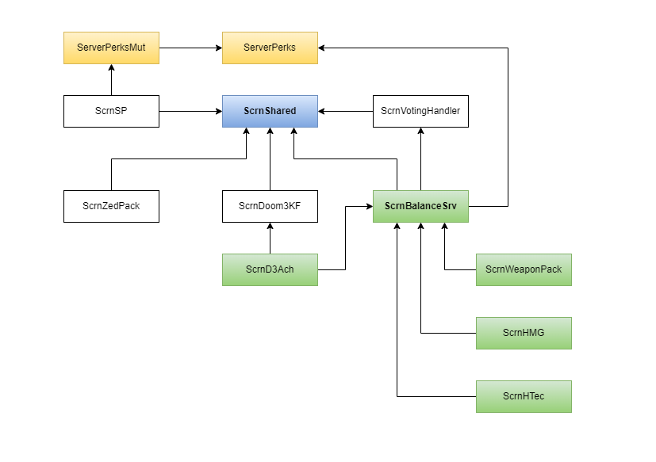

[](https://www.paypal.com/cgi-bin/webscr?cmd=_donations&business=VFARLRAL7CNJ4&lc=LV&item_name=Scrake%20Naders%20Community&item_number=ScrnBalance&currency_code=EUR&bn=PP%2dDonationsBF%3abtn_donateCC_LG%2egif%3aNonHosted)

<!-- some link shortcuts -->
[ScrN Brutal KF Bundle]: https://steamcommunity.com/groups/ScrNBalance/discussions/2/483368526570475472/

# KF ScrN Balance

Total rebalance/rework of Killing Floor 1. Added new guns, perk, game mods, server-side achievements, and more.

## Changelog

You can view complete changelog [here](Docs/CHANGELOG.md).

## Main Features

* Featuring [eXpert Challenge Mode (XCM)](https://steamcommunity.com/groups/ScrNBalance/discussions/9/4580716151550023598/).
* Featuring [Social Isolation Mod](https://steamcommunity.com/groups/ScrNBalance/discussions/2/4666237625653274273/).
* New perks: **Gunslinger** and **Combat Medic**.
* Balances weapons and perks, making each perk useful in the game.
* Perk levels up to 70 but no grinding required! Perk *bonus* levels automatically adjust to the game difficulty and player count always to bring a balanced gameplay experience while allowing perk progression (making e-penis bigger).
* Perk bonuses for custom weapons (the ones you get from Workshop)
* New weapons: **Golden M79 Incendiary**, **Napalm Thrower**, **Laser Dual-MK23**, etc.
* Medic Grenade Launchers: **M79M Medic GL**, **M4-203M Medic Rifle**.
* **Tactical Reload** for Assault Rifles, Sniper Rifles, SMG, and pistols.
* **Quick Melee Bash**
* **Chainsaw** consumes fuel and brings real massacre to the game.
* Changing gun skins "on-the-fly", e.g., switch from the regular to golden AK-47 on a key press.
* **30 game modes** (some require [ScrN Brutal KF Bundle])
* Enhanced server-side zed hitboxes (less wonky headshots)
* More than **400 achievements**.

Most features are configurable (turn on only what you like).

## Optional Features

* Configurable spawn inventory and weapon prices.
* Cool HUD
* Manual Reloading
* Grenade "Cooking"
* Show Damage Numbers
* User-defined soundtrack.
* Voting to end trader time, boost zed spawn, etc.
* Configurable max zeds at once on the map. Now you can raise the previously hardcoded value of 32 zeds and fight against a 100-zed crowd!

## Building

Requirements:

* [Server Perks 7.50](https://forums.tripwireinteractive.com/index.php?threads/mut-per-server-stats.36898/).
* [ScrN Shared](https://github.com/poosh/KF-ScrnShared).
* [ScrN SP](https://github.com/poosh/KF-ScrnSP).
* [ScrN Voting Handler](https://github.com/poosh/KF-ScrnVotingHandler).
* ScrN Packages (included in [ScrN Brutal KF Bundle]):
  * Animations\ScrnAnims.ukx
  * Sounds\ScrnSnd.uax
  * StaticMeshes\ScrnSM.usx
  * Textures\ScrnAch_T.utx
  * Textures\ScrnTex.utx
  * Textures\TSC_T.utx

**EditPackages**:

```cpp
EditPackages=ServerPerks
EditPackages=ScrnShared
EditPackages=ScrnVotingHandler
EditPackages=ScrnBalanceSrv
```

For other ScrN based packages you can check this dependency diagram.



## Links

* Download [ScrN Brutal KF Bundle].
* Detailed info on the [ScrN Balance News Page](https://steamcommunity.com/groups/ScrNBalance/discussions/2/).
* A [guide](http://steamcommunity.com/sharedfiles/filedetails/?id=124250783) on how to use custom weapons with this mutator.
* Any questions about this mod should be posted on [ScrN Balance Steam Group Forums](https://steamcommunity.com/groups/ScrNBalance/discussions/1/). Your feedback is more than welcome!

-------------------------------------------------------------------------------

*Copyright (c) 2012-2023 PU Developing IK, Latvia, All Rights Reserved.*
