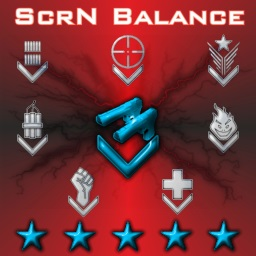
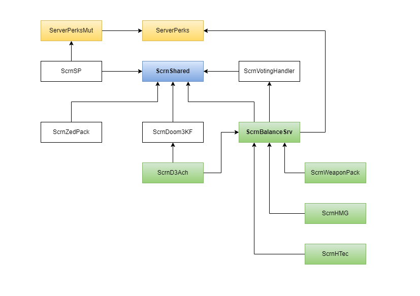

<!-- some link shortcuts -->
[ScrN Brutal KF Bundle]: https://steamcommunity.com/groups/ScrNBalance/discussions/2/483368526570475472/
[Discord]: https://discord.com/invite/Y3W5crSXA5

<div align="center">



</div>

# KF ScrN Balance

Total rebalance/rework of Killing Floor 1. Added new guns, perk, game mods, server-side achievements, and more.

## Changelog

You can view complete changelog [here](Docs/CHANGELOG.md).

## Main Features

* Featuring [eXpert Challenge Mode (XCM)](https://steamcommunity.com/groups/ScrNBalance/discussions/9/4580716151550023598/).
* Featuring [Social Isolation Mod](https://steamcommunity.com/groups/ScrNBalance/discussions/2/4666237625653274273/).
* New perks: **Gunslinger** and **Combat Medic**.
* Balances weapons and perks, making each perk useful in the game.
* Perk levels up to 70 but no grinding required! Perk *bonus* levels automatically adjust to the game difficulty and player count always to bring a balanced gameplay experience while allowing perk progression (making e-penis bigger).
* Perk bonuses for custom weapons (the ones you get from Workshop)
* New weapons: **Golden M79 Incendiary**, **Napalm Thrower**, **Laser Dual-MK23**, etc.
* Medic Grenade Launchers: **M79M Medic GL**, **M4-203M Medic Rifle**.
* **Tactical Reload** for Assault Rifles, Sniper Rifles, SMG, and pistols.
* **Quick Melee Bash**
* **Chainsaw** consumes fuel and brings real massacre to the game.
* Changing gun skins "on-the-fly", e.g., switch from the regular to golden AK-47 on a key press.
* **30 game modes** (some require [ScrN Brutal KF Bundle])
* Enhanced server-side zed hitboxes (less wonky headshots)
* More than **400 achievements**.

Most features are configurable (turn on only what you like).

## Optional Features

* Configurable spawn inventory and weapon prices.
* Cool HUD
* Manual Reloading
* Grenade "Cooking"
* Show Damage Numbers
* User-defined soundtrack.
* Voting to end trader time, boost zed spawn, etc.
* Configurable max zeds at once on the map. Now you can raise the previously hardcoded value of 32 zeds and fight against a 100-zed crowd!

## Modding
READ THIS before forking this repo to change "two code lines" and live with the burden of downmerging forever.

* You don't need to change the code to create or modify **game modes**. It can be done via the [ScrnGames.ini](Configs/ScrnGames.ini). Modify waves, zeds, spawnrate, trader time, dosh, etc. - all that can be done simply by modifying config files.
* You don't need to change ScrnBalance to modify perks, weapons, or add new ones. Create a separate package with ScrN-extended classes and make your changes there. For example, `class MyGunslinger extends ScrnVetGunslinger`. Then, replace `ScrnBalanceSrv.ScrnVetGunslinger` with `MyPackage.MyGunslinger` in [ScrnServerPerks.ini](Configs/ScrnServerPerks.ini) and [ScrnBalanceSrv.ini](Configs/ScrnBalanceSrv.ini), and you will have your own version of Gunslinger! Moreover, you won't be required to recompile your package on every ScrN update thanks to dynamic linkage.
* The above technique also applies to creating custom achievements or game rules. Those can be done in a separate package, too.
* Join our [Discord] for assistance.
* If you still have to fork the ScrnBalance repo, **RENAME** your forked package to avoid version mismatches with the original one. For example, `MyScrnBalance.u`
* Please submit pull requests with the changed code if the changes can be useful for other users. You have access to this code thanks to chain of developers that haven't behaved like dicks to the community. Join the chain!

### Knowledge
If you still decide to write *UnrealScript*, read the following guides on where you may shoot yourself in the foot. I learned it the hard way, so you don't have to.
- [Network Replication Guide](Docs/Info/code/UnrealNetworkReplication.md). Unreal's networking model differs vastly from the classic client-server paradigm. Typical AJAX knowledge is irrelevant here.
- [Object Lifetime / Garbage Collection / Dangling References](Docs/Info/code/DanglingRefCrash.md). Does your GUI crash the game? Read this guide!
- [ScrN Classes](Docs/Info/code/ScrnClasses.md)

## Building

Requirements:

* [Server Perks 7.50](https://forums.tripwireinteractive.com/index.php?threads/mut-per-server-stats.36898/).
* [ScrN Shared](https://github.com/poosh/KF-ScrnShared).
* [ScrN SP](https://github.com/poosh/KF-ScrnSP).
* [ScrN Voting Handler](https://github.com/poosh/KF-ScrnVotingHandler).
* ScrN Packages (included in [ScrN Brutal KF Bundle]):
  * Animations\ScrnAnims.ukx
  * Sounds\ScrnSnd.uax
  * StaticMeshes\ScrnSM.usx
  * Textures\ScrnAch_T.utx
  * Textures\ScrnTex.utx
  * Textures\TSC_T.utx

**EditPackages**:

```cpp
EditPackages=ServerPerks
EditPackages=ScrnShared
EditPackages=ScrnVotingHandler
EditPackages=ScrnBalanceSrv
```

For other ScrN based packages you can check this dependency diagram.



## Links

* [Discord]
* Steam: [ScrN Brutal KF Bundle].
* A [guide](http://steamcommunity.com/sharedfiles/filedetails/?id=124250783) on how to use custom weapons with this mutator.


## AI Usage
- In 2024, AI programming skills were laughably pathetic.
- In 2025, they became promising.
- In 2026, they are transitioning from recommended to mandatory.
- In 2027, coding without AI assistance will be like writing on a typewriter instructions to manufacture punch cards.

> "We, as a society, are on an uncontrollably accelerating train running into a concrete wall, while competing for a front row at the head of the train. The other option is to jump off and die immediately." - Welcome to real life, Neo!

### No Dark Code
ScrN Balance DOES NOT and WILL NOT have AI Dark Code, at least in Version 9. Every single line of code is written or reviewed by a human, except for documentation and unit tests - f**k them!
### AI is used for:
- Code audit.
- Commit review.
- Refactoring ("monkey job").
- Documentation.
- Tests.

P.S. This text was human-written by yours truly.

-------------------------------------------------------------------------------

*Copyright (c) 2012-2026 PU Developing IK, Latvia, All Rights Reserved.*
